<h2 style="text-align: center;"> Universidad Peruana de Ciencias Aplicadas </h2>
<h4 style="text-align: center"> Ingeniería de Software </h4>
<h4 style="text-align: center"> Periodo: 202610 </h4>
 
 

    

<h4 style="text-align: center"> Desarrollo de Soluciones IOT </h4>
<h4 style="text-align: center"> Sección: 17756 </h4>
<h4 style="text-align: center"> Docente: David Vera Olivera </h4>
<h3 style="text-align: center;"> Informe de Trabajo Final </h3>
<h4 style="text-align: center"> Startup: BioDemeter </h4>
<h4 style="text-align: center"> Producto: PlantSync </h4>
<h4 style="text-align: center">Integrantes:</h4>

   <table style="margin-left: auto; margin-right: auto;">
      <tr>
         <th>Código</th>
         <th>Apellidos y Nombres</th>
      </tr>
      <tr>
         <td>U20231A500</td>
         <td>Palomino Fiestas, Erick Leonardo</td>
      </tr>
      <tr>
         <td>U20231D974</td>
         <td>Rivera Ratachi, Renzo Sebastian</td>
      </tr>
      <tr>
         <td>U201314454</td>
         <td>Paitan Pumacahua, Max Anthony</td>
      </tr>
      <tr>
         <td>U20231C784</td>
         <td>Rodríguez Villa, Elvia Marcela</td>
      </tr>
      <tr>
         <td>U202313172</td>
         <td>Coca Lavado, Carlos Andrés</td>
      </tr>
       <tr>
         <td>U20211F211</td>
         <td>Briceño De La Cruz, Farid Sebastian</td>
      </tr>
       <tr>
         <td>U202221436</td>
         <td>Acuña Tomas, Diego Rolin</td>
      </tr>
   </table>

 
<h5 style="text-align: center; font-style: italic;"> Abril 2026 </h5>

# Registro de Versiones del Informe

| Version | Fecha | Autor | Descripción de modificación |
| :--- | :--- | :--- | :--- |
| 0.1 | 14/04/2026 | Acuña Tomas, Diego Rolin | Creación del documento base y redacción del Capítulo I: Startup Profile. |
| 0.2 | 15/04/2026 | Briceño De La Cruz, Farid Sebastian | Desarrollo del Solution Profile, antecedentes y procesos Lean UX. |
| 0.3 | 16/04/2026 | Palomino Fiestas, Erick Leonardo y Rivera Ratachi, Renzo Sebastian | Elaboración del Segmento Objetivvo y Análisis de competidores y estrategias competitivas del Capítulo II. |
| 0.4 | 17/04/2026 | Paitan Pumacahua, Max Anthony | Elaboración de la sección de entrevistas, Needfinding y Big Picture EventStorming. |
| 0.5 | 18/04/2026 | Rodríguez Villa, Elvia Marcela | Finalización del Capítulo II con Ubiquitous Language y User Journey Mapping. |
| 0.6 | 19/04/2026 | Coca Lavado, Carlos Andrés | Redacción del Capítulo III: User Stories, Impact Mapping y Product Backlog. |
| 0.7 | 21/04/2026 | Briceño De La Cruz, Farid Sebastian | Inicio del Capítulo IV: Design-Level EventStorming y Candidate Context Discovery. |
| 0.8 | 23/04/2026 | Paitan Pumacahua, Max Anthony | Modelado de Bounded Context Canvases y Context Mapping en el Capítulo IV. |
| 0.9 | 24/04/2026 | Rodríguez Villa, Elvia Marcela | Diseño de Software Architecture y diagramas de contenedores y despliegue. |
| 0.10 | 25/04/2026 | Rivera Ratachi, Renzo Sebastian | Desarrollo del Tactical-Level DDD (capas de dominio, interfaz y aplicación). |
| 1.0 | 26/04/2026 | Coca Lavado, Carlos Andrés | Revisión final de diagramas de componentes y base de datos. |

# Project Report Collaboration Insights

El repositorio del informe se encuentra en GitHub en el siguiente link: https://github.com/BioDemeter-IoT/report 

**TB1**

  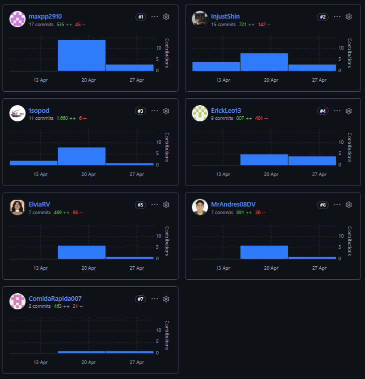

  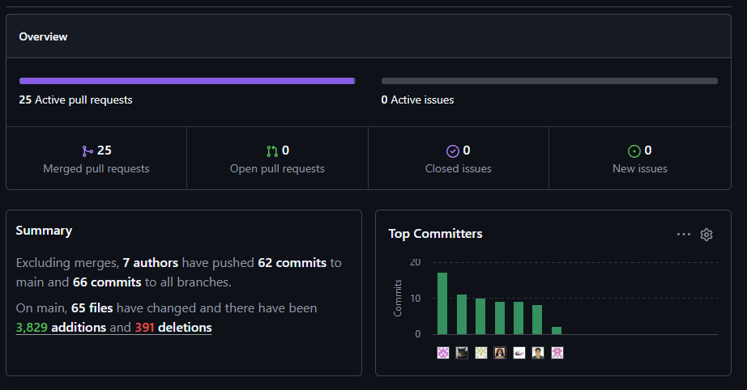

  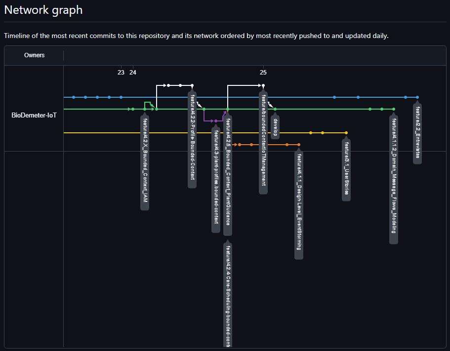

# Contenido

- [Registro de Versiones del Informe](#registro-de-versiones-del-informe)
- [Project Report Collaboration Insights](#project-report-collaboration-insights)
- [Contenido](#contenido)
- [Student Outcome](#student-outcome)
- [Capítulo I: Introducción](#capítulo-i-introducción)
  - [1.1. Startup Profile](#11-startup-profile)
    - [1.1.1. Descripción de la Startup](#111-descripción-de-la-startup)
    - [1.1.2. Perfiles de integrantes del equipo](#112-perfiles-de-integrantes-del-equipo)
  - [1.2. Solution Profile](#12-solution-profile)
    - [1.2.1. Antecedentes y problemática](#121-antecedentes-y-problemática)
      - [WHO (Quién)](#who-quién)
      - [WHAT (Qué)](#what-qué)
      - [WHERE (Dónde)](#where-dónde)
      - [WHEN (Cuándo)](#when-cuándo)
      - [WHY (Por qué)](#why-por-qué)
      - [HOW (Cómo)](#how-cómo)
      - [HOW MUCH (Cuánto)](#how-much-cuánto)
    - [1.2.2. Lean UX Process](#122-lean-ux-process)
      - [1.2.2.1. Lean UX Problem Statements](#1221-lean-ux-problem-statements)
      - [1.2.2.2. Lean UX Assumptions](#1222-lean-ux-assumptions)
        - [Business Assumptions](#business-assumptions)
        - [User Assumptions](#user-assumptions)
      - [1.2.2.3. Lean UX Hypothesis Statements](#1223-lean-ux-hypothesis-statements)
      - [Hypothesis Statement 01](#hypothesis-statement-01)
      - [Hypothesis Statement 02](#hypothesis-statement-02)
      - [Hypothesis Statement 03](#hypothesis-statement-03)
      - [Hypothesis Statement 04](#hypothesis-statement-04)
      - [1.2.2.4. Lean UX Canvas](#1224-lean-ux-canvas)
  - [1.3. Segmentos objetivo](#13-segmentos-objetivo)
    - [Principiantes cuidadores de plantas](#principiantes-cuidadores-de-plantas)
        - [Características demográficas:](#características-demográficas)
    - [Expertos cuidadores de plantas](#expertos-cuidadores-de-plantas)
      - [Características demográficas:](#características-demográficas-1)
- [Capítulo II: Requirements Elicitation \& Analysis](#capítulo-ii-requirements-elicitation--analysis)
  - [2.1. Competidores](#21-competidores)
    - [2.1.1. Análisis competitivo](#211-análisis-competitivo)
    - [2.1.2. Estrategias y tácticas frente a competidores](#212-estrategias-y-tácticas-frente-a-competidores)
  - [2.2. Entrevistas](#22-entrevistas)
    - [2.2.1. Diseño de entrevistas](#221-diseño-de-entrevistas)
    - [2.2.2. Registro de entrevistas](#222-registro-de-entrevistas)
    - [2.2.3. Análisis de entrevistas](#223-análisis-de-entrevistas)
  - [2.3. Needfinding](#23-needfinding)
    - [2.3.1. User Personas](#231-user-personas)
    - [2.3.2. User Task Matrix](#232-user-task-matrix)
    - [2.3.3. User Journey Mapping](#233-user-journey-mapping)
      - [Journey principiante](#journey-principiante)
      - [Journey experto](#journey-experto)
    - [2.3.4. Empathy Mapping](#234-empathy-mapping)
      - [Segmento 1 — Principiante cuidador de plantas](#segmento-1--principiante-cuidador-de-plantas)
      - [Segmento 2 — Experto cuidador de plantas](#segmento-2--experto-cuidador-de-plantas)
  - [2.4. Big Picture EventStorming](#24-big-picture-eventstorming)
  - [2.5. Ubiquitous Language](#25-ubiquitous-language)
- [Capítulo III: Requirements Specification](#capítulo-iii-requirements-specification)
  - [3.1. User Stories](#31-user-stories)
  - [3.2. Impact Mapping](#32-impact-mapping)
  - [3.3. Product Backlog](#33-product-backlog)
- [Capítulo IV: Solution Software Design](#capítulo-iv-solution-software-design)
  - [4.1. Strategic-Level Domain-Driven Design](#41-strategic-level-domain-driven-design)
    - [4.1.1. Design-Level EventStorming](#411-design-level-eventstorming)
      - [4.1.1.1. Candidate Context Discovery](#4111-candidate-context-discovery)
      - [4.1.1.2. Domain Message Flows Modeling](#4112-domain-message-flows-modeling)
      - [4.1.1.3. Bounded Context Canvases](#4113-bounded-context-canvases)
    - [4.1.2. Context Mapping](#412-context-mapping)
    - [4.1.3. Software Architecture](#413-software-architecture)
      - [4.1.3.1. Software Architecture System Landscape Diagram](#4131-software-architecture-system-landscape-diagram)
      - [4.1.3.2. Software Architecture Context Level Diagrams](#4132-software-architecture-context-level-diagrams)
      - [4.1.3.3. Software Architecture Container Level Diagrams](#4133-software-architecture-container-level-diagrams)
      - [4.1.3.4. Software Architecture Deployment Diagrams](#4134-software-architecture-deployment-diagrams)
  - [4.2. Tactical-Level Domain-Driven Design](#42-tactical-level-domain-driven-design)
    - [4.2.1. Bounded Context: \<IAM\>](#421-bounded-context-iam)
      - [4.2.1.1. Domain Layer](#4211-domain-layer)
      - [4.2.1.2. Interface Layer](#4212-interface-layer)
      - [4.2.1.3. Application Layer](#4213-application-layer)
      - [4.2.1.4. Infrastructure Layer](#4214-infrastructure-layer)
      - [4.2.1.5. Bounded Context Software Architecture Component Level Diagrams](#4215-bounded-context-software-architecture-component-level-diagrams)
      - [4.2.1.6. Bounded Context Software Architecture Code Level Diagrams](#4216-bounded-context-software-architecture-code-level-diagrams)
        - [4.2.1.6.1. Bounded Context Domain Layer Class Diagrams](#42161-bounded-context-domain-layer-class-diagrams)
        - [4.2.1.6.2. Bounded Context Database Design Diagram](#42162-bounded-context-database-design-diagram)
    - [4.2.2. Bounded Context: Profiles](#422-bounded-context-profiles)
      - [4.2.2.1. Domain Layer](#4221-domain-layer)
      - [4.2.2.2. Interface Layer](#4222-interface-layer)
      - [4.2.2.3. Application Layer](#4223-application-layer)
      - [4.2.2.4. Infrastructure Layer](#4224-infrastructure-layer)
      - [4.2.2.5. Bounded Context Software Architecture Component Level Diagrams](#4225-bounded-context-software-architecture-component-level-diagrams)
      - [4.2.2.6. Bounded Context Software Architecture Code Level Diagrams](#4226-bounded-context-software-architecture-code-level-diagrams)
        - [4.2.2.6.1. Bounded Context Domain Layer Class Diagrams](#42261-bounded-context-domain-layer-class-diagrams)
        - [4.2.2.6.2. Bounded Context Database Design Diagram](#42262-bounded-context-database-design-diagram)
    - [4.2.3. Bounded Context: PlantProfiles](#423-bounded-context-plantprofiles)
      - [4.2.3.1. Domain Layer](#4231-domain-layer)
      - [4.2.3.2. Interface Layer](#4232-interface-layer)
      - [4.2.3.3. Application Layer](#4233-application-layer)
      - [4.2.3.4. Infrastructure Layer](#4234-infrastructure-layer)
      - [4.2.3.5. Bounded Context Software Architecture Component Level Diagrams](#4235-bounded-context-software-architecture-component-level-diagrams)
      - [4.2.3.6. Bounded Context Software Architecture Code Level Diagrams](#4236-bounded-context-software-architecture-code-level-diagrams)
        - [4.2.3.6.1. Bounded Context Domain Layer Class Diagrams](#42361-bounded-context-domain-layer-class-diagrams)
        - [4.2.3.6.2. Bounded Context Database Design Diagram](#42362-bounded-context-database-design-diagram)
    - [4.2.4. Bounded Context: IoT Management](#424-bounded-context-iot-management)
      - [4.2.4.1. Domain Layer](#4241-domain-layer)
      - [4.2.4.2. Interface Layer](#4242-interface-layer)
      - [4.2.4.3. Application Layer](#4243-application-layer)
      - [4.2.4.4. Infrastructure Layer](#4244-infrastructure-layer)
      - [4.2.4.5. Bounded Context Software Architecture Component Level Diagrams](#4245-bounded-context-software-architecture-component-level-diagrams)
      - [4.2.4.6. Bounded Context Software Architecture Code Level Diagrams](#4246-bounded-context-software-architecture-code-level-diagrams)
        - [4.2.4.6.1. Bounded Context Domain Layer Class Diagrams](#42461-bounded-context-domain-layer-class-diagrams)
        - [4.2.4.6.2. Bounded Context Database Design Diagram](#42462-bounded-context-database-design-diagram)
    - [4.2.5. Bounded Context: CareScheduling](#425-bounded-context-carescheduling)
      - [4.2.5.1. Domain Layer](#4251-domain-layer)
      - [4.2.5.2. Interface Layer](#4252-interface-layer)
      - [4.2.5.3. Application Layer](#4253-application-layer)
      - [4.2.5.4. Infrastructure Layer](#4254-infrastructure-layer)
      - [4.2.5.5. Bounded Context Software Architecture Component Level Diagrams](#4255-bounded-context-software-architecture-component-level-diagrams)
      - [4.2.5.6. Bounded Context Software Architecture Code Level Diagrams](#4256-bounded-context-software-architecture-code-level-diagrams)
        - [4.2.5.6.1. Bounded Context Domain Layer Class Diagrams](#42561-bounded-context-domain-layer-class-diagrams)
        - [4.2.5.6.2. Bounded Context Database Design Diagram](#42562-bounded-context-database-design-diagram)
    - [4.2.6. Bounded Context: Inteligencia Botánica y Análisis Externo](#426-bounded-context-inteligencia-botánica-y-análisis-externo)
      - [4.2.6.1. Domain Layer](#4261-domain-layer)
      - [4.2.6.2. Interface Layer](#4262-interface-layer)
      - [4.2.6.3. Application Layer](#4263-application-layer)
      - [4.2.6.4. Infrastructure Layer](#4264-infrastructure-layer)
      - [4.2.6.5. Bounded Context Software Architecture Component Level Diagrams](#4265-bounded-context-software-architecture-component-level-diagrams)
      - [4.2.6.6. Bounded Context Software Architecture Code Level Diagrams](#4266-bounded-context-software-architecture-code-level-diagrams)
        - [4.2.6.6.1. Bounded Context Domain Layer Class Diagrams](#42661-bounded-context-domain-layer-class-diagrams)
        - [4.2.6.6.2. Bounded Context Database Design Diagram](#42662-bounded-context-database-design-diagram)
    - [4.2.7. Bounded Context: PlantGuidence](#427-bounded-context-plant-guidance)
      - [4.2.7.1. Domain Layer](#4271-domain-layer)
      - [4.2.7.2. Interface Layer](#4272-interface-layer)
      - [4.2.7.3. Application Layer](#4273-application-layer)
      - [4.2.7.4. Infrastructure Layer](#4274-infrastructure-layer)
      - [4.2.7.5. Bounded Context Software Architecture Component Level Diagrams](#4275-bounded-context-software-architecture-component-level-diagrams)
      - [4.2.7.6. Bounded Context Software Architecture Code Level Diagrams](#4276-bounded-context-software-architecture-code-level-diagrams)
        - [4.2.7.6.1. Bounded Context Domain Layer Class Diagrams](#42761-bounded-context-domain-layer-class-diagrams)
        - [4.2.7.6.2. Bounded Context Database Design Diagram](#42762-bounded-context-database-design-diagram)
- [Conclusiones](#conclusiones)
  - [Conclusiones y recomendaciones](#conclusiones-y-recomendaciones)
- [Bibliografía](#bibliografía)
- [Anexos](#anexos)
  - [Links](#links)

# Student Outcome

En el siguiente cuadro se describe las acciones realizadas y enunciados de conclusiones por parte del grupo, que permiten sustentar el haber alcanzado el logro del ABET – EAC - Student Outcome.

<table>
  <thead>
    <tr>
      <th>Criterio específico</th>
      <th>Acciones realizadas</th>
      <th>Conclusiones</th>
    </tr>
  </thead>
  <tbody>
    <tr>
      <td rowspan="7"><strong>Trabaja en equipo para proporcionar liderazgo en forma conjunta</strong></td>
      <td><strong>Rivera Ratachi, Renzo Sebastian</strong> <b>TB1:</b> Lideró la definición estratégica mediante la elaboración de Lean UX Hypothesis Statements y la identificación de segmentos objetivo.</td>
      <td rowspan="7"><b>TB1:</b> El equipo ejerció un liderazgo compartido donde cada integrante asumió la dirección de áreas críticas. La integración entre el análisis de negocio, la investigación de campo y el modelado técnico permitió establecer una visión unificada para la solución IoT, asegurando que cada componente del sistema estuviera alineado con los objetivos estratégicos del proyecto.</td>
    </tr>
    <tr>
      <td><strong>Palomino Fiestas, Erick Leonardo</strong> <b>TB1:</b> Dirigió el análisis de competidores y estableció la base de seguridad en el IAM Bounded Context.</td>
    </tr>
    <tr>
      <td><strong>Coca Lavado, Carlos Andrés</strong> <b>TB1:</b> Lideró la planificación técnica mediante la estructuración del Product Backlog y los diagramas de arquitectura C4.</td>
    </tr>
    <tr>
      <td><strong>Paitan Pumacahua, Max Anthony</strong> <b>TB1:</b> Ejerció liderazgo en el modelado estructural del dominio mediante el Context Mapping y el Domain Message Flows Modeling.</td>
    </tr>
    <tr>
      <td><strong>Rodríguez Villa, Elvia Marcela</strong> <b>TB1:</b> Lideró el diseño arquitectónico de los Bounded Context de Inteligencia Botánica y Análisis Externo.</td>
    </tr>
    <tr>
      <td><strong>Briceño De La Cruz, Farid Sebastian</strong> <b>TB1:</b> Dirigió la fase de descubrimiento conceptual mediante el Design Level Event Storming y la definición de la problemática.</td>
    </tr>
    <tr>
      <td><strong>Acuña Tomas, Diego Rolin</strong> <b>TB1:</b> Lideró la identidad de la Startup y el diseño técnico del Bounded Context de IoT Management.</td>
    </tr>
    <tr>
      <td rowspan="7"><strong>Crea un entorno colaborativo e inclusivo, establece metas, planifica tareas y cumple objetivos.</strong></td>
      <td><strong>Rivera Ratachi, Renzo Sebastian</strong> <b>TB1:</b> Colaboró en la definición de los Bounded Context de Plant Profiles y Care Scheduling para alcanzar los hitos de la entrega.</td>
      <td rowspan="7"><b>TB1:</b> Se logró un entorno colaborativo donde los hallazgos de las entrevistas y el Needfinding fueron la base para el diseño de User Stories y la arquitectura. El cumplimiento de los objetivos de la TB1 se facilitó mediante una planificación coordinada, asegurando que cada entregable técnico respondiera a las necesidades reales de los usuarios identificadas por el equipo.</td>
    </tr>
    <tr>
      <td><strong>Palomino Fiestas, Erick Leonardo</strong> <b>TB1:</b> Cumplió con los objetivos de diseño para el PlantGuidence Bounded Context en colaboración con el área de UX.</td>
    </tr>
    <tr>
      <td><strong>Coca Lavado, Carlos Andrés</strong> <b>TB1:</b> Estableció las metas de usuario mediante el desarrollo de User Stories e Impact Mapping para ambos segmentos.</td>
    </tr>
    <tr>
      <td><strong>Paitan Pumacahua, Max Anthony</strong> <b>TB1:</b> Facilitó un entorno inclusivo mediante el análisis de entrevistas, transformándolas en User Personas y Task Matrix.</td>
    </tr>
    <tr>
      <td><strong>Rodríguez Villa, Elvia Marcela</strong> <b>TB1:</b> Validó los flujos de trabajo grupales mediante el Event Storming del dominio y la creación de User Journey Maps.</td>
    </tr>
    <tr>
      <td><strong>Briceño De La Cruz, Farid Sebastian</strong> <b>TB1:</b> Participó en el Candidate Context Discovery y la investigación de antecedentes para alinear las tareas del grupo.</td>
    </tr>
    <tr>
      <td><strong>Acuña Tomas, Diego Rolin</strong> <b>TB1:</b> Cumplió con la planificación de los perfiles de equipo y la descripción técnica de la gestión de dispositivos IoT.</td>
    </tr>
  </tbody>
</table>

# Capítulo I: Introducción

## 1.1. Startup Profile

### 1.1.1. Descripción de la Startup

Nuestra startup, BioDemeter, se establece con la misión de ofrecer soluciones tecnológicas 
para el mantenimiento de plantas en hogares, aprovechando al máximo las tecnologías IoT para 
promover un cambio positivo en el medio ambiente.

Nuestro producto, PlantSync, es un servicio digital accesible desde aplicaciones web y móvil 
que facilita a los usuarios el seguimiento y cuidado de sus plantas. Proporciona información 
en tiempo real sobre las condiciones ambientales, recomendaciones personalizadas de riego y 
fertilización, alertas automáticas, guías de cuidado e identificación de plantas mediante 
fotografías. Nuestro compromiso es fomentar la responsabilidad ambiental mientras 
contribuimos a la sostenibilidad.

**Visión:** 

En un período de cinco años, BioDemeter alcanzará la posición de vanguardia en el 
mercado de soluciones tecnológicas para el cuidado de plantas en el hogar. PlantSync 
se consolidará como la aplicación de referencia para entusiastas de la jardinería 
hogareña en América Latina, quienes buscan mantener sus plantas saludables y 
vibrantes. Nos destacaremos por la excelencia, la asequibilidad y la originalidad 
de nuestras soluciones.

**Misión:**

Nuestra misión es facilitar el cuidado de plantas en el hogar mediante soluciones 
tecnológicas accesibles e inteligentes. Nos comprometemos a proporcionar 
herramientas personalizadas que permitan a nuestros usuarios mantener sus 
plantas saludables mientras fortalecen su conexión con el medio ambiente.

### 1.1.2. Perfiles de integrantes del equipo

<table>
  <thead>
    <tr>
      <th>Fotos del Integrantes</th>
      <th>Nombres y Apellidos</th>
      <th>Código de estudiante</th>
      <th>Conocimientos técnicos y habilidades</th>
    </tr>
  </thead>
  <tbody>
    <tr>
      <td></td>
      <td><strong>Acuña Tomas, Diego Rolin</strong></td>      
      <td>U202221436</td>
      <td>Soy estudiante de Ingeniería de Software en la UPC, actualmente cursando el octavo ciclo. Durante mi formación académica he adquirido sólidos conocimientos en múltiples lenguajes de programación y frameworks, desarrollando competencias especializadas en frontend, backend y bases de datos. Me interesa especialmente contribuir a proyectos de código abierto, como Angular, Spring y otras herramientas modernas. Me considero una persona curiosa y proactiva, con una visión optimista del futuro tecnológico.</td>
    </tr>
    <tr>
      <td></td>
      <td><strong>Briceño De La Cruz, Farid Sebastian</strong></td>
      <td>U20211F211</td>
      <td>Soy estudiante de Ingeniería de Software con un fuerte interés en el desarrollo de productos digitales y la tecnología. En mi tiempo libre, me gusta jugar videojuegos. También tengo un interés especial en la música, lo que me ayuda a equilibrar mi vida académica y personal. Cuento con habilidades en gestión de bases de datos relacionales, frontend y backend; también me gusta estar al pendiente de las noticias de software, lo que me anima a experimentar con nuevas tecnologías.</td>
    </tr>
    <tr>
      <td></td>
      <td><strong>Coca Lavado, Carlos Andrés</strong></td>
      <td>U202313172</td>
      <td>Mi Nombre es Carlos Andrés Coca, tengo 20 años, actualmente me encuentro cursando el septimo ciclo de la carrera de Ingeniería de Software. Cuento con conocimientos en C++, Python y HTML. y desde muy joven me ha interesado el desarrollo Web. Teniendo en cuenta el gran impacto que presentan a día de hoy las novedosas soluciones presentadas.</td>
    </tr>
    <tr>
      <td></td>
      <td><strong>Palomino Fiestas, Erick Leonardo</strong></td>
      <td>U20231A500</td>
      <td>Hola, soy Erick Leonardo Palomino Fiestas, un estudiante entusiasta de séptimo ciclo en Ingeniería de Software. Mi conjunto de habilidades técnicas incluye C++, HTML, CSS, .NET, Python, fundamentos de JavaScript y experiencia con bases de datos SQL y MongoDB. Me considero una persona responsable, con sólidas habilidades de comunicación para trabajar en equipo y una perspectiva optimista. También tengo un nivel básico de inglés.

</td>
    </tr>
    <tr>
      <td></td>
      <td><strong>Rivera Ratachi, Renzo Sebastian</strong></td>
      <td>U20231D974</td>
      <td>Soy Renzo Sebastian Rivera Ratachi y soy estudiante de la carrera de Ingeniería de Software. Actualmente estoy cursando el 7mo ciclo de mi carrera y tengo conocimientos intermedios de JavaScript y C++. Me considero una persona responsable y puntual.</td>
    </tr>
    <tr>
      <td>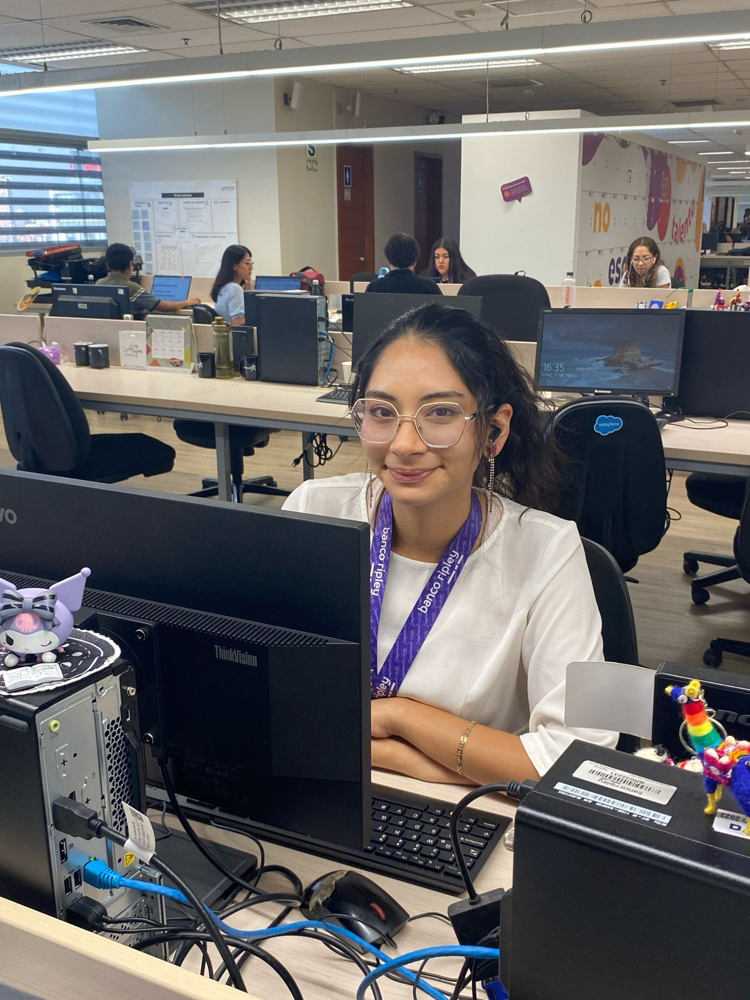</td>
      <td><strong>Rodríguez Villa, Elvia Marcela</strong></td>
      <td>U20231c784</td>
      <td>Soy estudiante de Ingeniería de Software y actualmente me desempeño como AI/ML Engineer. Cuento con experiencia en Python, AWS, ingeniería de datos y automatización de procesos. He trabajado en proyectos de inteligencia artificial como chatbots y speech analytics, motivada por el impacto de la tecnología basada en datos en la actualidad.</td>
    </tr>
    <tr>
      <td></td>
      <td><strong>Paitan Pumacahua, Max Anthony</strong></td>
      <td>U201314454</td>
      <td>Soy Max Anthony y estoy retomando la carrera de Ingeniería de Software. Actualmente estoy cursando el noveno ciclo. Entre mis habilidades están: Ágil capacidad de análisis -tanto individual como también en colectivo-, empático en un contexto determinado -tomando decisiones de manera sensata-, y puedo ser tanto gestor como un participante activo dentro de un grupo de trabajo.</td>
    </tr>
  </tbody>
</table>

## 1.2. Solution Profile

### 1.2.1. Antecedentes y problemática

La relación entre los seres humanos y las plantas ha evolucionado de una mera dependencia de subsistencia a una conexión profunda de bienestar psicológico y salud social. En la actualidad, tener plantas en el hogar no es solo una decisión estética; responde a una necesidad de reducir el cortisol y el estrés urbano, actuando como un mecanismo de autorregulación emocional. Diversas fuentes psicológicas destacan que el "fanatismo" por las plantas surge del instinto de cuidado y la gratificación de ver un ser vivo prosperar bajo nuestra responsabilidad. No obstante, existe una contradicción fundamental: mientras que el 80% de la biomasa terrestre es vegetal, la mayoría de los ciudadanos urbanos carecen de la alfabetización biológica para mantener este plexo vivo en sus hogares.
La horticultura terapéutica demuestra que el acto de cultivar mejora la salud física y mental, reduciendo la depresión y la ansiedad. Sin embargo, la entrada de estos "cuidados verdes" en el hogar se ve amenazada por la falta de tiempo y conocimientos técnicos. Para cuidar a los humanos, las plantas primero deben ser cuidadas , y es aquí donde surge la problemática: el usuario moderno se enfrenta a una fragmentación de cuidados. El aficionado a menudo no logra interpretar las señales de sus plantas —lo que la neurobiología define como inteligencia colaborativa — hasta que el daño es irreversible.
Esta desconexión genera una brecha de éxito. Mientras que las plantas operan bajo una lógica descentralizada y modular, los sistemas de monitoreo tradicionales son jerárquicos y limitados. Existe una necesidad imperativa de herramientas que funcionen como mediadoras de cuidados, permitiendo que la tecnología IoT actúe como un puente para que el usuario, sea novato o experto, pueda entender y responder a las necesidades de su micro-ecosistema doméstico de forma remota y precisa.

#### WHO (Quién)

+ **Afectados directos:** Entusiastas del cuidado de plantas, divididos en novatos (quienes sufren mayor frustración emocional por la muerte de sus ejemplares) y experimentados (quienes buscan precisión y optimización de su tiempo); quienes dependen de su intuición o de cronogramas manuales que a menudo fallan por falta de datos objetivos.

+ **Beneficiarios indirectos:** El ecosistema doméstico y la salud mental del usuario, dado que las plantas actúan como mediadoras de bienestar y agentes de "salutogénesis"

#### WHAT (Qué)

+ **El problema:** Una alta tasa de mortalidad y deterioro de plantas ornamentales en entornos urbanos debido a la incapacidad del ser humano para interpretar las señales bióticas (como el déficit lumínico) en tiempo real.

+ **El objeto técnico:** Un sistema IoT compuesto por un sensor de luminosidad real y un actuador de iluminación UV real, complementado con sensores y actuadores simulados para cubrir variables como humedad y temperatura.

+ **El servicio:** Una plataforma multiplataforma que ofrece control táctico y alertas en una Mobile App, junto con análisis estratégico de datos en una Web App.

#### WHERE (Dónde)

+ **Espacio físico:** Hogares urbanos, departamentos con iluminación natural inconsistente y oficinas donde el microclima no siempre es apto para la vida vegetal.

+ **Entorno digital:** La interacción ocurre en el "Edge" (dispositivo físico), en la nube (procesamiento de datos) y en las interfaces de usuario (móvil y web).

#### WHEN (Cuándo)

+ **Temporalidad del problema:** El riesgo de daño irreversible es continuo, pero se intensifica durante las jornadas laborales extensas, viajes del usuario o cambios estacionales que alteran la radiación solar recibida por la planta.

+ **Ciclo de vida:** Desde la adquisición de la planta (fase crítica para el novato) hasta su mantenimiento a largo plazo (fase de optimización para el experto).

+ **Momento de la alerta:** La notificación debe ser inmediata al detectar una anomalía lumínica o un fallo en la conectividad del sistema, permitiendo una "sinergia de cuidados".

#### WHY (Por qué)

+ **Justificación:** Existe una "separación de sociedad y naturaleza" que ha dejado a los humanos sin la capacidad de entender las necesidades de las plantas.

+ **Causa raíz:** La falta de herramientas accesibles que transformen datos crudos en acciones automáticas (como encender luz UV ante déficit solar) y en pedagogías vegetales para el usuario.

+ **Motivación psicológica:** El fracaso en el cuidado botánico genera una percepción de incapacidad personal, afectando el bienestar que el hobby debería proporcionar.

#### HOW (Cómo)

+ **Diferencia entre estado óptimo y problema:** En el estado óptimo, la planta mantiene una homeostasis botánica donde los niveles de radiación fotosintética activa (PAR) son constantes y adecuados para su especie, lo que se traduce en un crecimiento vigoroso y beneficios psicológicos medibles para el usuario, como la reducción del cortisol. En el estado de problema, existe una "asimetría de información": el usuario percibe la planta como "sana" visualmente, mientras que internamente la planta ya sufre un déficit de lúmenes o estrés hídrico que el ojo humano no detecta a tiempo. Esta brecha entre la percepción humana y la necesidad biológica es lo que la tecnología IoT viene a cerrar mediante datos objetivos.

+ **Patrón de aparición:** El problema no es aleatorio; sigue patrones cíclicos. Estos se dividen en:
  + **Patrones circadianos:** Déficits de luz en horarios específicos del día debido a la rotación solar y sombras urbanas (edificios).
  + **Patrones estacionales:** Variaciones en la intensidad lumínica según la época del año.
  + **Patrones de actividad humana:** La falta de cuidado coincide con las jornadas laborales de 8 a 10 horas o periodos de viaje, momentos en los que el usuario se desconecta físicamente de la planta.

#### HOW MUCH (Cuánto)

+ **Frecuencia y Gravedad de los Problemas:**
  + **Mortalidad:** Aproximadamente el 35% de las plantas mueren en hogares por cuidados inadecuados.
  + **Impacto diario:** Se detectan de 3 a 5 fluctuaciones críticas de luz al día que requieren intervención automática o manual.
+ **Implicación económica:**
  + Tomando como referencia a esta tienda online [https://www.teslaelectronic.com.pe/tarjetas-arduino/](https://www.teslaelectronic.com.pe/tarjetas-arduino/), el desglose de costos de IoT es el siguiente, tomando como costo máximo **S/.237**: 
  
  | Componente | Costo unitario | Descripción |
  |---|---|---|
  |Arduino UNO R4 WiFi|S/.129|Placa arduino|
  |Sensor de Humedad de Suelo Capacitivo v2.0|S/.15|Mide la humedad en la tierra que detecta el sensor|
  |Módulo detector de radiación UVB con ML8511|S/.68|Mide la luz ultravioleta que llega al sensor|
  |Módulo sensor de luz BH1750|S/.15|Mide la luz que llega al sensor|
  |Sensor DHT11 Temperatura y Humedad KY-015|S/.10|Mide la temperatura y humedad del ambiente|
  
  +  Tomando como referencia a esta plataforma de reclutamiento [https://jobicy.com/salaries/pe/software-developer#salary-section](https://jobicy.com/salaries/pe/software-developer#salary-section), y tomando en cuenta el equipo de 7 desarrolladores junior, el desglose de desarrollo sería el siguiente, tomando como costo máximo :
  
  |Herramienta|Costo unitario mensual|Descripción|
  |-|-|-|
  |Capital humano | 8750$ | 15000$ (salario anual junior estimado) ÷ 12 meses * 7 integrantes
  | AWS App Runner (Backend) | 15$| Despliegue del RESTful API (Spring Boot/ASP.NET Core).
  | Vercel Pro (Frontend) | 20$ | Hosting de alta disponibilidad para la Web Application (Angular/Vue).|
  | Figma Profesional | 20$ | Licencias para el diseño de Wireframes, Mock-ups y Prototipos.
  | UXPressia Pro | 36$ | Elaboración de User Personas, Journey Maps e Impact Maps.
  | Lucid Suite Individual| 18$ | Diagramas C4 Model, UML y Database Design. | 
  | Jira Standard | 7.91$ | Gestión de Product Backlog y Sprints.|
  

### 1.2.2. Lean UX Process

#### 1.2.2.1. Lean UX Problem Statements
Nuestra plataforma IoT de monitoreo y cuidado de plantas fue diseñada para lograr que los usuarios mantengan la salud de sus plantas de forma óptima y mejoren su bienestar emocional mediante datos precisos. Hemos observado que el servicio actual del mercado no está cumpliendo con la interpretación efectiva de las señales bióticas de las plantas, lo que está causando una tasa de mortalidad botánica del 35% y frustración en el usuario. ¿Cómo podríamos mejorar nuestra plataforma IoT para que nuestros clientes tengan más éxito basándonos en la reducción del 50% de la pérdida de plantas domésticas y el incremento del tiempo de vida de los ejemplares monitoreados?
**Aspectos Específicos:**
+ **Domain:** Smart Gardening e IoT aplicado a la horticultura doméstica y la salud ambiental.
+ **Customer Segments:** Entusiastas novatos y cuidadores experimentados de plantas domésticas.
+ **Pain Points:** Incertidumbre sobre el estado real de la planta, falta de tiempo para monitoreo constante y limitación de movilidad para actuar sobre la planta.
+ **Gap:** Inexistencia de soluciones accesibles que unifiquen sensores reales con actuadores automáticos en una experiencia multiplataforma (Web/Móvil).
+ **Visión/Strategy:** Ecosistema integrado de hardware (Edge API) y software (RESTful API) que democratice el cuidado botánico de precisión.
+ **Initial Segment:** Entusiastas novatos con el hobby del cuidado de plantas.

#### 1.2.2.2. Lean UX Assumptions

##### Business Assumptions
1. **Creemos que nuestros clientes tienen la necesidad de:** Mantener sus plantas saludables sin requerir conocimientos botánicos avanzados o presencia física constante.
2. **Estas necesidades pueden resolverse con:** Una plataforma IoT que utilice sensores de luz reales y actuadores UV para compensar deficiencias ambientales automáticamente.
3. **Nuestro clientes iniciales son (o serán):** Entusiastas novatos que han tenido experiencias previas de fracaso en el cuidado de plantas.
4. **El valor número uno que un cliente quiere obtener de nuestro servicio es:** La supervivencia y crecimiento constante de sus plantas. También pueden obtener estos beneficios adicionales: Mejora en el bienestar mental del usuario y automatización de tareas tediosas.
5. **Obtendremos la mayoría de nuestros clientes a través de:** La Landing Page del proyecto y estrategias de marketing de contenidos sobre bienestar botánico.
6. **Ganaremos dinero mediante:** La venta del kit de hardware IoT y posibles suscripciones premium para analítica avanzada de datos históricos.
7. **Nuestra competencia principal en el mercado será:** Sensores de humedad básicos y temporizadores de riego no inteligentes. Les ganaremos debido a: La integración total entre el monitoreo de luz real y la acción inmediata del actuador UV.
8. **El mayor riesgo de nuestro producto es:** Que los usuarios no confíen en la automatización para el cuidado de sus seres vivos. Resolveremos esto a través de: Notificaciones constantes de las acciones realizadas por el sistema.
9. **Otras supocisiones:** Que los usuarios cuentan con conectividad WiFi estable en el lugar donde ubican sus plantas.

##### User Assumptions
1. **¿Quién es el usuario?:** Personas urbanas que disfrutan de las plantas pero tienen estilos de vida ocupados o poco espacio con luz natural.
2. **¿Dónde encaja nuestro producto en su trabajo o vida?:** En sus hogares, departamentos u oficinas, integrándose como un asistente inteligente de cuidado ambiental.
3. **¿Qué problemas resuelve nuestro producto?:** El olvido de los cuidados básicos, la falta de luz solar adecuada y el sentimiento de frustración por la muerte de sus plantas.
4. **¿Cuándo y cómo se utiliza nuestro producto?:** Diariamente a través de la app móvil para recibir alertas y ver estados, y semanalmente en la web para analizar el progreso histórico.
5. **¿Qué características (features) son importantes?:** Alertas de salud en tiempo real, activación automática de luz UV y visualización de métricas en dashboards.
6. **¿Cómo debería verse y comportarse nuestro producto?:** Debe ser intuitivo, educativo y con un tono entusiasta que refuerce el éxito del usuario en su hobby.

#### 1.2.2.3. Lean UX Hypothesis Statements

#### Hypothesis Statement 01 

Creemos que los expertos y principiantes cuidadores de plantas necesitan una plataforma con monitoreo automatizado mediante sensores IoT que les permita conocer el estado real de sus plantas (humedad del suelo y temperatura ambiental) sin depender de la observación visual o recordatorios manuales.
Sabremos que hemos tenido éxito cuando la tasa de adopción activa (usuarios que registran al menos una planta, vinculan un nodo IoT y mantienen la telemetría funcionando por más de 14 días consecutivos) se encuentre alrededor del 70% del total de usuarios registrados en la plataforma.

#### Hypothesis Statement 02 

Creemos que las alertas proactivas basadas en datos reales de sensores (humedad del suelo, temperatura) ayudarán más a los usuarios a tener plantas saludables que los recordatorios fijos.
Sabremos que esto es cierto cuando al menos el 70% de los usuarios con sensores instalados reporten una mejora en la salud de sus plantas en 2 semanas.

#### Hypothesis Statement 03
Creemos que la visualización en tiempo real e histórica de la telemetría (humedad, temperatura) será de ayuda para que los usuarios ajusten sus rutinas de cuidado.
Sabremos que esto es cierto cuando al menos el 40% de los usuarios revisen el dashboard de telemetría al menos 3 veces por semana 

#### Hypothesis Statement 04
Creemos que la implementación de guías vinculadas a alertas IoT   será de ayuda para principiantes.
Sabremos que esto es cierto cuando el segmento principiante consulte guías al menos una vez por semana y el 30% de esas consultas vengan directamente desde una alerta del sistema.

#### 1.2.2.4. Lean UX Canvas

    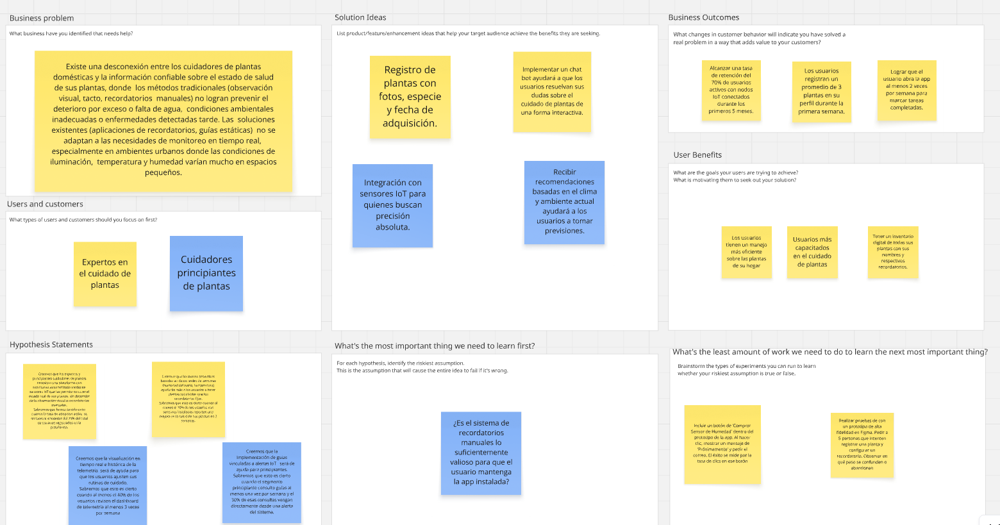

[Enlace al tablero en Miro](https://miro.com/app/board/uXjVHfgR13k=/?share_link_id=679214059458)

## 1.3. Segmentos objetivo

Según Revista Economía (2020), los peruanos realizaron más de 51 mil búsquedas online relacionadas a áreas verdes de enero a octubre del 2020. De las cuales un 66% eran de mantenimiento y mejora de jardines en el hogar. El 64% de las personas que realizaron estas búsquedas tenian entre 34 y 50 años. Ello nos indica que hay segmentos con poder adquisitivo dispuestos a adoptar soluciones tecnológicas que les faciliten el cuidado de sus espacios verdes.

### Principiantes cuidadores de plantas

Personas interesadas en iniciarse en el cuidado de plantas que buscan evitar el fracaso inicial mediante tecnología sencilla.

##### Características demográficas:

  - Edad: De 18 a 45 años.

  - Ubicación: Residentes de zonas urbanas (departamentos) con espacio limitado y poco conocimiento botánico.

  - Nivel socioeconómico: Medio. Valoran soluciones que les ahorren tiempo y dinero al evitar que sus plantas mueran.

  - Nivel educativo: Con conocimientos de tecnologia.

### Expertos cuidadores de plantas

Personas con amplia experiencia y colecciones botánicas que buscan optimizar el crecimiento de sus ejemplares mediante datos precisos.

#### Características demográficas:

- Edad: De 25 a 55 años.

- Ubicación: Residentes de áreas urbanas y suburbanas con espacios dedicados (terrazas o jardines interiores).

- Nivel socioeconómico: Medio a alto . Dispuestos a invertir en hardware (nodos IoT) para proteger plantas de alto valor o especies exóticas.

- Nivel educativo: Perfil tecnológico avanzado. Se sienten cómodos analizando gráficas de telemetría y comparando datos históricos.

# Capítulo II: Requirements Elicitation & Analysis

## 2.1. Competidores

En esta sección se identifican y describen los principales competidores del mercado. Se han seleccionado tres competidores que representan tanto el liderazgo en software de cuidado de plantas como la integración de hardware (IoT). permitiendo identificar las brechas tecnológicas que nuestra startup busca cubrir para poder identificar opotunidades y ofrecer una propuesta de valor unico.

### 2.1.1. Análisis competitivo

<table>
  <tr>
    <th colspan="5">Competitive Analysis Landscape</th>
  </tr>
  <tr>
    <td colspan="2" align="center"><b>¿Por qué llevar a cabo este análisis?</b></td>
    <td colspan="3">El objetivo es identificar las limitaciones de las aplicaciones de monitoreo actuales y comparar nuestra capacidad de automatización frente a los dispositivos IoT existentes, asegurando que nuestra integración de software y hardware sea superior en experiencia de usuario.</td>
  </tr>
  <tr>
    <th colspan="2">Nombre</th>
    <th>PlantSync</th>
    <th>Xiaomi Flower Care</th>
    <th>Planta App</th>
    <th>Vera: Plant Care Made Easy</th>
  </tr>
  <tr>
    <td colspan="2" align="center"><b>Logo</b></td>
    <td align="center">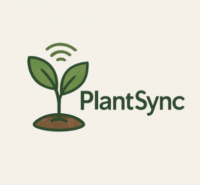</td>
    <td align="center"></td>
    <td align="center">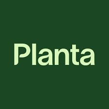</td>
    <td align="center"></td>
  </tr>
  <tr>
    <td rowspan="2"><b>Perfil</b></td>
    <td><b>Overview</b></td>
    <td>Sistema integral que combina sensores IoT y actuadores con una app móvil y chatbot para el cuidado de las plantas.</td>
    <td>Sensor físico que se inserta en la tierra para medir humedad, fertilidad, luz y temperatura, vinculado a una aplicación movil.</td>
    <td>Aplicación móvil de suscripción que ofrece guías detalladas, identificación y planes de cuidado personalizados.</td>
    <td>Herramienta de gestión de inventario de plantas con recordatorios de riego y seguimiento fotográfico.</td>
  </tr>
  <tr>
    <td><b>Ventaja competitiva ¿Qué valor ofrece a los clientes?</b></td>
    <td>Automatización activa, el sistema no solo avisa, sino que actúa mediante el ecosistema IoT y el uso de un asistencia inteligente para consultas sobre el cuidado.</td>
    <td>Precisión de datos gracias a hardware especializado y bajo costo de adquisición del sensor.</td>
    <td>Algoritmo de recomendación basado en la ubicación y condiciones climáticas locales del usuario.</td>
    <td>Interfaz sumamente intuitiva y fuerte enfoque en la documentación fotográfica del progreso de la planta.</td>
  </tr>
  <tr>
    <td rowspan="2"><b>Perfil de Marketing</b></td>
    <td><b>Mercado objetivo</b></td>
    <td>Personas que cuidan plantas en su hogar y principiantes que requieren asistencia constante.</td>
    <td>Usuarios avanzados en el cuidado de las plantas que requierne información más precisa y fans del ecosistema Xiaomi/Smart Home.</td>
    <td>Usuarios de smartphones que buscan una solución rápida de software sin comprar hardware extra.</td>
    <td>Cuidadores de plantas jovenes que priorizan la estética y el seguimiento visual.</td>
  </tr>
  <tr>
    <td><b>Estrategias de Marketing</b></td>
    <td>Marketing de contenidos sobre "Hogares Inteligentes" y colaboraciones con tiendas de plantas y tecnología.</td>
    <td>Distribución masiva en marketplaces globales (Amazon, AliExpress) y SEO basado en "Smart Garden".</td>
    <td>Publicidad en redes sociales (Instagram/TikTok) y modelo freemium agresivo.</td>
    <td>Marketing de comunidad y boca a boca en foros de entusiastas de la jardinería.</td>
  </tr>
  <tr>
    <td rowspan="3"><b>Perfil de Producto</b></td>
    <td><b>Productos &amp; Servicios</b></td>
    <td>App móvil, Sensor de temperatura y humedad, lámpara inteligente IoT y Chatbot de soporte</td>
    <td>Sensor físico y aplicación movil para observar la información del sensor</td>
    <td>App móvil con escáner de plantas y planes Premium.</td>
    <td>App móvil gratuita para gestión de tareas y recordatorios.</td>
  </tr>
  <tr>
    <td><b>Precios y Costos</b></td>
    <td>Kit inicial (Hardware + App) con suscripción opcional para funciones avanzadas del Chatbot.</td>
    <td>Pago único por el dispositivo físico ($15 - $25 USD aproximadamente).</td>
    <td>Descarga gratuita; suscripción Premium (mensual/anual) para funciones completas.</td>
    <td>Gratuito (Modelo basado en recolección de datos o futuras funciones premium).</td>
  </tr>
  <tr>
    <td><b>Canales de distribución (Web y/o Móvil)</b></td>
    <td>Venta directa vía Web, tiendas de tecnología y App Store / Play Store</td>
    <td>Distribuidores de electrónica, tiendas oficiales Xiaomi y plataformas de e-commerce.</td>
    <td>App Store y Google Play Store.</td>
    <td>App Store y Google Play Store.</td>
  </tr>
  <tr>
    <td rowspan="4"><b>Análisis SWOT</b></td>
    <td><b>Fortalezas</b></td>
    <td>El uso de sensores y actuadores, ademas de un asistente inteligente</td>
    <td>Hardware confiable, gran autonomía de batería, marca reconocida.</td>
    <td>Marca líder, comunidad enorme, excelente interfaz de usuario.</td>
    <td>Simplicidad de uso, enfoque en la experiencia emocional del usuario.</td>
  </tr>
  <tr>
    <td><b>Debilidades</b></td>
    <td>Dependencia de hardware, para la información de la planta.</td>
    <td>App con errores de traducción, limitada a la lectura de datos</td>
    <td>No tiene sensores físicos, impresición en la información.</td>
    <td>Funcionalidades limitadas; no ofrece consejos basados en datos reales del suelo.</td>
  </tr>
  <tr>
    <td><b>Oportunidades</b></td>
    <td>Crecimiento del mercado de Smart Homes en Latinoamérica.</td>
    <td>Expansión a sistemas de riego automático.</td>
    <td>Integración con dispositivos inteligentes de terceros.</td>
    <td>Alianzas para la venta de plantas desde la app.</td>
  </tr>
  <tr>
    <td><b>Amenazas</b></td>
    <td>Competidores con mayor capital podrían replicar la automatización IoT rápidamente.</td>
    <td>Problemas de compatibilidad con nuevas versiones de sistemas operativos.</td>
    <td>Saturación de apps de recordatorios en las tiendas virtuales.</td>
    <td>Pérdida de usuarios frente a apps con funciones más robustas.</td>
  </tr>
</table>

### 2.1.2. Estrategias y tácticas frente a competidores

**Afrontando las fortalezas de nuestros competidores**

Fortalezas de la competencia:

- Xiaomi: Bajo costo y precisión de hardware.

- Planta App: Base de datos masiva y reconocimiento de marca.

- Vera: Simplicidad y experiencia de usuario fluida.

Nuestras fortalezas:

- Nuestros componentes IoT son sensores y actuadores que nos permiten actuar ante un cambio.

- El uso de un chatbot ofrece una capa de interacción humana/IA que las otras apps no poseen de forma tan integrada.

Estrategias:

- Posicionarnos como la mejor solución del cuidado de plantas mediante el uso de sensores y actuadores IoT, que se diferencian de otras marcas.

- Fomentar la facilidad de instalación del hardware para competir con la simplicidad de otras aplicaciones.

Tácticas:

- Lanzar videos demostrativos que contrasten el uso de una aplicación que solo ayuda con recordadorios y otra que actua ante un cambio.

- Ofrecer durante tiempo limitado el uso del chatbot de manera gratuita.

**Afrontando las debilidades de nuestros competidores**

Debilidades clave de la competencia:

- Xiaomi: Falta de actuadores; solo informa pero el usuario debe estar presente para solucionar.

- Planta/Vera: Carencia de datos reales del entorno, confiando solo en estimaciones manuales.

Nuestras debilidades:

- Barrera de precio por el costo del hardware IoT.

Estrategias:

- Resaltar la presición de nuestro hardware de nuestra app frente a las estimaciones de las apps de solo software.

- Mitigar el costo del hardware mediante modelos de pago en cuotas o venta de kits separados, uno para la humedad, otro para temperatura, etc.

Tácticas:

- Realizar entrevistas para saber cual es el modelod pago ensencial para los consumidores para mitigar los costos del hardware.

- Publicar comparativas de salud de plantas usando sensores reales contra recordatorios de tareas sin metricas reales.

**Afrontando las oportunidades de nuestros competidores**

Oportunidades clave por competidor:

- Xiaomi Flower Care: Posibilidad de expandir su ecosistema hacia el riego automatizado aprovechando su infraestructura de Smart Home.

- Planta App: Capacidad de integrar su algoritmo con asistentes o sensores de terceros para combatir su falta de hardware.

- Vera: Plant Care Made Easy: Potencial para establecer alianzas exclusivas con grandes cadenas para la venta directa de plantas desde su interfaz.

Nuestras oportunidades:

- Liderar el nicho de automatización de tareas de cuidado de plantas en el hogar, algo que ninguno de los tres realiza actualmente.

- Convertirnos en el asistente inteligente de referencia para usuarios que buscan una solución automatizada mediante el chatbot y los actuadores.

Estrategias:

- Mientras los competidores solo pueden ver u observar o recordar, nosotros usamos actuadores para el entorno de la planta.

- Colaborar con viveros locales para posicionar el kit IoT como un producto de cuidado preventivo premium.

Tácticas:

- Lanzar campañas de marketing resaltando la funciones IoT como un factor de supervivencia único frente a las apps de solo recordatorios.

- Participar en eventos sobre el cuidado y venta de plantas para realizar presentaciones en vivo para los diferentes dueños de plantas en el hogar.

**Afrontando las amenazas de nuestros competidores**

Amenazas clave por competidor:

- Xiaomi Flower Care: Riesgo de pérdida de mercado si no actualizan la compatibilidad de su app con las nuevas versiones de sistemas operativos móviles (iOS/Android).

- Planta App: Saturación de su modelo de negocio debido a la aparición constante de aplicaciones gratuitas con funciones de escaneo similares.

- Vera: Plant Care Made Easy: Migración masiva de sus usuarios hacia plataformas con funciones más robustas y basadas en datos reales.

Nuestras amenazas:

- Ingreso de grandes tecnológicas con recursos masivos que puedan producir hardware similar a un precio mucho menor.

- Dificultad inicial de escalar la producción de dispositivos físicos en comparación con la escalabilidad inmediata de una app.

Estrategias:

- Crear una comunidad fuerte alrededor del cuidado de plantas que compita con los productos genericos de los competidores o compañias grandes

Tácticas:

- Implementar un sistema de fidelización gamificado para asegurar que el usuario se mantenga en nuestra plataforma a pesar de la aparición de alternativas gratuitas.

- Establecer contratos sólidos con proveedores de componentes IoT para asegurar el suministro y mantener precios competitivos frente a rivales internacionales.

## 2.2. Entrevistas

### 2.2.1. Diseño de entrevistas

**Entrevista para personas con experiencia como hobbista (años cuidando plantas en casa):**

**1.-** ¿Cuánto tiempo llevas cuidando plantas en tu hogar y qué motivó ese interés?

**2.-** ¿Qué dificultades principales enfrentas al momento de cuidar tus plantas?

**3.-** ¿Tienes alguna planta preferida o rutina que sigas con mayor frecuencia?

**4.-** ¿Acostumbras llevar un registro de los cuidados (riego, fertilización, etc.)? ¿De qué manera lo haces?

**5.-** ¿Has utilizado aplicaciones o blogs especializados para apoyarte en el cuidado de plantas?

**6.-** ¿Qué tan útil te parecería una herramienta que analice el clima de tu zona y sugiera cuidados personalizados?

**7.-** ¿Qué opinión tienes sobre una función que identifique plantas mediante fotografías?

**8.-** ¿Qué te parece la idea de usar una app que permita registrar y monitorear el estado de tus plantas mediante formularios visuales y predicciones (por ejemplo, seleccionar “hojas verdes” o “tierra húmeda” para recibir recomendaciones)?

**9.-** ¿Qué funcionalidades avanzadas te gustaría encontrar en una aplicación para mejorar tu experiencia cuidando plantas?

**10.-** ¿Pagarías por una suscripción que ofrezca beneficios adicionales para el cuidado de tus plantas?

**11.-** ¿Cómo te sentirías si pudieras automatizar algunos cuidados de tus plantas para mantener condiciones adecuadas sin tener que intervenir constantemente?

**12.-** ¿Qué tan útil te parecería contar con un sistema que reaccione por sí solo ante cambios en el ambiente para proteger tus plantas?

**Entrevista para personas con poca experiencia en el cuidado de plantas:**

**1.-** ¿Has tenido alguna vez una planta en casa? De ser así, ¿cómo fue esa experiencia?

**2.-** ¿Qué problemas o dificultades encuentras actualmente al cuidar plantas?

**3.-** ¿Te resulta complicado determinar la cantidad de agua, luz u otros cuidados necesarios? ¿Por qué?

**4.-** ¿Utilizas alguna aplicación, blog o comunidad en línea para orientarte? ¿Qué aspectos te agradan o desagradan de estas herramientas?

**5.-** ¿Te interesaría usar una aplicación que te envíe recordatorios y consejos básicos según el tipo de planta? ¿Por qué?

**6.-** ¿Te parecería útil una función que analice el clima local y brinde recomendaciones específicas? ¿Por qué?

**7.-** ¿Qué opinas de una herramienta que identifique plantas a partir de una foto? ¿La usarías?

**8.-** ¿Cómo percibirías una función que permita registrar el estado de la planta mediante opciones visuales y que, en base a ello, sugiera acciones?

**9.-** ¿Qué características avanzadas te gustaría que tenga una app para ayudarte en el cuidado de plantas (por ejemplo: detección de enfermedades, guías de trasplante, alertas inteligentes, etc.)?

**10.-** ¿Estarías dispuesto/a a pagar por funciones premium? ¿Qué debería ofrecer la aplicación para que consideres que vale la pena?

**11.-** ¿Qué tan cómodo/a te sentirías utilizando herramientas que ajusten automáticamente el entorno de tus plantas para ayudarte a mantenerlas en buen estado?

**12.-** ¿Te parecería útil que ciertos cuidados de tus plantas se realicen de forma automática para evitar errores o descuidos?

### 2.2.2. Registro de entrevistas

Se han realizado las entrevistas de acuerdo al diseño de preguntas. Se puede visualizar el video de las entrevistas en el siguiente link: https://1drv.ms/v/c/9fed6c4f629930aa/IQAYDCTdw01JQqxtd9UvgOK1AS-h7GujJ3JhC70KI1Xfn3I?e=P7c49p

Por motivos de almacenamiento, tuvimos que mantener por separado la entrevista 3, la cual se puede visualizar en el siguiente link: https://drive.google.com/drive/folders/1d0wVikpVQSXuzfDZE4gxl3loqMahencH

#### Expertos cuidadores de plantas:

<table cellpadding="8" cellspacing="0">
  <tbody>
    <tr>
      <td>Entrevista 1</td>
      <td>  </td>
    </tr>
    <tr>
      <td>Nombre Entrevistado</td>
      <td>Genaro Ledesma</td>
    </tr>
    <tr>
      <td>Edad</td>
      <td>23</td>
    </tr>
    <tr>
      <td>Distrito</td>
      <td>Lima Cercado</td>
    </tr>
    <tr>
      <td>Ocupacion</td>
      <td>Estudiante</td>
    </tr>
    <tr>
      <td>Duración Entrevista</td>
      <td>04:53</td>
    </tr>
    <tr>
      <td>Minuto de Inicio</td>
      <td>00:00 - 04:53</td>
    </tr>
        <tr>
      <td><strong>Resumen:</strong></td>
      <td>
        Genaro Ledesma (23), estudiante de ingeniería Civil en la UNMSM, con 7 años de experiencia, vive en Lima y busca profesionalizar el cuidado de sus plantas mediante tecnología. Aunque domina la inspección visual, enfrenta retos con las plagas, el clima inestable y el seguimiento de la fertilización. Le interesa integrar detección de hongos por IA y sistemas IoT para automatizar la humedad y luz, estando dispuesto a pagar por diagnósticos de alta precisión y contacto con especialistas para llevar su hobby al siguiente nivel.
      </td>
    </tr>
  </tbody>
</table>

<table cellpadding="8" cellspacing="0">
  <tbody>
    <tr>
      <td>Entrevista 2</td>
      <td>  </td>
    </tr>
    <tr>
      <td>Nombre Entrevistado</td>
      <td>Dione Ostos Guillén</td>
    </tr>
    <tr>
      <td>Edad</td>
      <td>60</td>
    </tr>
    <tr>
      <td>Distrito</td>
      <td>Lima</td>
    </tr>
    <tr>
      <td>Ocupacion</td>
      <td>Niñera</td>
    </tr>
    <tr>
      <td>Duración Entrevista</td>
      <td>06:41</td>
    </tr>
    <tr>
      <td>Minuto de Inicio</td>
      <td>04:54 - 11:34</td>
    </tr>
        <tr>
      <td><strong>Resumen:</strong></td>
      <td>
        Dione Ostos Guillén, una hobbista experta que trabaja como niñera y se interesa por cuidar plantas en maceta, tanto en hogares ajenos como en sus propios cultivos. Siembra flores y hortalizas (como lechuga), todo en macetas, y ha aprendido a manejar problemas como plagas, hongos y los efectos del exceso de riego. Su planta favorita es el jazmín por su aroma; utiliza abono orgánico y complementa su experiencia investigando sobre el cuidado y posibles daños en sus cultivos. Le resulta atractiva una app que explique cómo el clima afecta a las plantas y que pueda reconocer especies mediante fotos. También estaría dispuesta a pagar por un servicio que automatice el cuidado para ahorrar tiempo y mantener sus cultivos saludables.
      </td>
    </tr>
  </tbody>
</table>

<table cellpadding="8" cellspacing="0">
  <tbody>
    <tr>
      <td>Entrevista 3</td>
      <td>  </td>
    </tr>
    <tr>
      <td>Nombre Entrevistado</td>
      <td>Pedro Vargas</td>
    </tr>
    <tr>
      <td>Edad</td>
      <td>24</td>
    </tr>
    <tr>
      <td>Distrito</td>
      <td>Lima</td>
    </tr>
    <tr>
      <td>Ocupacion</td>
      <td>Estudiante</td>
    </tr>
    <tr>
      <td>Duración Entrevista</td>
      <td>09:21</td>
    </tr>
    <tr>
      <td>Minuto de Inicio</td>
      <td>20:58 - 30:17</td>
    </tr>
        <tr>
      <td><strong>Resumen:</strong></td>
      <td>
        Pedro Vargas, un joven de 24 años con una afición botánica heredada de su familia, experimenta incertidumbre al determinar los requerimientos específicos de riego y clima para cada especie, especialmente con su palto, al cual considera una planta difícil y sensible al exceso de agua. Actualmente gestiona sus cuidados de manera empírica e informal mediante un grupo de WhatsApp personal y tutoriales de YouTube, por lo que valora positivamente una herramienta que centralice el monitoreo visual y ofrezca recomendaciones personalizadas según su ubicación en Lima. Aunque disfruta del proceso manual por la tranquilidad que le brinda, se muestra abierto a la implementación de tecnología IoT y sugiere funciones innovadoras como barreras automatizadas contra el viento para proteger brotes delicados. Finalmente, pese a ser reacio a las suscripciones digitales, estaría dispuesto a realizar pagos eventuales por asesoría avanzada en nutrientes y predicciones climáticas si esto le garantiza la salud de sus plantas más complejas.
      </td>
    </tr>
  </tbody>
</table>

#### Principiantes cuidadores de plantas:

<table cellpadding="8" cellspacing="0">
  <tbody>
    <tr>
      <td>Entrevista 4</td>
      <td>  </td>
    </tr>
    <tr>
      <td>Nombre Entrevistado</td>
      <td>Melany Paitan</td>
    </tr>
    <tr>
      <td>Edad</td>
      <td>22</td>
    </tr>
    <tr>
      <td>Distrito</td>
      <td>Lima Cercado</td>
    </tr>
    <tr>
      <td>Ocupacion</td>
      <td>Estudiante</td>
    </tr>
    <tr>
      <td>Duración Entrevista</td>
      <td>04:33</td>
    </tr>
    <tr>
      <td>Minuto de Inicio</td>
      <td>11:35 - 16:07</td>
    </tr>
        <tr>
      <td><strong>Resumen:</strong></td>
      <td>
        Melany Paitan (22), estudiante de derecho en la PUCP, cuidadora de plantas principiante con dificultades en la gestión del tiempo y falta de conocimiento técnico, lo que afecta la supervivencia de sus plantas. Busca un sistema de seguimiento claro mediante notificaciones móviles y alertas preventivas basadas en el clima. Debido a su interés en la domótica y la IA, valora la automatización total a través de sensores para garantizar el cuidado óptimo sin depender de su memoria, mostrando disposición a usar herramientas avanzadas para diagnósticos rápidos y efectivos.
      </td>
    </tr>
  </tbody>
</table>

<table cellpadding="8" cellspacing="0">
  <tbody>
    <tr>
      <td>Entrevista 5</td>
      <td>  </td>
    </tr>
    <tr>
      <td>Nombre Entrevistado</td>
      <td>Josue Paiva</td>
    </tr>
    <tr>
      <td>Edad</td>
      <td>23</td>
    </tr>
    <tr>
      <td>Distrito</td>
      <td>Lima</td>
    </tr>
    <tr>
      <td>Ocupacion</td>
      <td>Estudiante</td>
    </tr>
    <tr>
      <td>Duración Entrevista</td>
      <td>04:50</td>
    </tr>
    <tr>
      <td>Minuto de Inicio</td>
      <td>16:08 - 20:57</td>
    </tr>
        <tr>
      <td><strong>Resumen:</strong></td>
      <td>
        Josué Paiva (23), estudiante de Ingeniería de Software en la UPC, cuida como hobby 10 plantas del hogar que pertenecen a su madre y están distribuidas por distintas zonas de la casa. Su mayor dificultad es recordar qué necesita cada planta y en qué momento, lo que le hace perder tiempo desplazándose y a veces cometer errores. Para organizarse usa una app de notas y alarmas, aunque requiere configurar varios recordatorios para no olvidarse. Considera muy acertada la idea de identificar la planta y conocer sus cuidados con solo tomarle una foto, y cree que incluir información del clima le ayudaría a decidir si conviene sacarla al exterior. Estaría dispuesto a pagar si el servicio realmente le brinda recomendaciones que mejoren la vitalidad de sus plantas y le interesa explorar opciones con tecnología IoT para automatizar el cuidado.
      </td>
    </tr>
  </tbody>
</table>

<table cellpadding="8" cellspacing="0">
  <tbody>
    <tr>
      <td>Entrevista 6</td>
      <td>  </td>
    </tr>
    <tr>
      <td>Nombre Entrevistado</td>
      <td>Marcelo Barrientos</td>
    </tr>
    <tr>
      <td>Edad</td>
      <td>21</td>
    </tr>
    <tr>
      <td>Distrito</td>
      <td>Lima</td>
    </tr>
    <tr>
      <td>Ocupacion</td>
      <td>Estudiante</td>
    </tr>
    <tr>
      <td>Duración Entrevista</td>
      <td>09:52</td>
    </tr>
    <tr>
      <td>Minuto de Inicio</td>
      <td>00:00 - 09:52 (link separado por problemas de almacenamiento)</td>
    </tr>
        <tr>
      <td><strong>Resumen:</strong></td>
      <td>
        Marcelo Barrientos, el cual se le pregunta acerca de que tan beneficioso seria para el una aplicación tecnológica relacionada con la agricultura o el cultivo, posiblemente enfocada en el análisis de imágenes (fotos) para diagnosticar problemas en plantas, recomendar soluciones y facilitar el control automático mediante sensores y retroalimentación.
      </td>
    </tr>
  </tbody>
</table>

### 2.2.3. Análisis de entrevistas

**Análisis de entrevista para expertos cuidadores de plantas:**

Este segmento, integrado por personas de entre 21 y 60 años con una vasta experiencia heredada o desarrollada recientemente, mantiene sus plantas mediante rutinas diarias sin el uso de aplicaciones, aunque reconoce dificultades para gestionar la personalización en colecciones amplias. Existe un interés unánime en adoptar soluciones digitales que ofrezcan registros y recordatorios, destacando de manera especial la utilidad de herramientas que permitan automatizar parámetros como la luz artificial o la humedad ambiental. Para estos aficionados, el hecho de que un sistema pueda reaccionar de forma autónoma ante cambios climáticos extremos representa un nivel de seguridad superior y una ayuda imprescindible para la protección de sus ejemplares más delicados. Por esta razón, muestran una disposición total a pagar por una suscripción que optimice sus tareas y garantice la salud de sus plantas mediante este tipo de asistencia tecnológica.

**Análisis de entrevista para principiantes cuidadores de plantas:**

Los cuidadores principiantes, con edades entre 21 y 23 años, se encuentran en una etapa de aprendizaje marcada por la iniciativa personal y la pérdida de plantas debido a errores comunes como el exceso de riego. Ante la carencia de conocimientos técnicos, este grupo busca guías simples y se muestra sumamente interesado en la incorporación de herramientas que ajusten automáticamente el entorno de sus plantas para evitar descuidos. Se sienten muy cómodos delegando funciones a sistemas que actúen por sí solos, ya que ven en la automatización una forma eficaz de asegurar que sus plantas reciban exactamente lo que necesitan sin tener que depender de su propia memoria o experiencia. Debido a su deseo de evitar fallos y sentirse acompañados en el proceso, están totalmente dispuestos a invertir en una plataforma que sea clara y que facilite el cuidado botánico a través de estas funciones automáticas.

## 2.3. Needfinding

Después de realizar las entrevistas y detectar los problemas, necesidades y expectativas del público objetivo, se procede a construir los User Persona y otros elementos relacionados con la experiencia del usuario antes de interactuar con la solución propuesta.

### 2.3.1. User Personas

Para desarrollar estos artefactos se consideraron factores como edad, ocupación, ubicación, intereses y frustraciones de los entrevistados. Estos perfiles reflejan usuarios reales que desean incorporar plantas en su rutina diaria, pero requieren orientación clara y soluciones acordes a su estilo de vida. A continuación, se presentan los User Persona definidos.

- #### User Persona: Interesados en comenzar a cuidar plantas
  

- #### User Persona: Personas con experiencia en el cuidado de plantas
  

### 2.3.2. User Task Matrix

En esta sección se construye la User Task Matrix considerando los dos segmentos definidos y vinculados a los User Persona. Se analizan perfiles como estudiantes universitarios que buscan adquirir experiencia y gerentes interesados en incorporar talento joven para sus proyectos.

<table border="1" cellpadding="8" cellspacing="0" style="border-collapse: collapse; text-align: center; width: 100%;">
  <thead>
    <tr>
      <th rowspan="2">Tarea</th>
      <th colspan="2">Experto</th>
      <th colspan="2">Persona sin experiencia</th>
    </tr>
    <tr>
      <th>Frecuencia</th>
      <th>Importancia</th>
      <th>Frecuencia</th>
      <th>Importancia</th>
    </tr>
  </thead>
  <tbody>
    <tr>
      <td>Adquirir nuevas plantas</td>
      <td>Sometimes</td>
      <td>Medium</td>
      <td>Rarely</td>
      <td>Low</td>
    </tr>
    <tr>
      <td>Ajustar los cuidados de acuerdo al clima</td>
      <td>Sometimes</td>
      <td>Medium</td>
      <td>Never</td>
      <td>Low</td>
    </tr>
    <tr>
      <td>Registrar todas las actividades de cuidado</td>
      <td>Sometimes</td>
      <td>High</td>
      <td>Never</td>
      <td>Low</td>
    </tr>
    <tr>
      <td>Evaluar el estado de salud de sus plantas</td>
      <td>Often</td>
      <td>High</td>
      <td>Rarely</td>
      <td>Medium</td>
    </tr>
    <tr>
      <td>Comprar los insumos para el cuidado</td>
      <td>Sometimes</td>
      <td>Medium</td>
      <td>Rarely</td>
      <td>Low</td>
    </tr>
    <tr>
      <td>Consultar guías o videos sobre plantas</td>
      <td>Rarely</td>
      <td>Medium</td>
      <td>Often</td>
      <td>High</td>
    </tr>
    <tr>
      <td>Decorar su habitación con plantas</td>
      <td>Rarely</td>
      <td>Low</td>
      <td>Medium</td>
      <td>High</td>
    </tr>
    <tr>
      <td>Preguntar por consejos a sus conocidos</td>
      <td>Rarely</td>
      <td>Low</td>
      <td>Sometimes</td>
      <td>Medium</td>
    </tr>
    <tr>
      <td>Buscar soluciones digitales de apoyo</td>
      <td>Sometimes</td>
      <td>Medium</td>
      <td>Sometimes</td>
      <td>High</td>
    </tr>
    <tr>
      <td>Tomar fotos para seguimiento del crecimiento</td>
      <td>Sometimes</td>
      <td>Low</td>
      <td>Sometimes</td>
      <td>Medium</td>
    </tr>
  </tbody>
</table>

A partir de esta matriz se pueden extraer las siguientes conclusiones sobre las actividades de los User Persona:

- Para el usuario con experiencia, las tareas más relevantes son evaluar la salud de sus plantas y llevar un registro de los cuidados. En contraste, el usuario principiante se enfoca más en aprender y en encontrar herramientas digitales de apoyo.

- Ambos perfiles coinciden en su interés por documentar el crecimiento mediante fotografías y en la búsqueda de soluciones tecnológicas que faciliten el cuidado.

- Las diferencias se evidencian en el nivel de experiencia: el usuario experto dedica más tiempo a monitorear y mantener un plan estructurado, mientras que el principiante prioriza el aprendizaje y valora más el aspecto estético de las plantas.

### 2.3.3. User Journey Mapping
#### Journey principiante
Este mapa muestra el recorrido de una persona con poca experiencia en jardinería que compra plantas para decorar su hogar y descubre que se deterioran sin entender por qué. A través de las etapas Aware, Join, Use, Develop y Leave se ilustran sus objetivos, acciones, problemas y emociones al buscar información en internet, probar consejos y, eventualmente, apoyarse en una solución digital que le ofrezca recordatorios y recomendaciones simples para mantener sus plantas sanas.

  

#### Journey experto
Este mapa representa el recorrido de un cuidador de plantas con varios años de experiencia y una colección amplia, que comienza a sentir límites al gestionar muchas especies con necesidades distintas. En las etapas Aware, Join, Use, Develop y Leave se detallan sus motivaciones, procesos, dificultades y emociones al investigar soluciones más avanzadas, registrar y analizar datos de sus plantas y evaluar si una herramienta digital le aporta suficiente valor para optimizar y profesionalizar su rutina de cuidado.

  

### 2.3.4. Empathy Mapping
#### Segmento 1 — Principiante cuidador de plantas

A continuación se presenta el mapa de empatía correspondiente al segmento de principiantes, representado por Alejandro Flores, joven de 20 años de Chorrillos, Lima, quien se inició en el cuidado de plantas en 2025 sin conocimientos previos ni herramientas de apoyo.

  

#### Segmento 2 — Experto cuidador de plantas
A continuación se presenta el mapa de empatía correspondiente al segmento de expertos, representado por Leonor Gonzales, cuidadora de 60 años de San Miguel, Lima, con más de 6 años de experiencia en jardinería doméstica y una amplia colección de plantas que gestiona sin ningún sistema de registro formal.

  

## 2.4. Big Picture EventStorming
A continuación se presenta el Big Picture Event Storming correspondiente al segmento de principiantes, representado por Alejandro Flores, mostrando el flujo de eventos del dominio desde el momento en que detecta el deterioro de su planta hasta que establece una rutina de cuidado sostenida con el apoyo de BioPafi.

  

A continuación se presenta el Big Picture Event Storming correspondiente al segmento de expertos, representado por Leonor Gonzales, mostrando el flujo de eventos del dominio desde que identifica los límites de gestionar su colección por memoria hasta que sistematiza y optimiza sus rutinas de cuidado mediante análisis histórico en BioPafi.

  

## 2.5. Ubiquitous Language
<table>
  <thead>
    <tr>
      <th>Término</th>
      <th>Tipo</th>
      <th>Definición en el dominio de BioPafi</th>
      <th>Ejemplo de uso</th>
    </tr>
  </thead>
  <tbody>
    <tr>
      <td><strong>Planta Registrada / Plant Registry</strong></td>
      <td>Dominio</td>
      <td>Funcionalidad que permite a los usuarios registrar sus plantas ingresando datos como nombre, especie, fecha de adquisición y condiciones del entorno.</td>
      <td>"El usuario tiene 4 plantas registradas: 2 interiores y 2 exteriores."</td>
    </tr>
    <tr>
      <td><strong>Sensor IoT / Nodo IoT</strong></td>
      <td>Sistema</td>
      <td>Dispositivo físico instalado en la maceta que captura humedad del suelo, temperatura y humedad ambiental, enviando lecturas periódicas a BioPafi.</td>
      <td>"El nodo IoT reportó humedad crítica al 18%."</td>
    </tr>
    <tr>
      <td><strong>Lectura de Sensor</strong></td>
      <td>Sistema</td>
      <td>Conjunto de valores capturados por el sensor en un instante: humedad del suelo, temperatura, humedad ambiental y timestamp.</td>
      <td><code>{humedad: 22%, temp: 26°C, ts: 21/04/2026 08:00}</code></td>
    </tr>
    <tr>
      <td><strong>Alerta de Cuidado / Care Reminders</strong></td>
      <td>Evento</td>
      <td>Sistema de notificaciones que alerta a los usuarios sobre tareas pendientes de cuidado como riego, fertilización y cambios de sustrato.</td>
      <td>"Tu Pothos necesita riego: humedad del suelo al 22%."</td>
    </tr>
    <tr>
      <td><strong>Estado de Salud / Plant Health Monitoring</strong></td>
      <td>Dominio</td>
      <td>Seguimiento automático del estado de salud de las plantas basado en reportes del usuario, fotos y datos ambientales proporcionados. Representado visualmente como: Óptimo / En riesgo / Crítico.</td>
      <td>"Estado de salud: Crítico — humedad bajo el umbral mínimo."</td>
    </tr>
    <tr>
      <td><strong>Historial de Cuidados</strong></td>
      <td>Dominio</td>
      <td>Registro cronológico de todas las acciones realizadas sobre una planta y las lecturas históricas del sensor asociado.</td>
      <td>"Esta planta fue regada 3 veces en los últimos 10 días."</td>
    </tr>
    <tr>
      <td><strong>Recomendación Personalizada / Adaptive Care Recommendations</strong></td>
      <td>Sistema</td>
      <td>Sugerencias personalizadas de cuidado generadas dinámicamente según la especie de la planta, las condiciones reportadas y los cambios ambientales detectados.</td>
      <td>"Con 28°C y humedad baja, mueve tu helecho a sombra parcial."</td>
    </tr>
    <tr>
      <td><strong>Identificación de Planta / Plant Identification</strong></td>
      <td>Sistema</td>
      <td>Funcionalidad que permite reconocer especies de plantas mediante fotografías, usando algoritmos de análisis de imagen.</td>
      <td>"El sistema identificó la planta como Ficus lyrata y mostró su guía de cuidado."</td>
    </tr>
    <tr>
      <td><strong>Clima Local</strong></td>
      <td>Sistema</td>
      <td>Datos de temperatura y humedad ambiental obtenidos de una API externa para ajustar dinámicamente las recomendaciones de cuidado.</td>
      <td>"BioPafi detectó 30°C en Lima y ajustó la frecuencia de riego."</td>
    </tr>
    <tr>
      <td><strong>Usuario Principiante</strong></td>
      <td>Actor</td>
      <td>Segmento con poca experiencia. Necesita guías visuales paso a paso y recordatorios automáticos para evitar errores básicos.</td>
      <td>Alejandro, 20 años, Chorrillos. Perdió su primera planta por exceso de riego.</td>
    </tr>
    <tr>
      <td><strong>Usuario Experto</strong></td>
      <td>Actor</td>
      <td>Segmento con amplia experiencia. Busca sistematizar una colección extensa mediante datos históricos y análisis avanzado.</td>
      <td>Leonor, 60 años, San Miguel. Gestiona más de 10 especies sin registro formal.</td>
    </tr>
    <tr>
      <td><strong>Regla de Cuidado</strong></td>
      <td>Política</td>
      <td>Condición que dispara automáticamente una alerta cuando un valor del sensor supera o cae por debajo de un umbral definido para la especie.</td>
      <td>"Si humedad &lt; 25% en Pothos → generar alerta de riego."</td>
    </tr>
  </tbody>
</table>

# Capítulo III: Requirements Specification

## 3.1. User Stories

<table border="1">
  <tbody>
    <tr>
      <td><strong>Epic / Story ID</strong></td>
      <td><strong>Título</strong></td>
      <td><strong>Descripción</strong></td>
      <td><strong>Criterios de Aceptación</strong></td>
      <td><strong>Relación con Epic</strong></td>
    </tr>
    <tr>
      <td>EP01</td>
      <td>Presencia Digital y Conversión</td>
      <td>
        <strong>Como</strong> visitante o cliente potencial, <strong>quiero</strong> explorar una página de aterrizaje informativa y confiable, <strong>para</strong> entender los beneficios del sistema y registrarme fácilmente en la plataforma.
      </td>
      <td>No corresponde</td>
      <td>No corresponde</td>
    </tr>
    <tr>
      <td>EP02</td>
      <td>Gestión de Identidad y Perfil de Usuario</td>
      <td>
        <strong>Como</strong> usuario de la plataforma, <strong>quiero</strong> gestionar mi identidad, seguridad y personalizar la interfaz, <strong>para</strong> tener una experiencia de uso cómoda y visualizar mis estadísticas personales.
      </td>
      <td>No corresponde</td>
      <td>No corresponde</td>
    </tr>
    <tr>
      <td>EP03</td>
      <td>Gestión del Inventario Botánico</td>
      <td>
        <strong>Como</strong> cuidador de plantas, <strong>quiero</strong> registrar, editar y documentar visualmente el ciclo de vida de mis plantas, <strong>para</strong> mantener un inventario botánico digital organizado.
      </td>
      <td>No corresponde</td>
      <td>No corresponde</td>
    </tr>
    <tr>
      <td>EP04</td>
      <td>Integración IoT y Monitoreo de Variables</td>
      <td>
        <strong>Como</strong> usuario con hardware IoT, <strong>quiero</strong> vincular mis sensores y actuadores a la aplicación, <strong>para</strong> monitorear las métricas ambientales y automatizar el entorno físico de mis plantas.
      </td>
      <td>No corresponde</td>
      <td>No corresponde</td>
    </tr>
    <tr>
      <td>EP05</td>
      <td>Planificación y Registro de Cuidados</td>
      <td>
        <strong>Como</strong> usuario, <strong>quiero</strong> programar recordatorios automáticos y registrar el historial de mis acciones manuales, <strong>para</strong> planificar adecuadamente los cuidados y no olvidar ninguna tarea.
      </td>
      <td>No corresponde</td>
      <td>No corresponde</td>
    </tr>
    <tr>
      <td>EP06</td>
      <td>Inteligencia Botánica y Análisis Externo</td>
      <td>
        <strong>Como</strong> usuario, <strong>quiero</strong> recibir asesoría de un asistente inteligente y consultar datos climáticos locales, <strong>para</strong> obtener recomendaciones expertas y personalizadas según cada especie.
      </td>
      <td>No corresponde</td>
      <td>No corresponde</td>
    </tr>
    <tr>
      <td>US01</td>
      <td>Visualización de beneficios botánicos en el Landing Page</td>
      <td>
        <strong>Como</strong> visitante, <strong>quiero</strong> visualizar una sección informativa sobre los beneficios psicológicos del cuidado de plantas, <strong>para</strong> motivarme a adquirir la solución.
      </td>
      <td>
        <strong>Escenario 1: Acceso a información de bienestar.</strong> 
        <strong>Dado que</strong> el visitante se encuentra en la página de inicio, <strong>cuando</strong> navega hacia la sección de beneficios, <strong>entonces</strong> el sistema muestra los datos de salud mental y reducción de estrés vinculados a la horticultura.
      </td>
      <td>EP01</td>
    </tr>
    <tr>
      <td>US02</td>
      <td>Vinculación de dispositivo IoT con la cuenta</td>
      <td>
        <strong>Como</strong> usuario, <strong>quiero</strong> vincular mi dispositivo físico con mi cuenta en la aplicación móvil, <strong>para</strong> visualizar los datos capturados de forma privada y exclusiva.
      </td>
      <td>
        <strong>Escenario 1: Asociación exitosa de hardware.</strong> 
        <strong>Dado que</strong> el usuario ha iniciado sesión en la aplicación, <strong>cuando</strong> ingresa el identificador único de su kit IoT, <strong>entonces</strong> el sistema vincula el dispositivo a su perfil y confirma la conexión.
      </td>
      <td>EP04</td>
    </tr>
    <tr>
      <td>US03</td>
      <td>Notificación de activación de actuador</td>
      <td>
        <strong>Como</strong> entusiasta del cuidado de plantas, <strong>quiero</strong> recibir una notificación en tiempo real cuando la luz UV se encienda, <strong>para</strong> estar al tanto del soporte que recibe mi planta.
      </td>
      <td>
        <strong>Escenario 1: Envío exitoso de alerta.</strong> 
        <strong>Dado que</strong> el sistema detecta un nivel de luz inferior al umbral, <strong>cuando</strong> el actuador activa la iluminación UV, <strong>entonces</strong> el sistema envía una notificación push al dispositivo móvil del usuario.
      </td>
      <td>EP04</td>
    </tr>
    <tr>
      <td>US04</td>
      <td>Redirección a plataformas desde el Landing Page</td>
      <td>
        <strong>Como</strong> visitante, <strong>quiero</strong> encontrar enlaces directos a la aplicación web y a las tiendas de descarga móvil, <strong>para</strong> acceder a las herramientas de gestión botánica.
      </td>
      <td>
        <strong>Escenario 1: Uso de Call-to-Action (CTA).</strong> 
        <strong>Dado que</strong> el visitante se encuentra en el Landing Page, <strong>cuando</strong> selecciona el botón de "Acceder a la plataforma" o "Descargar App", <strong>entonces</strong> el sistema le redirige al punto de acceso correspondiente.
      </td>
      <td>EP01</td>
    </tr>
    <tr>
      <td>US05</td>
      <td>Registro de métricas de sensores</td>
      <td>
        <strong>Como</strong> Developer, <strong>quiero</strong> implementar un endpoint que reciba y almacene los datos de luminosidad enviados por el dispositivo IoT, <strong>para</strong> asegurar la persistencia de la información.
      </td>
      <td>
        <strong>Escenario 1: Recepción de datos IoT.</strong> 
        <strong>Dado que</strong> el dispositivo IoT tiene conexión a internet, <strong>cuando</strong> envía un request HTTP POST con el valor de luminosidad al endpoint, <strong>entonces</strong> el sistema responde con un status 201 y registra el dato.
      </td>
      <td>EP04</td>
    </tr>
    <tr>
      <td>US06</td>
      <td>Registro de nueva planta desde la app móvil</td>
      <td>
        <strong>Como</strong> usuario, <strong>quiero</strong> registrar una nueva planta ingresando su nombre, especie y ubicación, <strong>para</strong> comenzar a monitorear su cuidado desde la aplicación.
      </td>
      <td>
        <strong>Escenario 1: Registro exitoso de planta.</strong> 
        <strong>Dado que</strong> el usuario ha iniciado sesión, <strong>cuando</strong> completa el formulario de registro con nombre, especie y ubicación, <strong>entonces</strong> el sistema guarda la planta y la muestra en el dashboard.  
        <strong>Escenario 2: Campos obligatorios incompletos.</strong> 
        <strong>Dado que</strong> el usuario intenta registrar una planta, <strong>cuando</strong> deja el campo de especie vacío, <strong>entonces</strong> el sistema muestra un mensaje de validación y no procesa el registro.
      </td>
      <td>EP03</td>
    </tr>
    <tr>
      <td>US07</td>
      <td>Visualización del historial de cuidados</td>
      <td>
        <strong>Como</strong> usuario, <strong>quiero</strong> consultar el historial de acciones realizadas sobre cada una de mis plantas, <strong>para</strong> identificar patrones y mejorar mis rutinas de cuidado.
      </td>
      <td>
        <strong>Escenario 1: Acceso al historial.</strong> 
        <strong>Dado que</strong> el usuario se encuentra en el detalle de una planta, <strong>cuando</strong> selecciona la opción "Ver historial", <strong>entonces</strong> el sistema muestra una lista cronológica de las acciones registradas.  
        <strong>Escenario 2: Historial vacío.</strong> 
        <strong>Dado que</strong> el usuario accede al historial de una planta recién registrada, <strong>cuando</strong> no existe ninguna acción previa, <strong>entonces</strong> el sistema muestra un mensaje indicando que aún no hay cuidados registrados.
      </td>
      <td>EP05</td>
    </tr>
    <tr>
      <td>US08</td>
      <td>Monitoreo de Humedad de Tierra</td>
      <td>
        <strong>Como</strong> usuario, <strong>quiero</strong> ver el porcentaje de humedad del suelo, <strong>para</strong> saber si la tierra está seca.
      </td>
      <td>
        <strong>Escenario 1: Visualización de humedad.</strong> 
        <strong>Dado que</strong> el sensor de humedad envía datos, <strong>cuando</strong> el usuario abre la app, <strong>entonces</strong> visualiza el porcentaje real de agua en el sustrato.
      </td>
      <td>EP04</td>
    </tr>
    <tr>
      <td>US09</td>
      <td>Registro manual de acción de cuidado</td>
      <td>
        <strong>Como</strong> usuario, <strong>quiero</strong> registrar manualmente una acción de cuidado, <strong>para</strong> mantener el historial actualizado aunque no cuente con sensor IoT activo.
      </td>
      <td>
        <strong>Escenario 1: Registro exitoso.</strong> 
        <strong>Dado que</strong> el usuario se encuentra en el detalle de una planta, <strong>cuando</strong> selecciona "Registrar cuidado", elige el tipo de acción y confirma, <strong>entonces</strong> el sistema lo agrega al historial.  
        <strong>Escenario 2: Acción duplicada.</strong> 
        <strong>Dado que</strong> el usuario ya registró un riego hoy, <strong>cuando</strong> intenta registrar la misma acción nuevamente, <strong>entonces</strong> el sistema muestra una advertencia solicitando confirmación.
      </td>
      <td>EP05</td>
    </tr>
    <tr>
      <td>US10</td>
      <td>Integración de API de IA</td>
      <td>
        <strong>Como</strong> Developer, <strong>quiero</strong> conectar un LLM al backend, <strong>para</strong> procesar consultas botánicas.
      </td>
      <td>
        <strong>Escenario 1: Recomendación generada exitosamente.</strong> 
        <strong>Dado que</strong> el usuario envía un mensaje, <strong>cuando</strong> el backend procesa la solicitud, <strong>entonces</strong> el sistema retorna una respuesta coherente basada en conocimiento botánico.
      </td>
      <td>EP06</td>
    </tr>
    <tr>
      <td>US11</td>
      <td>Subir fotos de una planta</td>
      <td>
        <strong>Como</strong> usuario, <strong>quiero</strong> subir una imagen de una planta a lo largo del tiempo, <strong>para</strong> saber qué planta es.
      </td>
      <td>
        <strong>Escenario 1: Foto añadida.</strong> 
        <strong>Dado que</strong> el usuario selecciona una foto, <strong>cuando</strong> se procesa el archivo, <strong>entonces</strong> el sistema la carga y muestra la imagen de la planta.
      </td>
      <td>EP03</td>
    </tr>
    <tr>
      <td>US12</td>
      <td>Eliminación de planta</td>
      <td>
        <strong>Como</strong> usuario, <strong>quiero</strong> eliminar una planta de mi lista, <strong>para</strong> quitar aquellas que ya no tengo o que se han perdido.
      </td>
      <td>
        <strong>Escenario 1: Eliminación confirmada.</strong> 
        <strong>Dado que</strong> el usuario solicitó eliminar la planta, <strong>cuando</strong> confirma la acción, <strong>entonces</strong> el sistema elimina la planta y muestra: "Planta eliminada correctamente".  
        <strong>Escenario 2: Cancelación de eliminación.</strong> 
        <strong>Dado que</strong> el usuario es consultado sobre la eliminación, <strong>cuando</strong> cancela la acción, <strong>entonces</strong> el sistema no realiza cambios.
      </td>
      <td>EP03</td>
    </tr>
    <tr>
      <td>US13</td>
      <td>Inicio sesión de usuario</td>
      <td>
        <strong>Como</strong> usuario registrado, <strong>quiero</strong> iniciar sesión con mi correo y contraseña, <strong>para</strong> acceder a mi cuenta y mis plantas monitoreadas.
      </td>
      <td>
        <strong>Escenario 1: Inicio de sesión exitoso.</strong> 
        <strong>Dado que</strong> el usuario ingresó credenciales correctas, <strong>cuando</strong> presiona "Iniciar sesión", <strong>entonces</strong> el sistema lo redirige a su panel principal.  
        <strong>Escenario 2: Credenciales incorrectas.</strong> 
        <strong>Dado que</strong> el usuario ingresó mal sus datos, <strong>cuando</strong> presiona "Iniciar sesión", <strong>entonces</strong> el sistema muestra: "Correo o contraseña incorrectos".  
        <strong>Escenario 3: Campos vacíos.</strong> 
        <strong>Dado que</strong> el usuario dejó campos vacíos, <strong>cuando</strong> intenta iniciar sesión, <strong>entonces</strong> el sistema muestra: "Por favor, completa todos los campos".
      </td>
      <td>EP02</td>
    </tr>
    <tr>
      <td>US14</td>
      <td>Registrarse en la app</td>
      <td>
        <strong>Como</strong> usuario, <strong>quiero</strong> registrarme en la app, <strong>para</strong> crear mi cuenta y acceder a sus funcionalidades.
      </td>
      <td>
        <strong>Escenario 1: Registro exitoso.</strong> 
        <strong>Dado que</strong> el usuario se encuentra en la pantalla de registro, <strong>cuando</strong> completa los datos requeridos y pulsa "Registrarse", <strong>entonces</strong> el sistema debe crear una cuenta nueva y mostrarle la pantalla principal.
      </td>
      <td>EP02</td>
    </tr>
    <tr>
      <td>US15</td>
      <td>Edición de datos personales</td>
      <td>
        <strong>Como</strong> usuario registrado, <strong>quiero</strong> poder actualizar mis datos personales, <strong>para</strong> mantener mi perfil al día con mi información actual.
      </td>
      <td>
        <strong>Escenario 1: Visualización de datos.</strong> 
        <strong>Dado que</strong> el usuario ha iniciado sesión, <strong>cuando</strong> accede a la sección de perfil, <strong>entonces</strong> el sistema debe mostrar los datos actuales en campos editables.  
        <strong>Escenario 2: Actualización exitosa.</strong> 
        <strong>Dado que</strong> el usuario ha editado su información, <strong>cuando</strong> hace clic en "Guardar cambios", <strong>entonces</strong> el sistema valida los campos y actualiza la base de datos.
      </td>
      <td>EP02</td>
    </tr>
    <tr>
      <td>US16</td>
      <td>Edición de datos de planta</td>
      <td>
        <strong>Como</strong> usuario que cuida plantas, <strong>quiero</strong> editar la información de una planta registrada, <strong>para</strong> actualizar datos como su nombre, tipo o imagen.
      </td>
      <td>
        <strong>Escenario 1: Edición exitosa.</strong> 
        <strong>Dado que</strong> el usuario accedió a los datos de la planta, <strong>cuando</strong> cambió los datos y guardó, <strong>entonces</strong> el sistema muestra: "Datos de la planta actualizados correctamente".
      </td>
      <td>EP03</td>
    </tr>
    <tr>
      <td>US17</td>
      <td>Modo oscuro en la interfaz</td>
      <td>
        <strong>Como</strong> usuario, <strong>quiero</strong> activar el modo oscuro, <strong>para</strong> usar la aplicación en ambientes con poca luz.
      </td>
      <td>
        <strong>Escenario 1: Tema aplicado.</strong> 
        <strong>Dado que</strong> la opción está disponible en configuración, <strong>cuando</strong> el usuario activa el modo oscuro, <strong>entonces</strong> el sistema cambia la interfaz a colores oscuros inmediatamente.
      </td>
      <td>EP02</td>
    </tr>
    <tr>
      <td>US18</td>
      <td>Comparar planes de suscripción</td>
      <td>
        <strong>Como</strong> visitante de la landing page, <strong>quiero</strong> comparar fácilmente los planes de suscripción, <strong>para</strong> elegir el que mejor se ajuste a mis necesidades.
      </td>
      <td>
        <strong>Escenario 1: Comparación de planes.</strong> 
        <strong>Dado que</strong> el visitante se encuentra en la landing page, <strong>cuando</strong> se desplaza hasta la sección de planes, <strong>entonces</strong> debe visualizar claramente los distintos planes de suscripción con sus características.
      </td>
      <td>EP01</td>
    </tr>
    <tr>
      <td>US19</td>
      <td>Cambio de correo electrónico asociado</td>
      <td>
        <strong>Como</strong> usuario, <strong>quiero</strong> cambiar el correo electrónico asociado a mi cuenta, <strong>para</strong> asegurar que las notificaciones lleguen a la dirección correcta.
      </td>
      <td>
        <strong>Escenario 1: Cambio exitoso.</strong> 
        <strong>Dado que</strong> el usuario ha ingresado un nuevo correo válido, <strong>cuando</strong> hace clic en "Guardar cambios", <strong>entonces</strong> el sistema verifica el formato y actualiza el correo en la base de datos.
      </td>
      <td>EP02</td>
    </tr>
    <tr>
      <td>US20</td>
      <td>Selección de idioma</td>
      <td>
        <strong>Como</strong> usuario, <strong>quiero</strong> elegir el idioma de la página web, <strong>para</strong> usarla cómodamente.
      </td>
      <td>
        <strong>Escenario 1: Selección de idioma.</strong> 
        <strong>Dado que</strong> se muestra un selector de idioma, <strong>cuando</strong> el usuario selecciona "Español", <strong>entonces</strong> todo el contenido visible cambia a ese idioma y se mantiene al navegar.
      </td>
      <td>EP01</td>
    </tr>
    <tr>
      <td>US21</td>
      <td>Preguntas Frecuentes - FAQ</td>
      <td>
        <strong>Como</strong> usuario, <strong>quiero</strong> visualizar una sección de dudas comunes sobre el cuidado de plantas, <strong>para</strong> entender rápido cómo me ayudará la plataforma.
      </td>
      <td>
        <strong>Escenario 1: Despliegue de respuestas.</strong> 
        <strong>Dado que</strong> el usuario se encuentra en la sección de FAQ, <strong>cuando</strong> hace clic sobre una pregunta específica, <strong>entonces</strong> el sistema despliega el texto con la respuesta detallada de forma fluida.
      </td>
      <td>EP01</td>
    </tr>
    <tr>
      <td>US22</td>
      <td>Visualización de Testimonios de Usuarios</td>
      <td>
        <strong>Como</strong> visitante, <strong>quiero</strong> leer experiencias breves de otros usuarios, <strong>para</strong> tener mayor confianza en el producto antes de registrarme.
      </td>
      <td>
        <strong>Escenario 1: Lectura de reseñas.</strong> 
        <strong>Dado que</strong> el visitante se desplaza por el Landing Page, <strong>cuando</strong> visualiza la sección de testimonios, <strong>entonces</strong> el sistema le muestra un carrusel o cuadrícula estática con reseñas.
      </td>
      <td>EP01</td>
    </tr>
    <tr>
      <td>US23</td>
      <td>Botones de llamado a la acción para Registro</td>
      <td>
        <strong>Como</strong> usuario, <strong>quiero</strong> encontrar botones llamativos de "Empieza ahora", <strong>para</strong> ser redirigido de inmediato al formulario de registro.
      </td>
      <td>
        <strong>Escenario 1: Redirección exitosa a la Web App.</strong> 
        <strong>Dado que</strong> el usuario lee una sección del Landing Page, <strong>cuando</strong> hace clic en "Empieza ahora" o "Únete", <strong>entonces</strong> el sistema lo redirige a la vista de sign-up.
      </td>
      <td>EP01</td>
    </tr>
    <tr>
      <td>US24</td>
      <td>Acceso a Redes Sociales y Contacto en Footer</td>
      <td>
        <strong>Como</strong> usuario, <strong>quiero</strong> encontrar enlaces a las redes sociales del proyecto en el pie de página, <strong>para</strong> comunicarme con el equipo de soporte.
      </td>
      <td>
        <strong>Escenario 1: Redirección a redes sociales.</strong> 
        <strong>Dado que</strong> el visitante se encuentra en el footer, <strong>cuando</strong> hace clic en uno de los íconos de redes sociales, <strong>entonces</strong> el sistema abre una nueva pestaña al perfil oficial.  
        <strong>Escenario 2: Enlace de contacto por correo.</strong> 
        <strong>Dado que</strong> el visitante está en el footer, <strong>cuando</strong> hace clic en el correo de soporte, <strong>entonces</strong> se abre la aplicación de correo predeterminada.
      </td>
      <td>EP01</td>
    </tr>
    <tr>
      <td>US25</td>
      <td>Visualización de perfil de usuario</td>
      <td>
        <strong>Como</strong> usuario, <strong>quiero</strong> ver mi perfil, <strong>para</strong> tener una visión general de mis actividades de cuidado.
      </td>
      <td>
        <strong>Escenario 1: Perfil con datos.</strong> 
        <strong>Dado que</strong> el usuario tiene plantas y tareas, <strong>cuando</strong> ingresa al perfil, <strong>entonces</strong> el perfil muestra estadísticas como cantidad de plantas y tareas realizadas.  
        <strong>Escenario 2: Perfil sin datos.</strong> 
        <strong>Dado que</strong> el usuario es nuevo, <strong>cuando</strong> ingresa al perfil, <strong>entonces</strong> el sistema muestra: "Aún no has registrado plantas ni actividades".
      </td>
      <td>EP02</td>
    </tr>
    <tr>
      <td>US26</td>
      <td>Visualización de tareas con fechas</td>
      <td>
        <strong>Como</strong> usuario, <strong>quiero</strong> ver mis tareas del día por fechas, <strong>para</strong> poder organizarme mejor en el cuidado de las plantas.
      </td>
      <td>
        <strong>Escenario 1: Tareas con fechas.</strong> 
        <strong>Dado que</strong> el usuario tiene tareas, <strong>cuando</strong> accede a Tareas, <strong>entonces</strong> el sistema muestra las tareas con sus respectivas fechas.  
        <strong>Escenario 2: No hay tareas.</strong> 
        <strong>Dado que</strong> no hay tareas programadas, <strong>cuando</strong> ingresa, <strong>entonces</strong> el sistema no muestra tareas ni fechas.
      </td>
      <td>EP05</td>
    </tr>
    <tr>
      <td>US27</td>
      <td>Visualización de tareas de cuidado</td>
      <td>
        <strong>Como</strong> usuario con plantas registradas, <strong>quiero</strong> ver las tareas pendientes de cuidado, <strong>para</strong> saber qué debo hacer cada día.
      </td>
      <td>
        <strong>Escenario 1: Tareas del día visibles.</strong> 
        <strong>Dado que</strong> el usuario tiene tareas programadas, <strong>cuando</strong> entra al panel principal o calendario, <strong>entonces</strong> se muestra la lista de tareas del día.  
        <strong>Escenario 2: Sin tareas pendientes.</strong> 
        <strong>Dado que</strong> no hay tareas para hoy, <strong>cuando</strong> entra al panel, <strong>entonces</strong> se muestra: "No hay tareas para hoy".
      </td>
      <td>EP05</td>
    </tr>
    <tr>
      <td>US28</td>
      <td>Configuración de tareas</td>
      <td>
        <strong>Como</strong> usuario que cuida plantas, <strong>quiero</strong> configurar tareas para regar o fertilizar, <strong>para</strong> no olvidar sus cuidados.
      </td>
      <td>
        <strong>Escenario 1: Tarea creada.</strong> 
        <strong>Dado que</strong> el usuario eligió la tarea, hora y frecuencia, <strong>cuando</strong> guarda la tarea, <strong>entonces</strong> el sistema confirma: "Tarea creada correctamente".  
        <strong>Escenario 2: Notificación enviada.</strong> 
        <strong>Dado que</strong> el usuario tiene una tarea activa, <strong>cuando</strong> llega la hora de la tarea, <strong>entonces</strong> el sistema muestra una notificación de recordatorio.
      </td>
      <td>EP05</td>
    </tr>
    <tr>
      <td>US29</td>
      <td>Acceder a perfil de planta</td>
      <td>
        <strong>Como</strong> usuario, <strong>quiero</strong> acceder a los perfiles de las plantas que poseo, <strong>para</strong> ver su información actual.
      </td>
      <td>
        <strong>Escenario 1: Usuario accede al perfil de una planta.</strong> 
        <strong>Dado que</strong> el usuario se encuentra en la pantalla principal donde se listan sus plantas, <strong>cuando</strong> selecciona una planta de la lista, <strong>entonces</strong> debe visualizar el perfil detallado de la planta con su información actual.
      </td>
      <td>EP03</td>
    </tr>
    <tr>
      <td>US30</td>
      <td>Vinculación con datos climáticos locales</td>
      <td>
        <strong>Como</strong> usuario, <strong>quiero</strong> que el sistema tenga en cuenta el clima local al recomendar cuidados, <strong>para</strong> evitar regar cuando ya ha llovido.
      </td>
      <td>
        <strong>Escenario 1: Clima disponible.</strong> 
        <strong>Dado que</strong> el usuario ha autorizado su ubicación, <strong>cuando</strong> consulta las recomendaciones de cuidado, <strong>entonces</strong> el sistema informa si ha llovido y sugiere evitar el riego.  
        <strong>Escenario 2: Clima no disponible.</strong> 
        <strong>Dado que</strong> no es posible obtener el clima, <strong>cuando</strong> consulta, <strong>entonces</strong> el sistema muestra el mensaje de error verificando la conexión.
      </td>
      <td>EP06</td>
    </tr>
    <tr>
      <td>US31</td>
      <td>Telemetría de Temperatura Ambiental</td>
      <td>
        <strong>Como</strong> usuario, <strong>quiero</strong> visualizar la temperatura ambiental de mi planta, <strong>para</strong> evitar que se queme o se congele.
      </td>
      <td>
        <strong>Escenario 1: Visualización de temperatura.</strong> 
        <strong>Dado que</strong> el sensor de temperatura está activo, <strong>cuando</strong> el usuario revisa el perfil de la planta, <strong>entonces</strong> ve la temperatura en grados Celsius actualizada.
      </td>
      <td>EP04</td>
    </tr>
    <tr>
      <td>US32</td>
      <td>Control Manual de Riego</td>
      <td>
        <strong>Como</strong> usuario, <strong>quiero</strong> activar la bomba de agua desde mi celular, <strong>para</strong> regar mi planta a distancia.
      </td>
      <td>
        <strong>Escenario 1: Solicitud de regado exitoso.</strong> 
        <strong>Dado que</strong> el dispositivo IoT está vinculado, <strong>cuando</strong> el usuario presiona "Regar ahora", <strong>entonces</strong> la señal llega al kit, el actuador se activa y confirma el éxito en la app.
      </td>
      <td>EP04</td>
    </tr>
    <tr>
      <td>US33</td>
      <td>Gestión de Lámpara de Calor</td>
      <td>
        <strong>Como</strong> usuario, <strong>quiero</strong> encender la lámpara de calor manualmente, <strong>para</strong> proteger la planta si noto que el clima es muy frío.
      </td>
      <td>
        <strong>Escenario 1: Encendido exitoso.</strong> 
        <strong>Dado que</strong> el dispositivo tiene la lámpara vinculada, <strong>cuando</strong> el usuario activa el switch de calor, <strong>entonces</strong> el hardware recibe la orden y la lámpara se enciende.
      </td>
      <td>EP04</td>
    </tr>
    <tr>
      <td>US34</td>
      <td>Disponibilidad en múltiples dispositivos</td>
      <td>
        <strong>Como</strong> usuario, <strong>necesito</strong> poder ingresar a mi cuenta desde distintos dispositivos, <strong>para</strong> gestionar mis plantas desde cualquier lugar.
      </td>
      <td>
        <strong>Escenario 1: Inicio de sesión exitoso en otro dispositivo.</strong> 
        <strong>Dado que</strong> el usuario usa credenciales válidas, <strong>cuando</strong> inicia sesión desde un dispositivo diferente, <strong>entonces</strong> el sistema sincroniza y muestra los mismos datos.  
        <strong>Escenario 2: Acceso con verificación adicional.</strong> 
        <strong>Dado que</strong> hay un inicio de sesión inusual, <strong>cuando</strong> el sistema lo detecta, <strong>entonces</strong> solicita una verificación adicional para permitir el acceso.
      </td>
      <td>EP04</td>
    </tr>
    <tr>
      <td>US35</td>
      <td>Consulta a Asistente Botánico IA</td>
      <td>
        <strong>Como</strong> usuario, <strong>quiero</strong> chatear con el chatbot, <strong>para</strong> recibir guías personalizadas sobre cómo cuidar mis plantas.
      </td>
      <td>
        <strong>Escenario 1: Asistencia mediante Chat.</strong> 
        <strong>Dado que</strong> el asistente de IA está disponible, <strong>cuando</strong> el usuario hace una pregunta sobre una especie, <strong>entonces</strong> el chatbot responde y entrega consejos para su cuidado.
      </td>
      <td>EP06</td>
    </tr>
    <tr>
      <td>US36</td>
      <td>Asesoría basada en Telemetría IoT</td>
      <td>
        <strong>Como</strong> usuario, <strong>quiero</strong> que el chatbot analice los datos de mis sensores, <strong>para</strong> darme consejos preventivos personalizados.
      </td>
      <td>
        <strong>Escenario 1: Recomendaciones preventivas con IoT.</strong> 
        <strong>Dado que</strong> los sensores reportan baja humedad, <strong>cuando</strong> el usuario abre el chatbot y pregunta, <strong>entonces</strong> la IA sugiere regar la planta basándose en los datos capturados en tiempo real.
      </td>
      <td>EP06</td>
    </tr>
  </tbody>
</table>

## 3.2. Impact Mapping

  

  Impact Mapping 1 - Elaboración propia

 

  

  Impact Mapping 2 - Elaboración propia

## 3.3. Product Backlog

 

<table border="1">
  <thead>
    <tr>
      <th># Orden</th>
      <th>User Story Id</th>
      <th>Título</th>
      <th>Descripción</th>
      <th>Story Points (1 / 2 / 3 / 5 / 8)</th>
    </tr>
  </thead>
  <tbody>
    <tr>
      <td>1</td>
      <td>US01</td>
      <td>Visualización de beneficios botánicos en el Landing Page</td>
      <td>Como visitante, quiero visualizar una sección informativa sobre los beneficios psicológicos del cuidado de plantas para motivarme a adquirir la solución.</td>
      <td>2</td>
    </tr>
    <tr>
      <td>2</td>
      <td>US18</td>
      <td>Comparar planes de suscripción</td>
      <td>Como visitante de la landing page, quiero comparar fácilmente los planes de suscripción para elegir el que mejor se ajuste a mis necesidades.</td>
      <td>2</td>
    </tr>
    <tr>
      <td>3</td>
      <td>US21</td>
      <td>Preguntas Frecuentes - FAQ</td>
      <td>Como usuario, quiero visualizar una sección de dudas comunes sobre el cuidado de plantas, para entender rápido cómo me ayudará la plataforma.</td>
      <td>2</td>
    </tr>
    <tr>
      <td>4</td>
      <td>US22</td>
      <td>Visualización de Testimonios de Usuarios</td>
      <td>Como usuarios, quiero leer experiencias breves de otros usuarios que han utilizado la aplicación, para tener mayor confianza en el producto antes de tomar la decisión de registrarme.</td>
      <td>2</td>
    </tr>
    <tr>
      <td>5</td>
      <td>US04</td>
      <td>Redirección a plataformas desde el Landing Page</td>
      <td>Como visitante, quiero encontrar enlaces directos a la aplicación web y a las tiendas de descarga móvil para acceder a las herramientas de gestión botánica.</td>
      <td>1</td>
    </tr>
    <tr>
      <td>6</td>
      <td>US23</td>
      <td>Botones de llamado a la acción para Registro</td>
      <td>Como usuario, quiero encontrar botones llamativos de "Empieza ahora" en puntos estratégicos de la página, para ser redirigido de inmediato y sin fricciones al formulario de registro.</td>
      <td>1</td>
    </tr>
    <tr>
      <td>7</td>
      <td>US24</td>
      <td>Acceso a Redes Sociales y Contacto en Footer</td>
      <td>Como usuario, quiero encontrar enlaces a las redes sociales del proyecto y medios de contacto en el pie de página, para seguir sus actualizaciones o comunicarme con el equipo de soporte.</td>
      <td>1</td>
    </tr>
    <tr>
      <td>8</td>
      <td>US20</td>
      <td>Selección de idioma</td>
      <td>Como usuario, quiero elegir el idioma de la pagina web para usarla cómodamente.</td>
      <td>3</td>
    </tr>
    <tr>
      <td>9</td>
      <td>US14</td>
      <td>Registrarse en la app</td>
      <td>Como usuario quiero registrarme en la app para crear mi cuenta y acceder a sus funcionalidades.</td>
      <td>5</td>
    </tr>
    <tr>
      <td>10</td>
      <td>US13</td>
      <td>Inicio sesión de usuario</td>
      <td>Como usuario registrado, quiero iniciar sesión con mi correo y contraseña, para acceder a mi cuenta y mis plantas monitoreadas.</td>
      <td>3</td>
    </tr>
    <tr>
      <td>11</td>
      <td>US25</td>
      <td>Visualización de perfil de usuario</td>
      <td>Como usuario, quiero ver mi perfil, para tener una visión general de mis actividades de cuidado.</td>
      <td>2</td>
    </tr>
    <tr>
      <td>12</td>
      <td>US15</td>
      <td>Edición de datos personales</td>
      <td>Como usuario registrado, quiero poder actualizar mis datos personales, para mantener mi perfil al día con mi información actual.</td>
      <td>3</td>
    </tr>
    <tr>
      <td>13</td>
      <td>US19</td>
      <td>Cambio de correo electrónico asociado</td>
      <td>Como usuario, quiero cambiar el correo electrónico asociado a mi cuenta, para asegurar que las notificaciones y comunicaciones lleguen a la dirección correcta.</td>
      <td>2</td>
    </tr>
    <tr>
      <td>14</td>
      <td>US17</td>
      <td>Modo oscuro en la interfaz</td>
      <td>Como usuario, quiero activar el modo oscuro, para usar la aplicación en ambientes con poca luz.</td>
      <td>3</td>
    </tr>
    <tr>
      <td>15</td>
      <td>US06</td>
      <td>Registro de nueva planta desde la app móvil</td>
      <td>Como usuario, quiero registrar una nueva planta ingresando su nombre, especie y ubicación para comenzar a monitorear su cuidado desde la aplicación.</td>
      <td>5</td>
    </tr>
    <tr>
      <td>16</td>
      <td>US11</td>
      <td>Subir fotos de una planta</td>
      <td>Como usuario, quiero subir una imagen de una planta a lo largo del tiempo, para saber que planta es.</td>
      <td>3</td>
    </tr>
    <tr>
      <td>17</td>
      <td>US29</td>
      <td>Acceder a perfil de planta</td>
      <td>Como usuario, quiero acceder a los perfiles de las plantas que poseo para ver su información actual.</td>
      <td>2</td>
    </tr>
    <tr>
      <td>18</td>
      <td>US16</td>
      <td>Edición de datos de planta</td>
      <td>Como usuario que cuida plantas, quiero editar la información de una planta registrada, para actualizar datos como su nombre, tipo o imagen.</td>
      <td>3</td>
    </tr>
    <tr>
      <td>19</td>
      <td>US12</td>
      <td>Eliminación de planta</td>
      <td>Como usuario, quiero eliminar una planta de mi lista, para quitar aquellas que ya no tengo o que se han perdido.</td>
      <td>2</td>
    </tr>
    <tr>
      <td>20</td>
      <td>US28</td>
      <td>Configuración de tareas</td>
      <td>Como usuario que cuida plantas, quiero configurar tareas para regar o fertilizar, para no olvidar sus cuidados.</td>
      <td>5</td>
    </tr>
    <tr>
      <td>21</td>
      <td>US27</td>
      <td>Visualización de tareas de cuidado</td>
      <td>Como usuario con plantas registradas, quiero ver las tareas pendientes de cuidado, para saber qué debo hacer cada día.</td>
      <td>2</td>
    </tr>
    <tr>
      <td>22</td>
      <td>US26</td>
      <td>Visualización de tareas con fechas</td>
      <td>Como usuario, quiero ver mis tareas del día por fechas para poder organizarme mejor en el cuidado de las mismas.</td>
      <td>3</td>
    </tr>
    <tr>
      <td>23</td>
      <td>US09</td>
      <td>Registro manual de acción de cuidado</td>
      <td>Como usuario, quiero registrar manualmente una acción de cuidado realizada sobre una planta para mantener el historial actualizado aunque no cuente con sensor IoT activo.</td>
      <td>3</td>
    </tr>
    <tr>
      <td>24</td>
      <td>US07</td>
      <td>Visualización del historial de cuidados</td>
      <td>Como usuario, quiero consultar el historial de acciones realizadas sobre cada una de mis plantas para identificar patrones y mejorar mis rutinas de cuidado.</td>
      <td>3</td>
    </tr>
    <tr>
      <td>25</td>
      <td>US34</td>
      <td>Disponibilidad en múltiples dispositivos</td>
      <td>Como usuario, quiero poder ingresar a mi cuenta desde distintos dispositivos, para gestionar mis plantas desde cualquier lugar.</td>
      <td>5</td>
    </tr>
    <tr>
      <td>26</td>
      <td>US02</td>
      <td>Vinculación de dispositivo IoT con la cuenta</td>
      <td>Como usuario, quiero vincular mi dispositivo físico con mi cuenta en la aplicación móvil para visualizar los datos capturados de forma privada y exclusiva.</td>
      <td>5</td>
    </tr>
    <tr>
      <td>27</td>
      <td>US05</td>
      <td>Registro de métricas de sensores</td>
      <td>Como Developer, quiero implementar un endpoint que reciba y almacene los datos de luminosidad enviados por el dispositivo IoT para asegurar la persistencia de la información.</td>
      <td>5</td>
    </tr>
    <tr>
      <td>28</td>
      <td>US08</td>
      <td>Monitoreo de Humedad de Tierra</td>
      <td>Como usuario, quiero ver el porcentaje de humedad del suelo para saber si la tierra está seca.</td>
      <td>3</td>
    </tr>
    <tr>
      <td>29</td>
      <td>US31</td>
      <td>Telemetría de Temperatura Ambiental</td>
      <td>Como usuario, quiero visualizar la temperatura ambiental de mi planta para evitar que se queme o se congele.</td>
      <td>3</td>
    </tr>
    <tr>
      <td>30</td>
      <td>US32</td>
      <td>Control Manual de Riego</td>
      <td>Como usuario, quiero activar la bomba de agua desde mi celular para regar mi planta a distancia.</td>
      <td>5</td>
    </tr>
    <tr>
      <td>31</td>
      <td>US33</td>
      <td>Gestión de Lámpara de Calor</td>
      <td>Como usuario, quiero encender la lámpara de calor manualmente si noto que el clima es muy frío, para proteger la planta si noto que el clima es muy frío.</td>
      <td>3</td>
    </tr>
    <tr>
      <td>32</td>
      <td>US03</td>
      <td>Notificación de activación de actuador</td>
      <td>Como entusiasta del cuidado de plantas, quiero recibir una notificación en tiempo real cuando la luz UV se encienda para estar al tanto del soporte que recibe mi planta.</td>
      <td>5</td>
    </tr>
    <tr>
      <td>33</td>
      <td>US30</td>
      <td>Vinculación con datos climáticos locales</td>
      <td>Como usuario, quiero que el sistema tenga en cuenta el clima local al recomendar cuidados, para evitar regar cuando ya ha llovido.</td>
      <td>5</td>
    </tr>
    <tr>
      <td>34</td>
      <td>US10</td>
      <td>Integración de API de IA</td>
      <td>Como Developer, quiero conectar un LLM al backend para procesar consultas botánicas.</td>
      <td>8</td>
    </tr>
    <tr>
      <td>35</td>
      <td>US35</td>
      <td>Consulta a Asistente Botánico IA</td>
      <td>Como usuario, quiero chatear con el chatbot para recibir guías personalizadas sobre cómo cuidar mis planta.</td>
      <td>5</td>
    </tr>
    <tr>
      <td>36</td>
      <td>US36</td>
      <td>Asesoría basada en Telemetría IoT</td>
      <td>Como usuario, quiero que el chatbot analice los datos de mis sensores para darme consejos preventivos personalizados.</td>
      <td>8</td>
    </tr>
  </tbody>
</table>

 

  Product Backlog - Elaboración propia

# Capítulo IV: Solution Software Design

## 4.1. Strategic-Level Domain-Driven Design

### 4.1.1. Design-Level EventStorming
Como grupo llevamos a cabo una reunión de EventStorming con la finalidad de entender el ámbito del problema y proponer un enfoque inicial al modelado general de Innospace. Esta actividad tuvo una duración aproximada de 1-2 horas, durante las cuales identificamos los eventos clave, los participantes y las normas que determinan las interacciones entre los estudiantes y las empresas.

A lo largo de la sesión, utilizamos una herramienta colaborativa para estructurar y visualizar los elementos, lo que nos permitió conversar, llegar a un acuerdo y definir los primeros contextos delimitados del sistema. El resultado es un mapa preliminar del ámbito que servirá como fundamento para el análisis y diseño más detallado en las etapas siguientes.

__Paleta de colores aplicados a los post-its utilizados:__

+ 🟧 Naranja: Domain Event (Evento que ya ocurrió, siempre en pasado. Ej: Luz Registrada).
+ 🟦 Azul: Command (Acción o intención. Ej: Registrar Luz).
+ 🟨 Amarillo Claro (pequeño): Actor (El usuario).
+ 🟪 Rosado: External System (Sensores, Actuadores, APIs externas).
+ 🟩 Verde: Read Model (Lo que el usuario ve: Dashboards, Notificaciones).
+ 🟨 Amarillo Oscuro (grande): Aggregate / System (El componente de software que procesa la lógica).
+ 🟪 Lila: Policy (Regla de negocio: "Si pasa X, entonces haz Y"). 

__Primer paso:__

  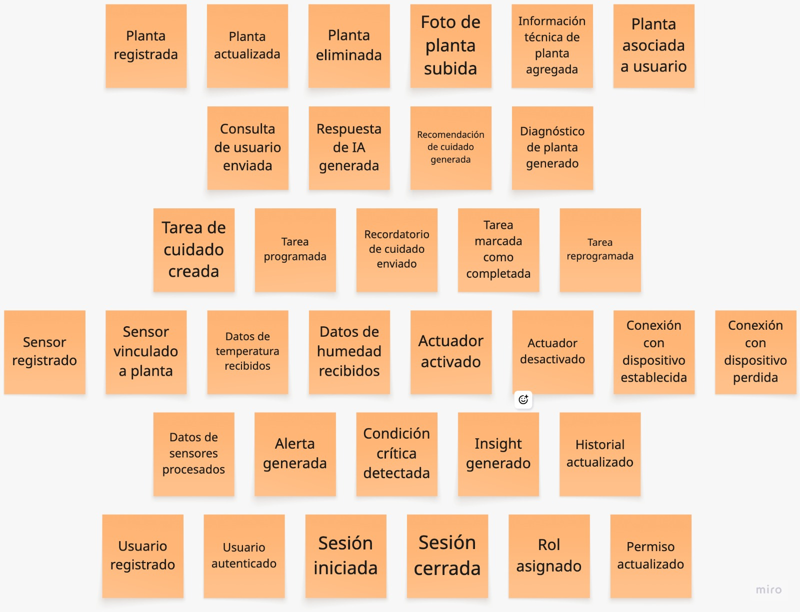

  Event Storming 1 - Elaboración propia

__Segundo paso:__

  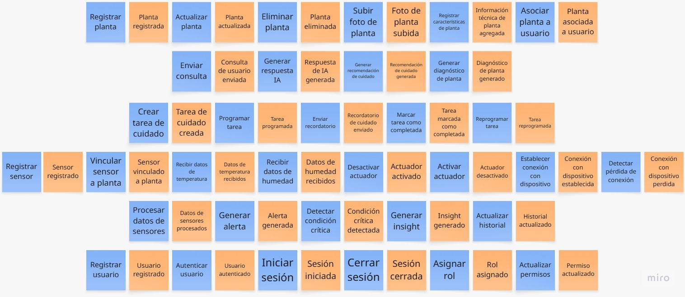

  Event Storming 2 - Elaboración propia

__Tercer paso:__

  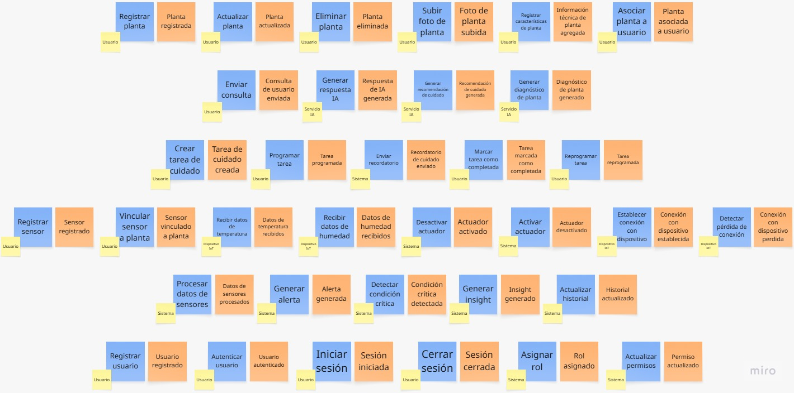

  Event Storming 3 - Elaboración propia

__Cuarto paso:__

  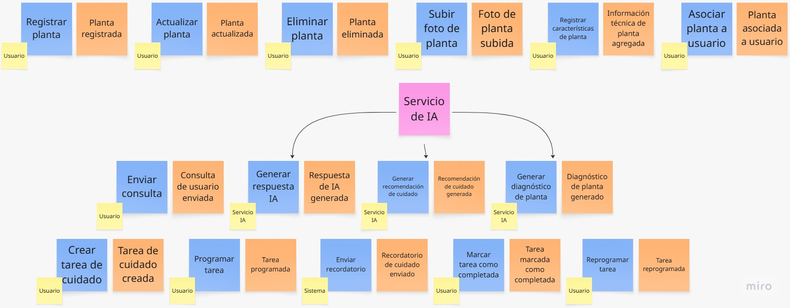

  Event Storming 4.1 - Elaboración propia

  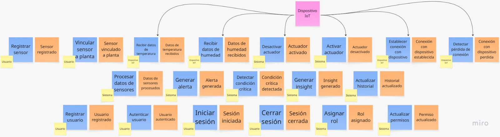

  Event Storming 4.2 - Elaboración propia

__Quinto paso:__

  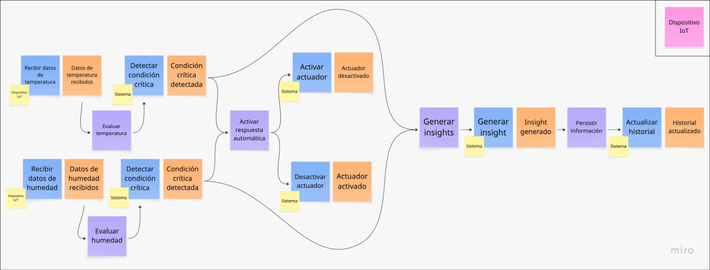

  Event Storming 5.1 - Elaboración propia

  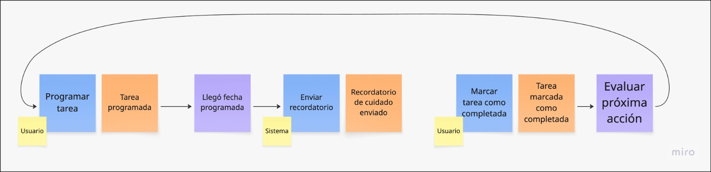

  Event Storming 5.2 - Elaboración propia

  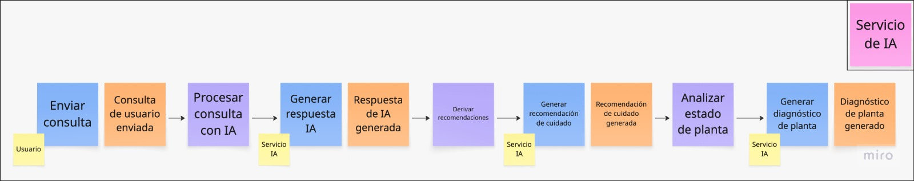

  Event Storming 5.3 - Elaboración propia

  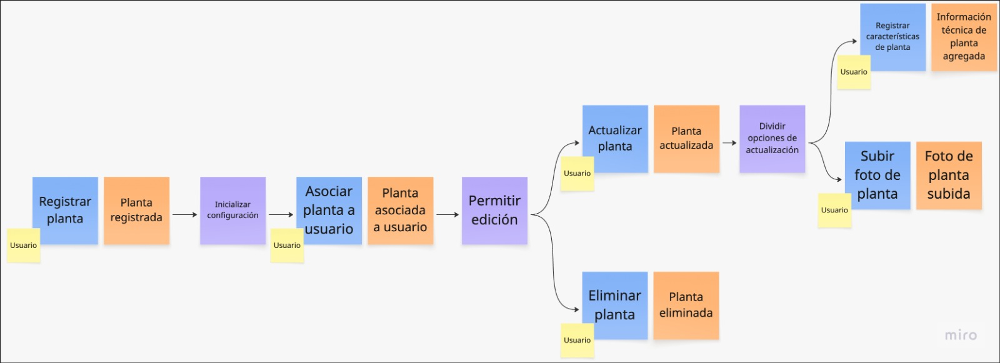

  Event Storming 5.4 - Elaboración propia

  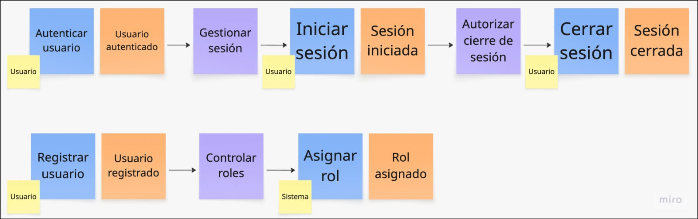

  Event Storming 5.5 - Elaboración propia

__Sexto paso:__

  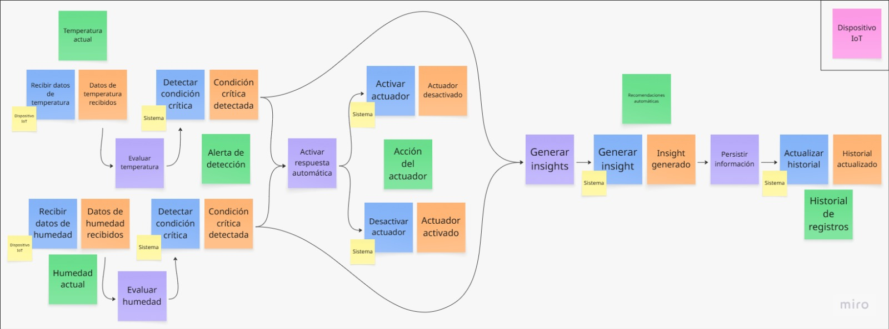

  Event Storming 6.1 - Elaboración propia

  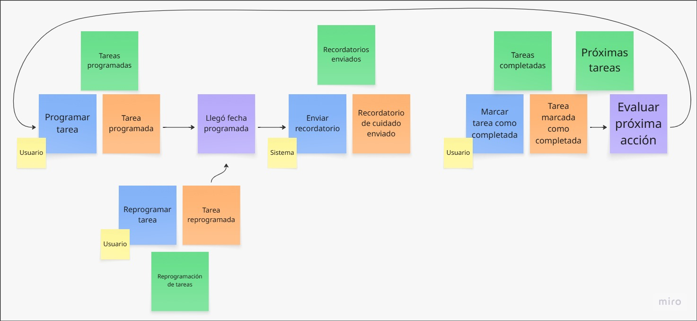

  Event Storming 6.2 - Elaboración propia

  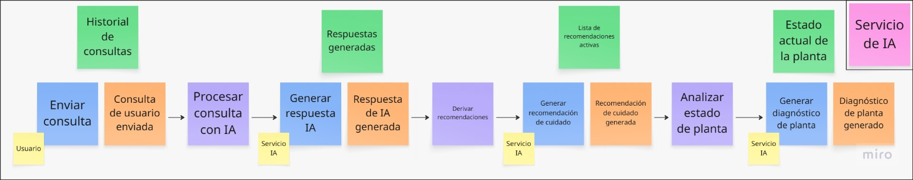

  Event Storming 6.3 - Elaboración propia

  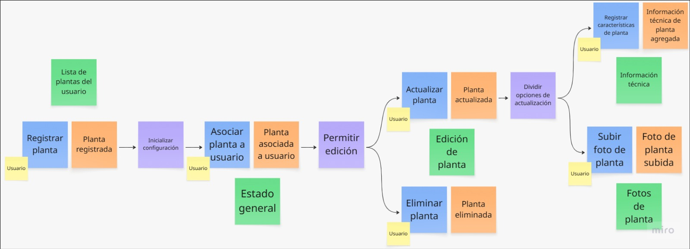

  Event Storming 6.4 - Elaboración propia

  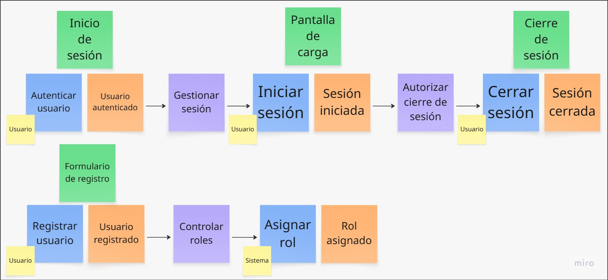

  Event Storming 6.5 - Elaboración propia

__Séptimo paso:__

  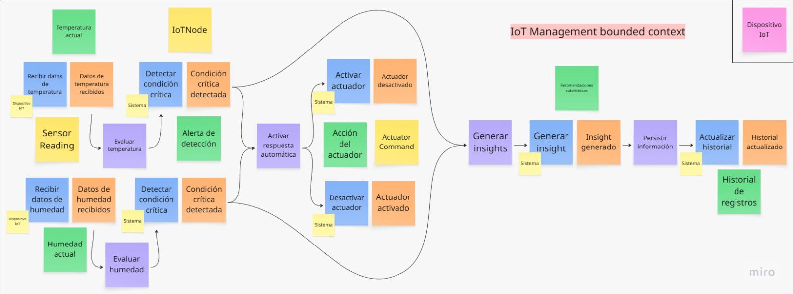

  Event Storming 7.1 - Elaboración propia

  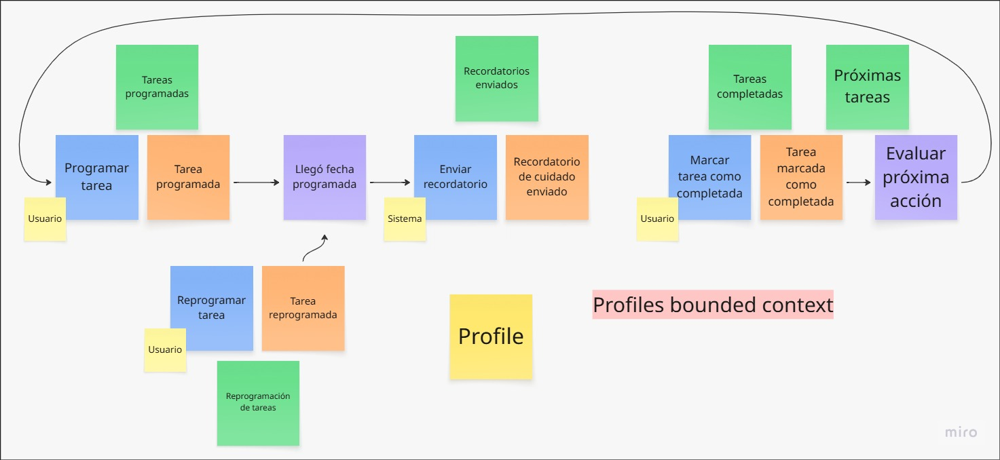

  Event Storming 7.2 - Elaboración propia

  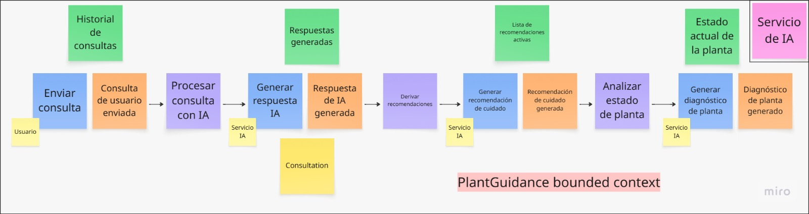

  Event Storming 7.3 - Elaboración propia

  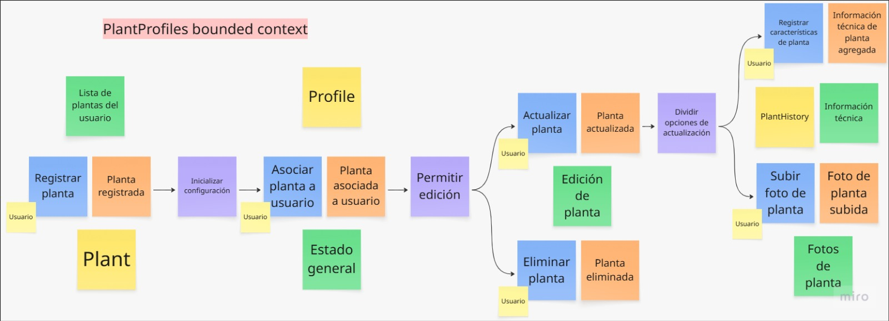

  Event Storming 7.4 - Elaboración propia

  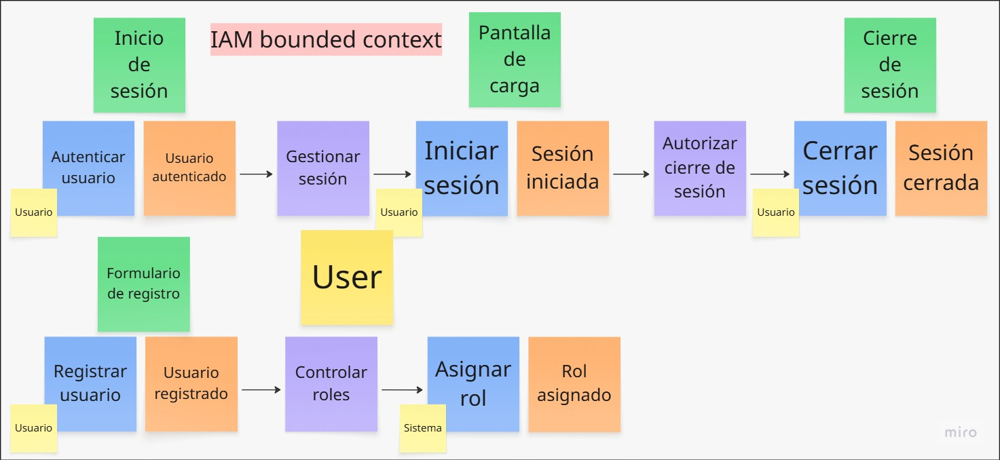

  Event Storming 7.5 - Elaboración propia

#### 4.1.1.1. Candidate Context Discovery

Después de completar la sesión de tormenta de eventos, se realizó un análisis detallado de los eventos detectados con la herramienta Miro para identificar los contextos candidatos más relevantes para el dominio. Este trabajo implicó reconocer patrones y relaciones entre eventos y crear flujos a partir de ellos. Como resultado, se organizaron una serie de eventos que correspondían a un mismo proceso dentro de la aplicación.

__IoT Management context:__

  

  IoT Management - Elaboración propia

__Profiles context:__

  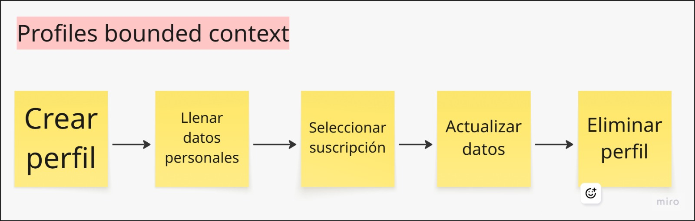

  Profiles - Elaboración propia

__PlantGuidance context:__

  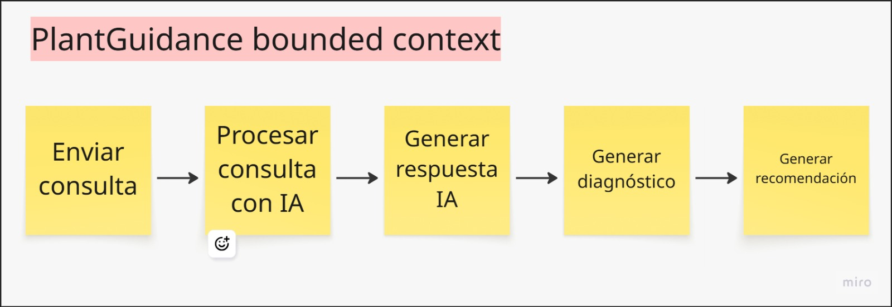

  PlantGuidance - Elaboración propia

__PlantProfiles context:__

  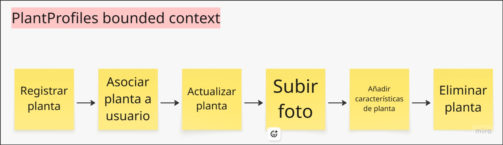

  PlantProfiles - Elaboración propia

__IAM context:__

  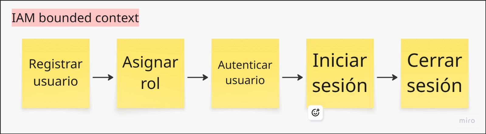

  IAM - Elaboración propia

Después de identificar los flujos de eventos dentro de la aplicación, se determinaron los pivotal points (eventos que cambian el curso del sistema), los cuales representan momentos clave en la interacción del usuario con la plataforma y el comportamiento del sistema IoT:

+ El registro y autenticación de un usuario en la plataforma
+ La creación y gestión de una planta por parte del usuario
+ La recepción de datos de sensores (temperatura y humedad) desde dispositivos IoT
+ La detección de condiciones críticas en el entorno de la planta
+ La activación o desactivación automática de actuadores
+ El envío de consultas del usuario al sistema de inteligencia artificial
+ La generación de respuestas, diagnósticos y recomendaciones de cuidado

Al identificar estos pivotal points, se puede observar cómo los eventos se agrupan naturalmente en distintos contextos del dominio, permitiendo definir los siguientes bounded contexts:

+ __IAM:__ Encargado de la gestión de identidad y acceso, incluyendo el registro, autenticación y control de sesiones de los usuarios.
+ __Profiles:__ Responsable de la administración de la información personal del usuario, como datos personales, suscripción y configuración del perfil.
+ __PlantProfiles:__ Gestiona el ciclo de vida de las plantas registradas por el usuario, incluyendo su creación, actualización, asociación, eliminación y almacenamiento de información relevante como fotos y características.
+ __IoT Management:__ Maneja la interacción con los dispositivos IoT, incluyendo la conexión, recepción de datos de sensores, detección de condiciones críticas y ejecución de acciones sobre actuadores.
+ __PlantGuidance:__ Encargado de procesar las consultas del usuario mediante inteligencia artificial, generando respuestas, diagnósticos y recomendaciones para el cuidado de las plantas.

Finalmente, utilizando la herramienta Miro, se realizó la división de estos bounded contexts, representando de manera visual los flujos de eventos dentro de cada uno y facilitando la comprensión de las responsabilidades y límites de cada contexto dentro del sistema.

#### 4.1.1.2. Domain Message Flows Modeling

En esta sección se desarrollan los Domain Message Flow Models para representar cómo fluyen los mensajes entre usuarios, sistemas externos y bounded contexts en los escenarios principales del sistema. Estos diagramas permiten visualizar la secuencia de commands, events y queries que ocurren durante cada proceso, facilitando la comprensión de las interacciones del dominio y validando que las responsabilidades de cada contexto estén correctamente definidas.

#### Scenario: User Registration

#### Scenario: User Login

#### Scenario: Registering a New Plant

#### Scenario: Linking an IoT Device to a Plant

#### Scenario: Receiving Temperature and Humidity Sensor Data

#### Scenario: Generating Plant Alerts From Sensor Data

#### Scenario: Activating an IoT Actuator Automatically

#### Scenario: Viewing Plant Health Status

#### Scenario: Scheduling a Plant Care Task

#### Scenario: Getting Plant Care Guidance From RootBot (bot temporal name)

#### Scenario: Viewing Plant Care History

#### Scenario: Viewing Sensor History and Insights

#### 4.1.1.3. Bounded Context Canvases

En esta sección se desarrollan los Bounded Context Canvases correspondientes a los contextos identificados en la arquitectura del dominio. Cada canvas permite describir el propósito, responsabilidades, comunicaciones, lenguaje ubicuo, decisiones de negocio, supuestos, métricas y preguntas abiertas de un bounded context específico. De esta manera, se documenta con mayor detalle el rol que cumple cada contexto dentro del sistema y se facilita la validación de su diseño.

#### IOT Management

#### Plant Profile

#### Care Scheduling

#### Analytics

#### Plant Guidance

#### IAM

### 4.1.2. Context Mapping

En esta sección elaboramos un conjunto de context maps para representar las relaciones entre los bounded contexts del sistema. A partir de la información recolectada, analizamos distintas alternativas de diseño, evaluando cómo cambiaría la estructura si se reubican, agrupan, dividen o aíslan determinadas capabilities. Para ello, consideramos patrones de Domain-Driven Design como Customer/Supplier, Conformist, Anti-corruption Layer y Shared Kernel, con el fin de identificar la mejor aproximación para la arquitectura del dominio. A continuación, presentamos las opciones evaluadas para Tavolo y la propuesta seleccionada.

#### Opción 1:

En esta alternativa se mantienen los seis bounded contexts separados, con relaciones claramente definidas entre ellos. Esta opción permite una mejor separación de responsabilidades, ya que cada contexto se concentra en una funcionalidad específica del sistema, facilitando su comprensión y evolución. Como desventaja, implica una mayor cantidad de dependencias e interacciones entre contextos, lo que incrementa la complejidad de integración y sincronización.

    

#### Opción 2:

En esta alternativa se agrupan los bounded contexts PlantProfile y Care Scheduling en un solo contexto denominado Plant Management, debido a que ambos trabajan directamente sobre la gestión de plantas y sus cuidados programados. Esta opción reduce la cantidad de relaciones entre contextos y simplifica la coordinación entre el perfil de la planta y sus tareas de mantenimiento. Sin embargo, como desventaja, el nuevo contexto concentra más responsabilidades, mezclando la administración de información de la planta con la planificación de tareas, lo que podría dificultar su evolución independiente si el sistema crece.

    

### Opción 3:

En esta alternativa se agrupan los bounded contexts IoT Management y Analytics en un solo contexto denominado IoT Operations, debido a que ambos trabajan directamente con la captura, procesamiento e interpretación de datos provenientes de sensores. Esta opción simplifica la comunicación entre el hardware y el análisis de datos, reduciendo dependencias internas del flujo IoT. Sin embargo, como desventaja, mezcla la gestión técnica de dispositivos con la generación de insights y alertas, lo que podría dificultar la evolución independiente de ambas capacidades si el sistema crece.

    

Finalmente, se seleccionó la Opción 1, ya que permite mantener los seis bounded contexts separados y con responsabilidades claramente delimitadas. Esta alternativa resulta más adecuada porque evita mezclar capacidades distintas, como la gestión de plantas, la planificación de cuidados, la comunicación IoT, el análisis de datos y el soporte mediante chatbot. Aunque implica una mayor cantidad de relaciones entre contextos, ofrece una arquitectura más ordenada, escalable y fácil de mantener, permitiendo que cada contexto evolucione de forma independiente según las necesidades del sistema.

### 4.1.3. Software Architecture

#### 4.1.3.1. Software Architecture System Landscape Diagram

Este diagrama representa la visión de más alto nivel del ecosistema de la startup BioDemeter, mostrando las interacciones que mantienen los diferentes actores con la plataforma PlantSync, el hardware IoT y los servicios externos.

  Elaboración propia

#### 4.1.3.2. Software Architecture Context Level Diagrams

Este diagrama representa el enfoque central de la solución PlantSync, mostrando las interacciones directas que mantiene la plataforma principal con sus distintos tipos de usuarios, el hardware IoT y las dependencias tecnológicas externas.

  Elaboración propia

#### 4.1.3.3. Software Architecture Container Level Diagrams

Este diagrama detalla la arquitectura interna de la plataforma PlantSync, exponiendo los diferentes contenedores de software, las tecnologías empleadas en cada uno y los flujos de comunicación y datos entre estas piezas.

  Elaboración propia

#### 4.1.3.4. Software Architecture Deployment Diagrams

Este diagrama ilustra la infraestructura y el entorno de ejecución de la solución PlantSync, mapeando cómo se distribuyen físicamente los contenedores de software en la nube de Microsoft Azure, los dispositivos cliente de los usuarios y los microcontroladores IoT instalados en sus hogares.

  Elaboración propia

## 4.2. Tactical-Level Domain-Driven Design

### 4.2.1. Bounded Context: \<IAM\>

#### 4.2.1.1. Domain Layer

En esta capa se define el núcleo de la seguridad y gestión de identidades, encapsulando las reglas de negocio para la autenticación y autorización de usuarios.

**Aggregate: `User`**

El agregado User es la raíz que gestiona la identidad de los usuarios en el sistema, asegurando que las credenciales y los roles asignados sean consistentes y válidos.

| Atributos      | Tipo de dato     | Visibilidad | Descripción                                     |
|----------------|-----------------|------------|------------------------------------------------|
| id     | Long            | Private    | Identificador único del usuario.            |
| email      | String           | Private    | Correo electrónico único para la autenticación.    |
| password       | String          | Private    | Contraseña del usuario almacenada de forma segura (hasheada).                      |
| roles    | Set<Role>         | Private    | Conjunto de roles asignados para el control de acceso.          |

| Métodos                         | Tipo de retorno | Visibilidad | Descripción                                      |
|---------------------------------|----------------|------------|------------------------------------------------|
| getId()                 | Long           | Public     | Devuelve el ID del usuario.                   |
| getEmail()                 | String          | Public     | Devuelve el correo electrónico.    |
| getPassword()                      | String         | Public     | Devuelve la contraseña hasheada.              |
| addRole(Role)                | User       | Public     | Agrega un nuevo rol al usuario.        |
| addRoles(List<Role>)                     | User  | Public     | Añade una lista de roles validando que no esté vacía.       |
| updateInformation(String)                       | User           | Public     | Actualiza el correo electrónico del usuario. |

**Value Objects**

| Value Object   | Descripción                                                                 |
|----------------|-----------------------------------------------------------------------------|
| Roles  | Enumeración que define los tipos de roles permitidos: `ROLE_USER`, `ROLE_ADMIN`, etc.      |
| Role | Entidad de dominio que representa un rol persistido con su respectivo nombre.|

**Clase: `UserQueryService`**

| Título       | UserQueryService |
|--------------|----------------------|
| Descripción  | Interfaz de servicio de consultas para operaciones de lectura de identidades y usuarios. |

**Métodos**

| Método                             | Descripción                                               |
|-----------------------------------|-----------------------------------------------------------|
| handle(GetUserByIdQuery)        | Obtiene la información detallada de un usuario por su identificador único.   |
| handle(GetUserByEmailQuery) | Busca un usuario en el sistema utilizando su dirección de correo electrónico.     |
| handle(GetAllUsersQuery) | Recupera la lista completa de usuarios registrados en el sistema. |

**Clase: `UserCommandService`**

| Título       | UserCommandService |
|--------------|------------------------|
| Descripción  | Interfaz de servicio de comandos para la gestión de registros y autenticación. |

**Métodos**

| Método                           | Descripción                                                        |
|---------------------------------|--------------------------------------------------------------------|
| handle(SignUpCommand)     | Registra un nuevo usuario, gestionando el hasheo de contraseña y asignación de roles iniciales.            |
| handle(SignInCommand)     | Procesa el inicio de sesión y genera el token de acceso correspondiente. |
| handle(UpdateUserCommand)    | Actualiza los datos de identidad de un usuario existente.                          |

#### 4.2.1.2. Interface Layer

La capa de interfaz del contexto IAM expone controladores REST para la seguridad y gestión de perfiles. Utiliza assemblers especializados para transformar las solicitudes HTTP en comandos y queries, asegurando que el dominio no se vea afectado por cambios en la API externa.

**Controlador: `AuthenticationController`**

Maneja los procesos críticos de entrada al sistema, permitiendo el registro de nuevos usuarios y la obtención de tokens de acceso Bearer.

**Metodos**

| Método           | Ruta                              | Descripción                                               |
|-----------------|----------------------------------|-----------------------------------------------------------|
| signUp   | POST /api/v1/authentication/sign-up        | Registra un usuario y devuelve sus datos básicos. |
| signIn| POST /api/v1/authentication/sign-in | Autentica al usuario y devuelve el token JWT generado. |

**Controlador: `UserController`**

Gestiona la administración y consulta de los usuarios dentro de la plataforma.

**Metodos**

| Método           | Ruta                              | Descripción                                               |
|-----------------|----------------------------------|-----------------------------------------------------------|
| getUserById   | GET /api/v1/users/{id}        | Recupera un usuario por su ID. |
| getAllUsers | GET /api/v1/users | Lista todos los usuarios del sistema. |
| updateUser    | PUT /api/v1/users/{id}            | Actualiza la información de un usuario. |

**Dependencias**

| Dependencia                         | Descripción                                                                 |
|------------------------------------|-----------------------------------------------------------------------------|
| UserCommandService                 | Servicio para ejecutar comandos de registro y autenticación.               |
| UserQueryService               | Servicio para recuperación de datos de usuarios. |
| SignUpCommandFromResourceAssembler | Mapea el recurso de registro a un comando SignUp.           |
| SignInCommandFromResourceAssembler | Mapea las credenciales a un comando SignIn.      |
| UserResourceFromEntityAssembler | Convierte la entidad User en un recurso para la respuesta API.         |

#### 4.2.1.3. Application Layer

Los servicios internos implementan la lógica de orquestación de la seguridad. Se encargan de validar la existencia de usuarios, interactuar con servicios de hashing y gestionar la generación de tokens, coordinando el flujo de datos entre el dominio y la infraestructura.

**Clase: `UserCommandServiceImpl`**

| Título       | UserCommandServiceImpl |
|--------------|--------------------------|
| Descripción  | Implementación del servicio de comandos para gestionar la creación y actualización de usuarios. |

**Dependencias**

| Dependencia            | Descripción                                   |
|-------------------------|-----------------------------------------------|
| UserRepository       | Repositorio para la persistencia de usuarios.  |
| RoleRepository     | Repositorio para buscar y asignar roles.  |
| HashingService     | Servicio para el cifrado seguro de contraseñas.  |
| TokenService    | Servicio para la generación de tokens JWT.  |

**Clase: `UserQueryServiceImpl`**

| Título       | ProjectCommandServiceImpl |
|--------------|----------------------------|
| Descripción  | Implementación del servicio de consultas para operaciones de lectura de usuarios. |

**Dependencias**

| Dependencia            | Descripción                                   |
|-------------------------|-----------------------------------------------|
| UserRepository       | Repositorio para el acceso a la base de datos de usuarios. |

#### 4.2.1.4. Infrastructure Layer

Esta capa implementa los mecanismos de persistencia mediante JPA y la integración con Spring Security para la protección de recursos.

**Clase: `UserRepository`**

| Título       | UserRepository |
|-------------|------------------|
| Descripción | Interfaz de persistencia para operaciones CRUD y búsqueda de usuarios por email o ID. |

**Metodos**

| Método             | Descripción                                           |
|-------------------|-------------------------------------------------------|
| findByUsername(String) | Recupera un usuario basándose en su email/username. |
| existsByUsername(String)   | Verifica si un correo electrónico ya está registrado en el sistema.                        |
| save(User)    | Persiste o actualiza la información del usuario en la base de datos.                        |

**Clase: `BCryptHashingService`**

| Título       | BCryptHashingService |
|-------------|------------------|
| Descripción | Implementación del servicio de hashing utilizando el algoritmo BCrypt para proteger las contraseñas. |

#### 4.2.1.5. Bounded Context Software Architecture Component Level Diagrams

Este diagrama representa cómo el Bounded Context de IAM gestiona la seguridad. 

El `AuthenticationController` es el punto de entrada principal para el flujo de autenticación, delegando al `UserCommandService`, el cual utiliza servicios de infraestructura como `TokenService` y `HashingService`. 

La persistencia se realiza en una base de datos relacional MySQL a través de `UserRepository`.

  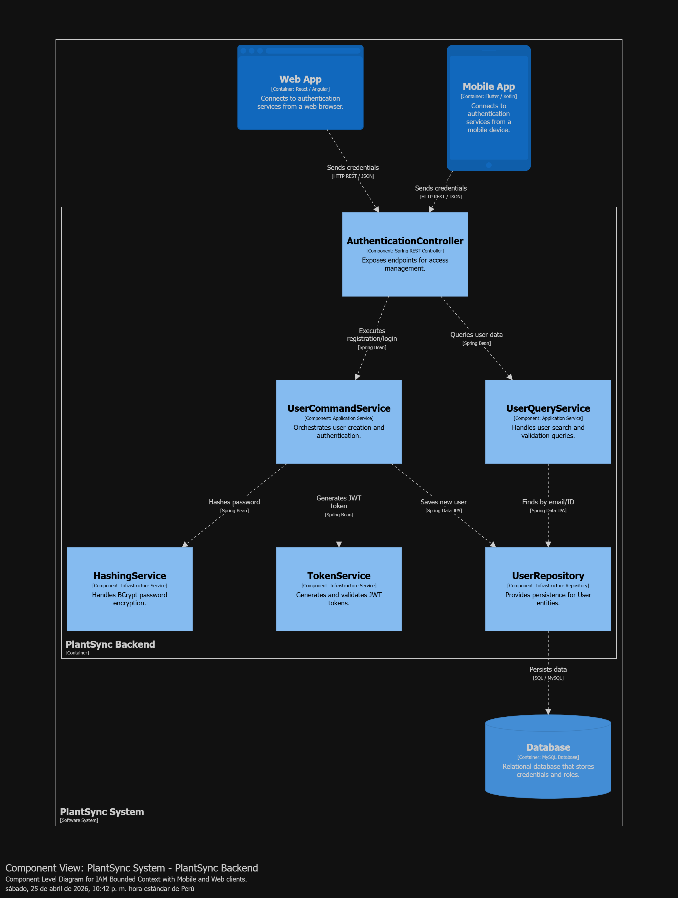

  Elaboración propia

#### 4.2.1.6. Bounded Context Software Architecture Code Level Diagrams

En esta sección, se explica los diagramas que presentan un mayor detalle sobre la implementación de componentes en el bounded context de IAM.

##### 4.2.1.6.1. Bounded Context Domain Layer Class Diagrams

 

  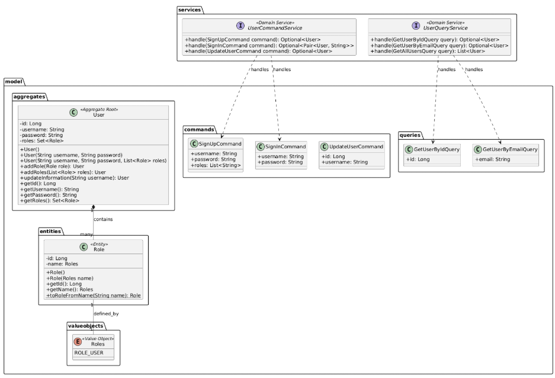

    Bounded Context Class Diagram - Elaboración propia

##### 4.2.1.6.2. Bounded Context Database Design Diagram

  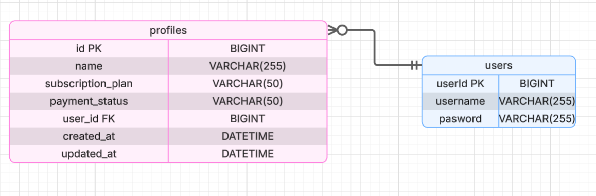

  Elaboración propia

### 4.2.2. Bounded Context: Profiles

#### 4.2.2.1. Domain Layer

En esta capa se define el núcleo de la gestión de perfiles de usuario, encapsulando las reglas de negocio para la información personal, suscripción y estado de pago.

**Aggregate: `Profile`**

El agregado Profile es la raíz que gestiona los perfiles de usuario en el sistema, asegurando que los datos personales y la suscripción sean consistentes y válidos.

| Atributos | Tipo de dato | Visibilidad | Descripción |
|---|---|---|---|
| id | Long | Private | Identificador único del perfil. |
| personName | PersonName | Private | Nombre completo de la persona asociada al perfil. |
| subscriptionPlan | SubscriptionPlan | Private | Plan de suscripción actual del usuario. |
| userId | UserId | Private | ID del usuario asociado al perfil. |
| paymentStatus | PaymentStatus | Private | Estado de pago de la suscripción. |

| Métodos | Tipo de retorno | Visibilidad | Descripción |
|---|---|---|---|
| getId() | Long | Public | Devuelve el ID del perfil. |
| getPersonName() | PersonName | Public | Devuelve el nombre completo. |
| getSubscriptionPlan() | SubscriptionPlan | Public | Devuelve el plan de suscripción. |
| getUserId() | UserId | Public | Devuelve el ID del usuario asociado. |
| getPaymentStatus() | PaymentStatus | Public | Devuelve el estado de pago. |
| updateInformation(PersonName, SubscriptionPlan) | Profile | Public | Actualiza el nombre y el plan de suscripción del perfil. |
| Profile(CreateProfileCommand) | Constructor | Public | Crea un nuevo perfil a partir de un comando. |

**Value Objects**

| Value Object | Descripción |
|---|---|
| PersonName | Registro que representa el nombre de una persona. Valida que no sea nulo o esté en blanco. |
| UserId | Registro que representa el identificador de un usuario. Valida que no sea nulo o menor o igual a cero. |
| SubscriptionPlan | Enumeración que define los planes de suscripción permitidos: `BASIC`, `PREMIUM`, `PRO`. |
| PaymentStatus | Enumeración que define los estados de pago: `PENDING`, `PAID`. |

**Excepciones de Dominio**

| Excepción | Descripción |
|---|---|
| ProfileNotFoundException | Se lanza cuando no se encuentra un perfil para actualizar. |
| ProfileUpdateException | Se lanza cuando ocurre un error durante la actualización de un perfil. |

**Clase: `ProfileQueryService`**

| Título | ProfileQueryService |
|---|---|
| Descripción | Interfaz de servicio de consultas para operaciones de lectura de perfiles. |

**Métodos**

| Método | Descripción |
|---|---|
| handle(GetProfileByIdQuery) | Obtiene un perfil por su identificador único. |
| handle(GetProfileByUserIdQuery) | Busca un perfil utilizando el ID del usuario. |
| handle(GetAllProfilesQuery) | Recupera la lista completa de perfiles registrados en el sistema. |

**Clase: `ProfileCommandService`**

| Título | ProfileCommandService |
|---|---|
| Descripción | Interfaz de servicio de comandos para la gestión de perfiles. |

**Métodos**

| Método | Descripción |
|---|---|
| handle(CreateProfileCommand) | Crea un nuevo perfil a partir del comando. |
| handle(UpdateProfileCommand) | Actualiza la información de un perfil existente. |

#### 4.2.2.2. Interface Layer

La capa de interfaz del contexto Profiles expone controladores REST para la gestión de perfiles. Utiliza assemblers especializados para transformar las solicitudes HTTP en comandos y queries, asegurando que el dominio no se vea afectado por cambios en la API externa.

**Controlador: `ProfilesCommandController`**

Maneja las operaciones de escritura sobre perfiles, permitiendo la creación y actualización de los mismos.

**Métodos**

| Método | Ruta | Descripción |
|---|---|---|
| createProfile | POST /api/v1/profiles | Crea un nuevo perfil y devuelve sus datos. |
| updateProfile | PUT /api/v1/profiles/{id} | Actualiza la información de un perfil existente. |

**Controlador: `ProfilesQueryController`**

Gestiona la administración y consulta de los perfiles dentro de la plataforma.

**Métodos**

| Método | Ruta | Descripción |
|---|---|---|
| getProfileById | GET /api/v1/profiles/{profileId} | Recupera un perfil por su ID. |
| getAllProfiles | GET /api/v1/profiles | Lista todos los perfiles del sistema. |
| getProfileByUserId | GET /api/v1/profiles/by-user-id | Recupera un perfil por ID de usuario. |

**Dependencias**

| Dependencia | Descripción |
|---|---|
| ProfileCommandService | Servicio para ejecutar comandos de creación y actualización de perfiles. |
| ProfileQueryService | Servicio para recuperación de datos de perfiles. |
| CreateProfileCommandFromResourceAssembler | Mapea el recurso de creación a un comando CreateProfileCommand. |
| UpdateProfileCommandFromResourceAssembler | Mapea el recurso de actualización a un comando UpdateProfileCommand. |
| ProfileResourceFromEntityAssembler | Convierte la entidad Profile en un recurso para la respuesta API. |

**Recursos**

| Recurso | Descripción |
|---|---|
| CreateProfileResource | Contiene los campos personName, subscriptionPlan y userId para crear un perfil. |
| UpdateProfileResource | Contiene los campos personName y subscriptionPlan para actualizar un perfil. |
| ProfileResource | Contiene los campos id, personName, subscriptionPlan y userId para la respuesta API. |

**ACL (Anticorruption Layer)**

| Clase | Descripción |
|---|---|
| ProfilesContextFacade | Interfaz de fachada para que otros contextos interactúen con Profiles. |
| ProfilesContextFacadeImpl | Implementación que permite crear un perfil desde otro contexto. |

#### 4.2.2.3. Application Layer

Los servicios internos implementan la lógica de orquestación de los perfiles. Se encargan de validar la existencia de perfiles, ejecutar comandos y gestionar la persistencia.

**Clase: `ProfileCommandServiceImpl`**

| Título | ProfileCommandServiceImpl |
|---|---|
| Descripción | Implementación del servicio de comandos para gestionar la creación y actualización de perfiles. |

**Dependencias**

| Dependencia | Descripción |
|---|---|
| ProfileRepository | Repositorio para la persistencia de perfiles. |

**Clase: `ProfileQueryServiceImpl`**

| Título | ProfileQueryServiceImpl |
|---|---|
| Descripción | Implementación del servicio de consultas para operaciones de lectura de perfiles. |

**Dependencias**

| Dependencia | Descripción |
|---|---|
| ProfileRepository | Repositorio para el acceso a la base de datos de perfiles. |

#### 4.2.2.4. Infrastructure Layer

Esta capa implementa los mecanismos de persistencia mediante JPA y Spring Data JPA.

**Clase: `ProfileRepository`**

| Título | ProfileRepository |
|---|---|
| Descripción | Interfaz de persistencia para operaciones CRUD y búsqueda de perfiles por usuario. |

**Métodos**

| Método | Descripción |
|---|---|
| findById(Long) | Recupera un perfil por su ID. |
| findByUserId(UserId) | Recupera un perfil basándose en el ID del usuario asociado. |
| save(Profile) | Persiste o actualiza la información del perfil en la base de datos. |
| findAll() | Recupera todos los perfiles. |

#### 4.2.2.5. Bounded Context Software Architecture Component Level Diagrams

Este diagrama representa cómo el Bounded Context de Profiles gestiona los perfiles de usuario.
El ProfilesCommandController es el punto de entrada principal para el flujo de creación y actualización de perfiles, mientras que el ProfilesQueryController maneja las consultas de lectura. Ambos controladores delegan respectivamente en ProfileCommandService y ProfileQueryService.
La persistencia se realiza en una base de datos relacional MySQL a través de ProfileRepository.

  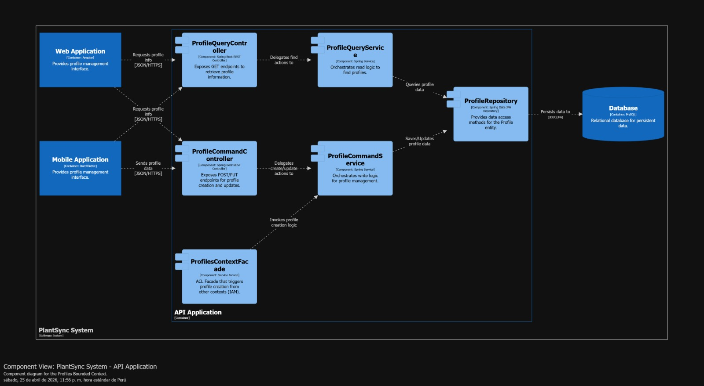

  Elaboración propia

#### 4.2.2.6. Bounded Context Software Architecture Code Level Diagrams

En esta sección, se explica los diagramas que presentan un mayor detalle sobre la implementación de componentes en el bounded context de Profiles.

##### 4.2.2.6.1. Bounded Context Domain Layer Class Diagrams

 

  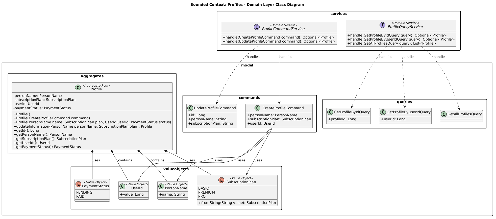

    Bounded Context Class Diagram - Elaboración propia

##### 4.2.2.6.2. Bounded Context Database Design Diagram

  

  Elaboración propia

### 4.2.3. Bounded Context: PlantProfiles

#### 4.2.3.1. Domain Layer

En esta capa se define el núcleo de la gestión de plantas, encapsulando las reglas de negocio para la información botánica, cuidados y seguimiento histórico de cada planta asociada a un perfil de usuario.

**Aggregate: `Plant`**

El agregado Plant es la raíz que gestiona las plantas en el sistema, asegurando que los datos botánicos y de cuidado sean consistentes y válidos.

| Atributos | Tipo de dato | Visibilidad | Descripción |
|---|---|---|---|
| id | Long | Private | Identificador único de la planta. |
| name | PlantName | Private | Nombre de la planta (valor object). |
| species | String | Private | Especie de la planta (ej. Monstera, Cactus). |
| acquisitionDate | LocalDate | Private | Fecha de adquisición de la planta. |
| humidity | HumidityLevel | Private | Nivel de humedad preferido para la planta. |
| nextWateringDate | LocalDate | Private | Próxima fecha programada para riego. |
| imageUrl | String | Private | URL o Base64 de la imagen de la planta. |
| notificationsEnabled | Boolean | Private | Indica si las notificaciones están habilitadas. |
| profileId | ProfileId | Private | ID del perfil propietario de la planta. |

| Métodos | Tipo de retorno | Visibilidad | Descripción |
|---|---|---|---|
| getId() | Long | Public | Devuelve el ID de la planta. |
| getName() | PlantName | Public | Devuelve el nombre de la planta. |
| getSpecies() | String | Public | Devuelve la especie. |
| getAcquisitionDate() | LocalDate | Public | Devuelve la fecha de adquisición. |
| getHumidity() | HumidityLevel | Public | Devuelve el nivel de humedad preferido. |
| getNextWateringDate() | LocalDate | Public | Devuelve la próxima fecha de riego. |
| getImageUrl() | String | Public | Devuelve la URL de la imagen. |
| getNotificationsEnabled() | Boolean | Public | Devuelve si las notificaciones están habilitadas. |
| getProfileId() | ProfileId | Public | Devuelve el ID del perfil propietario. |
| updateInformation(...) | Plant | Public | Actualiza toda la información de la planta. |
| Plant(CreatePlantCommand) | Constructor | Public | Crea una nueva planta a partir de un comando. |

**Aggregate: `PlantHistory`**

El agregado PlantHistory representa un registro histórico de cuidado o datos de sensores de una planta.

| Atributos | Tipo de dato | Visibilidad | Descripción |
|---|---|---|---|
| id | Long | Private | Identificador único del registro histórico. |
| plantId | PlantId | Private | ID de la planta asociada. |
| type | String | Private | Tipo de acción registrada (ej. WATERED, FERTILIZED). |
| date | LocalDate | Private | Fecha de la acción o lectura. |
| time | LocalTime | Private | Hora de la acción o lectura. |
| humidity | Integer | Private | Nivel de humedad registrado (si aplica). |

| Métodos | Tipo de retorno | Visibilidad | Descripción |
|---|---|---|---|
| getId() | Long | Public | Devuelve el ID del registro histórico. |
| getPlantId() | PlantId | Public | Devuelve el ID de la planta asociada. |
| getType() | String | Public | Devuelve el tipo de acción. |
| getDate() | LocalDate | Public | Devuelve la fecha. |
| getTime() | LocalTime | Public | Devuelve la hora. |
| getHumidity() | Integer | Public | Devuelve el nivel de humedad registrado. |
| PlantHistory(CreatePlantHistoryCommand) | Constructor | Public | Crea un nuevo registro histórico a partir de un comando. |

**Value Objects**

| Value Object | Descripción |
|---|---|
| PlantName | Registro que representa el nombre de una planta. Valida que no sea nulo o esté en blanco, y que no exceda 100 caracteres. |
| PlantId | Registro que representa el identificador de una planta. Valida que no sea nulo o menor o igual a cero. |
| ProfileId | Registro que representa el identificador de un perfil. Valida que no sea nulo o menor o igual a cero. |
| HumidityLevel | Enumeración que define los niveles de humedad: `BAJA`, `MEDIA`, `ALTA`. |

**Excepciones de Dominio**

| Excepción | Descripción |
|---|---|
| PlantNotFoundException | Se lanza cuando no se encuentra una planta por su ID. |
| PlantCreationException | Se lanza cuando ocurre un error durante la creación de una planta. |
| PlantUpdateException | Se lanza cuando ocurre un error durante la actualización de una planta. |
| PlantDeletionException | Se lanza cuando ocurre un error durante la eliminación de una planta. |
| PlantHistoryNotFoundException | Se lanza cuando no se encuentra un historial de planta por su ID. |

**Clase: `PlantQueryService`**

| Título | PlantQueryService |
|---|---|
| Descripción | Interfaz de servicio de consultas para operaciones de lectura de plantas. |

**Métodos**

| Método | Descripción |
|---|---|
| handle(GetAllPlantsQuery) | Recupera la lista completa de plantas registradas en el sistema. |
| handle(GetAllPlantsByProfileIdQuery) | Recupera las plantas asociadas a un ID de perfil específico. |
| handle(GetPlantByIdQuery) | Obtiene una planta por su identificador único. |

**Clase: `PlantCommandService`**

| Título | PlantCommandService |
|---|---|
| Descripción | Interfaz de servicio de comandos para la gestión de plantas. |

**Métodos**

| Método | Descripción |
|---|---|
| handle(CreatePlantCommand) | Crea una nueva planta a partir del comando y retorna su ID. |
| handle(UpdatePlantCommand) | Actualiza la información de una planta existente. |
| handle(DeletePlantCommand) | Elimina una planta del sistema. |

**Clase: `PlantHistoryQueryService`**

| Título | PlantHistoryQueryService |
|---|---|
| Descripción | Interfaz de servicio de consultas para operaciones de lectura de historiales de planta. |

**Métodos**

| Método | Descripción |
|---|---|
| handle(GetPlantHistoryByPlantIdQuery) | Obtiene un registro histórico por ID de planta. |
| handle(GetAllPlantHistoriesByPlantIdQuery) | Recupera todos los registros históricos asociados a un ID de planta. |

**Clase: `PlantHistoryCommandService`**

| Título | PlantHistoryCommandService |
|---|---|
| Descripción | Interfaz de servicio de comandos para la gestión de historiales de planta. |

**Métodos**

| Método | Descripción |
|---|---|
| handle(CreatePlantHistoryCommand) | Crea un nuevo registro histórico a partir del comando y retorna su ID. |

#### 4.2.3.2. Interface Layer

La capa de interfaz del contexto PlantProfiles expone controladores REST para la gestión de plantas y sus historiales. Utiliza assemblers especializados para transformar las solicitudes HTTP en comandos y consultas, asegurando que el dominio no se vea afectado por cambios en la API externa.

**Controlador: `PlantCommandController`**

Maneja las operaciones de escritura sobre plantas, permitiendo la creación, actualización y eliminación de las mismas.

**Métodos**

| Método | Ruta | Descripción |
|---|---|---|
| createPlant | POST /api/v1/plants | Crea una nueva planta y devuelve sus datos. |
| updatePlant | PUT /api/v1/plants/{plantId} | Actualiza la información de una planta existente. |
| deletePlant | DELETE /api/v1/plants/{plantId} | Elimina una planta del sistema. |

**Controlador: `PlantQueryController`**

Gestiona las operaciones de consulta y lectura de plantas en la plataforma.

**Métodos**

| Método | Ruta | Descripción |
|---|---|---|
| getAllPlants | GET /api/v1/plants | Lista todas las plantas del sistema. |
| getAllPlantsByProfileId | GET /api/v1/plants/by-profile/{profileId} | Recupera las plantas asociadas a un perfil. |
| getPlantById | GET /api/v1/plants/{plantId} | Recupera una planta por su ID. |

**Controlador: `PlantHistoryCommandController`**

Maneja las operaciones de escritura sobre historiales de planta.

**Métodos**

| Método | Ruta | Descripción |
|---|---|---|
| createPlantHistory | POST /api/v1/plantHistories | Crea un nuevo registro histórico de planta. |

**Controlador: `PlantHistoryQueryController`**

Gestiona las operaciones de consulta y lectura de historiales de planta.

**Métodos**

| Método | Ruta | Descripción |
|---|---|---|
| getPlantHistoryByPlantId | GET /api/v1/plantHistories/by-plant/plantId | Recupera un registro histórico por ID de planta. |
| getAllPlantsByProfileId | GET /api/v1/plantHistories/plantId | Recupera todos los historiales asociados a una planta. |

**Controlador adicional: `WeatherQueryController`**

Controlador proxy para consultas meteorológicas externas.

| Método | Ruta | Descripción |
|---|---|---|
| getWeatherByCity | GET /api/v1/weather/city | Obtiene datos climáticos de OpenWeather API por ciudad. |

**Recursos (DTOs)**

| Recurso | Descripción |
|---|---|
| CreatePlantResource | Contiene los datos para crear una planta: name, species, acquisitionDate, humidity, nextWateringDate, imageUrl, notificationsEnabled, profileId. |
| UpdatePlantResource | Contiene los datos actualizables de una planta. |
| PlantResource | Representa la respuesta de una planta: id, name, species, acquisitionDate, humidity, nextWateringDate, imageUrl, notificationsEnabled, profileId. |
| CreatePlantHistoryResource | Contiene los datos para crear un historial: plantId, type, date, time, humidity. |
| PlantHistoryResource | Representa la respuesta de un historial: id, plantId, type, date, time, humidity. |

**Assemblers (Transformadores)**

| Assembler | Descripción |
|---|---|
| CreatePlantCommandFromResourceAssembler | Convierte un CreatePlantResource en un CreatePlantCommand. |
| UpdatePlantCommandFromResourceAssembler | Convierte un UpdatePlantResource en un UpdatePlantCommand. |
| PlantResourceFromEntityAssembler | Convierte la entidad Plant en un PlantResource. |
| CreatePlantHistoryCommandFromResourceAssembler | Convierte un CreatePlantHistoryResource en un CreatePlantHistoryCommand. |
| PlantHistoryResourceFromEntityAssembler | Convierte la entidad PlantHistory en un PlantHistoryResource. |

#### 4.2.3.3. Application Layer

Los servicios internos implementan la lógica de orquestación para la gestión de plantas y sus historiales. Se encargan de validar la existencia de entidades, ejecutar comandos, coordinar la persistencia y manejar excepciones específicas del dominio.

**Clase: `PlantCommandServiceImpl`**

| Título | PlantCommandServiceImpl |
|---|---|
| Descripción | Implementación del servicio de comandos para gestionar la creación, actualización y eliminación de plantas. |

**Dependencias**

| Dependencia | Descripción |
|---|---|
| PlantRepository | Repositorio para la persistencia de plantas. |

**Clase: `PlantQueryServiceImpl`**

| Título | PlantQueryServiceImpl |
|---|---|
| Descripción | Implementación del servicio de consultas para operaciones de lectura de plantas. |

**Dependencias**

| Dependencia | Descripción |
|---|---|
| PlantRepository | Repositorio para el acceso a la base de datos de plantas. |

**Clase: `PlantHistoryCommandServiceImpl`**

| Título | PlantHistoryCommandServiceImpl |
|---|---|
| Descripción | Implementación del servicio de comandos para gestionar la creación de historiales de planta. |

**Dependencias**

| Dependencia | Descripción |
|---|---|
| PlantHistoryRepository | Repositorio para la persistencia de historiales de planta. |

**Clase: `PlantHistoryQueryServiceImpl`**

| Título | PlantHistoryQueryServiceImpl |
|---|---|
| Descripción | Implementación del servicio de consultas para operaciones de lectura de historiales de planta. |

**Dependencias**

| Dependencia | Descripción |
|---|---|
| PlantHistoryRepository | Repositorio para el acceso a la base de datos de historiales de planta. |

#### 4.2.3.4. Infrastructure Layer

Esta capa implementa los mecanismos de persistencia mediante JPA y Spring Data JPA.

**Clase: `PlantRepository`**

| Título | PlantRepository |
|---|---|
| Descripción | Interfaz de persistencia para operaciones CRUD y búsqueda de plantas por perfil. |

**Métodos**

| Método | Descripción |
|---|---|
| findById(Long) | Recupera una planta por su ID. |
| findAll() | Recupera todas las plantas. |
| findByProfileId(ProfileId) | Recupera las plantas asociadas a un ID de perfil. |
| save(Plant) | Persiste o actualiza la información de la planta. |
| deleteById(Long) | Elimina una planta por su ID. |
| existsById(Long) | Verifica si una planta existe por su ID. |

**Clase: `PlantHistoryRepository`**

| Título | PlantHistoryRepository |
|---|---|
| Descripción | Interfaz de persistencia para operaciones CRUD y búsqueda de historiales por planta. |

**Métodos**

| Método | Descripción |
|---|---|
| findById(Long) | Recupera un historial por su ID. |
| findByPlantId(PlantId) | Recupera todos los historiales asociados a un ID de planta. |
| save(PlantHistory) | Persiste o actualiza el historial de planta. |
| existsById(Long) | Verifica si un historial existe por su ID. |

#### 4.2.3.5. Bounded Context Software Architecture Component Level Diagrams

Este diagrama representa cómo el Bounded Context de PlantProfiles gestiona las plantas y sus historiales.
El PlantCommandController es el punto de entrada principal para el flujo de creación, actualización y eliminación de plantas, mientras que el PlantQueryController maneja las consultas de lectura. Adicionalmente, el PlantHistoryCommandController y PlantHistoryQueryController gestionan los registros históricos de cuidado de las plantas. Todos los controladores delegan respectivamente en PlantCommandService, PlantQueryService, PlantHistoryCommandService y PlantHistoryQueryService.
La persistencia se realiza en una base de datos relacional MySQL a través de PlantRepository y PlantHistoryRepository.

  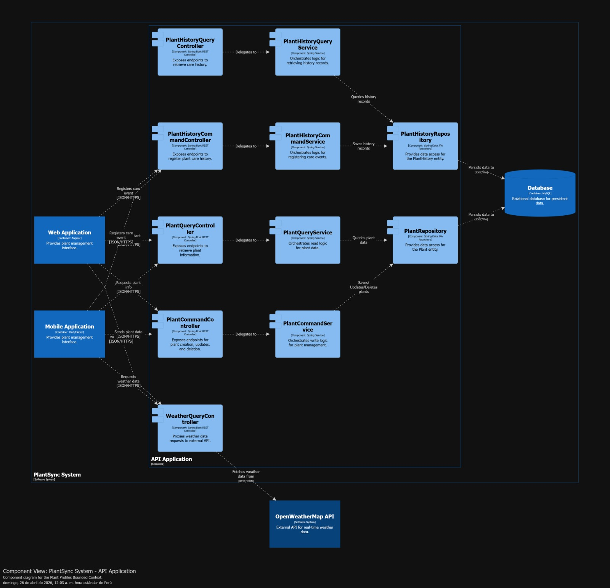

  Elaboración propia

#### 4.2.3.6. Bounded Context Software Architecture Code Level Diagrams

En esta sección, se explica los diagramas que presentan un mayor detalle sobre la implementación de componentes en el bounded context de PlantProfiles.

##### 4.2.3.6.1. Bounded Context Domain Layer Class Diagrams

 

  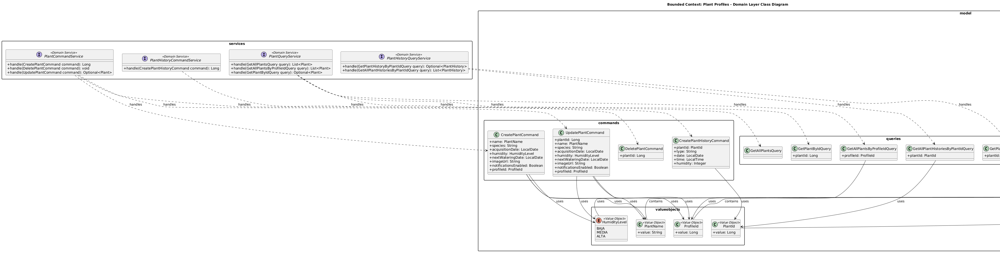

    Bounded Context Class Diagram - Elaboración propia

##### 4.2.3.6.2. Bounded Context Database Design Diagram

  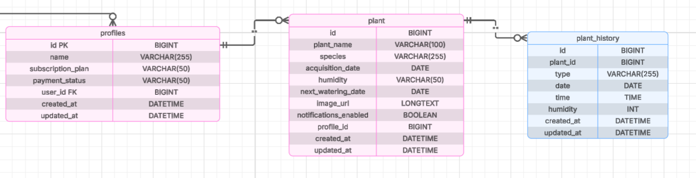

  Elaboración propia

### 4.2.4. Bounded Context: IoT Management

#### 4.2.4.1. Domain Layer

En esta capa se define la gestión de dispositivos IoT, lecturas de sensores y comandos de actuadores.

**Aggregate: `IoTNode`**

El agregado IoTNode representa un dispositivo Arduino registrado en el sistema, vinculado a una planta.

| Atributos | Tipo de dato | Visibilidad | Descripción |
|---|---|---|---|
| id | Long | Private | Identificador único del nodo. |
| nodeCode | String | Private | Código único del hardware (MAC). |
| status | NodeStatus | Private | ONLINE, OFFLINE, ERROR. |
| plantId | Long | Private | ID de la planta asociada. |
| profileId | Long | Private | ID del propietario. |
| createdAt | LocalDateTime | Private | Fecha de registro. |

| Métodos | Tipo de retorno | Visibilidad | Descripción |
|---|---|---|---|
| getId() | Long | Public | Devuelve el ID. |
| getNodeCode() | String | Public | Devuelve código. |
| getStatus() | NodeStatus | Public | Devuelve estado. |
| updateStatus(NodeStatus) | IoTNode | Public | Actualiza estado. |
| IoTNode(CreateNodeCommand) | Constructor | Public | Crea nodo. |

**Aggregate: `SensorReading`**

Representa una lectura de sensores (DHT11: temperatura y humedad; capacitivo: humedad de suelo).

| Atributos | Tipo de dato | Visibilidad | Descripción |
|---|---|---|---|
| id | Long | Private | Identificador único. |
| nodeId | Long | Private | ID del nodo origen. |
| soilHumidity | Float | Private | Humedad del suelo (%). |
| airTemperature | Float | Private | Temperatura (°C). |
| airHumidity | Float | Private | Humedad del aire (%). |
| timestamp | LocalDateTime | Private | Momento de captura. |

| Métodos | Tipo de retorno | Visibilidad | Descripción |
|---|---|---|---|
| getId() | Long | Public | Devuelve ID. |
| getNodeId() | Long | Public | Devuelve nodo origen. |
| getSoilHumidity() | Float | Public | Devuelve humedad suelo. |
| getAirTemperature() | Float | Public | Devuelve temperatura. |
| getTimestamp() | LocalDateTime | Public | Devuelve timestamp. |
| SensorReading(CreateReadingCommand) | Constructor | Public | Crea lectura. |

**Aggregate: `ActuatorCommand`**

Representa un comando enviado a un actuador (luz UV o rociador de agua).

| Atributos | Tipo de dato | Visibilidad | Descripción |
|---|---|---|---|
| id | Long | Private | Identificador único. |
| nodeId | Long | Private | ID del nodo destino. |
| actuatorType | ActuatorType | Private | UV_LIGHT o WATER_SPRAYER. |
| action | ActuatorAction | Private | ACTIVATE o DEACTIVATE. |
| status | CommandStatus | Private | PENDING, SENT, ACKNOWLEDGED. |
| issuedAt | LocalDateTime | Private | Momento de emisión. |

| Métodos | Tipo de retorno | Visibilidad | Descripción |
|---|---|---|---|
| getId() | Long | Public | Devuelve ID. |
| getNodeId() | Long | Public | Devuelve nodo. |
| getActuatorType() | ActuatorType | Public | Devuelve tipo. |
| getStatus() | CommandStatus | Public | Devuelve estado. |
| acknowledge() | ActuatorCommand | Public | Marca ejecutado. |
| ActuatorCommand(IssueCommandCommand) | Constructor | Public | Crea comando. |

**Value Objects**

| Value Object | Descripción |
|---|---|
| NodeStatus | ONLINE, OFFLINE, ERROR |
| ActuatorType | UV_LIGHT, WATER_SPRAYER |
| ActuatorAction | ACTIVATE, DEACTIVATE |
| CommandStatus | PENDING, SENT, ACKNOWLEDGED |

**Excepciones de Dominio**

| Excepción | Descripción |
|---|---|
| IoTNodeNotFoundException | Nodo no encontrado. |
| IoTNodeAlreadyRegisteredException | NodeCode ya existe. |
| ActuatorCommandFailedException | Comando no ejecutado. |

**Clase: `IoTNodeQueryService`**

| Título | IoTNodeQueryService |
|---|---|
| Descripción | Servicio de consultas para operaciones de lectura de nodos. |

| Métodos | Descripción |
|---|---|
| handle(GetNodeByIdQuery) | Obtiene nodo por ID. |
| handle(GetNodesByProfileIdQuery) | Lista nodos del perfil. |

**Clase: `IoTNodeCommandService`**

| Título | IoTNodeCommandService |
|---|---|
| Descripción | Servicio de comandos para gestión de nodos. |

| Métodos | Descripción |
|---|---|
| handle(CreateNodeCommand) | Registra nodo. |
| handle(UpdateNodeStatusCommand) | Actualiza estado. |

**Clase: `SensorReadingQueryService`**

| Título | SensorReadingQueryService |
|---|---|
| Descripción | Servicio de consultas para lecturas de sensores. |

| Métodos | Descripción |
|---|---|
| handle(GetLatestReadingQuery) | Obtiene lectura más reciente. |
| handle(GetReadingsByRangeQuery) | Obtiene lecturas en rango. |

**Clase: `SensorReadingCommandService`**

| Título | SensorReadingCommandService |
|---|---|
| Descripción | Servicio de comandos para ingesta de telemetría. Al recibir lectura, evalúa reglas y dispara actuadores. |

| Métodos | Descripción |
|---|---|
| handle(CreateReadingCommand) | Ingesta lectura y evalúa reglas. |

**Clase: `ActuatorCommandService`**

| Título | ActuatorCommandService |
|---|---|
| Descripción | Servicio para gestión de comandos de actuadores. |

| Métodos | Descripción |
|---|---|
| handle(IssueCommandCommand) | Emite comando al actuador. |
| handle(AcknowledgeCommandCommand) | Registra acuse de recibo. |

#### 4.2.4.2. Interface Layer

**Controlador: `SensorReadingController`**

Gestiona ingesta de lecturas de sensores.

| Método | Ruta | Descripción |
|---|---|---|
| createReading | POST /api/v1/iot/readings | Ingesta lectura. |
| getLatestReading | GET /api/v1/iot/readings/latest/{nodeId} | Lectura más reciente. |
| getReadingsByRange | GET /api/v1/iot/readings/{nodeId}/range | Lecturas en rango de fechas. |

**Controlador: `ActuatorCommandController`**

Gestiona comandos de actuadores.

| Método | Ruta | Descripción |
|---|---|---|
| issueCommand | POST /api/v1/iot/commands | Emite comando. |
| acknowledgeCommand | PATCH /api/v1/iot/commands/{commandId} | Acuse de recibo. |

**Controlador: `IoTNodeController`**

Gestiona las operaciones de registro, consulta y actualización de los nodos IoT.

| Método | Ruta | Descripción |
| :--- | :--- | :--- |
| createNode | POST /api/v1/iot/nodes | Registra un nuevo nodo IoT vinculándolo a una planta y perfil. |
| getNodeById | GET /api/v1/iot/nodes/{nodeId} | Obtiene la información de un nodo por su ID. |
| getNodesByProfileId | GET /api/v1/iot/nodes/profile/{profileId} | Lista todos los nodos asociados a un perfil específico. |
| updateNodeStatus | PATCH /api/v1/iot/nodes/{nodeId}/status | Actualiza el estado operativo de un nodo (ONLINE, OFFLINE, ERROR). |

**Recursos (DTOs)**

| Recurso | Descripción |
|---|---|
| CreateNodeResource | nodeCode, plantId, profileId |
| IoTNodeResource | id, nodeCode, status, plantId, profileId, createdAt |
| CreateReadingResource | nodeId, soilHumidity, airTemperature, airHumidity |
| SensorReadingResource | id, nodeId, soilHumidity, airTemperature, airHumidity, timestamp |
| IssueCommandResource | nodeId, actuatorType, action |
| ActuatorCommandResource | id, nodeId, actuatorType, action, status, issuedAt |

**Dependencias**

| Dependencia | Descripción |
|---|---|
| IoTNodeCommandService | Servicio de comandos de nodos. |
| IoTNodeQueryService | Servicio de consultas de nodos. |
| SensorReadingCommandService | Servicio de comandos de lecturas. |
| SensorReadingQueryService | Servicio de consultas de lecturas. |
| ActuatorCommandService | Servicio de comandos de actuadores. |
| IoTNodeRepository | Repositorio de nodos. |
| SensorReadingRepository | Repositorio de lecturas. |
| ActuatorCommandRepository | Repositorio de comandos. |

#### 4.2.4.3. Application Layer

**Clase: `IoTNodeCommandServiceImpl`**

| Título | IoTNodeCommandServiceImpl |
|---|---|
| Descripción | Implementación de servicio de comandos para gestión de nodos. |

| Dependencias | Descripción |
|---|---|
| IoTNodeRepository | Repositorio de nodos. |

**Clase: `IoTNodeQueryServiceImpl`**

| Título | IoTNodeQueryServiceImpl |
|---|---|
| Descripción | Implementación de servicio de consultas para operaciones de lectura de nodos. |

| Dependencias | Descripción |
|---|---|
| IoTNodeRepository | Repositorio de nodos. |

**Clase: `SensorReadingCommandServiceImpl`**

| Título | SensorReadingCommandServiceImpl |
|---|---|
| Descripción | Implementación de servicio de comandos para ingesta de telemetría. Evalúa reglas de cuidado automáticamente. |

| Dependencias | Descripción |
|---|---|
| SensorReadingRepository | Repositorio de lecturas. |
| ActuatorCommandService | Dispara comandos automáticos si hay anomalías. |

**Clase: `SensorReadingQueryServiceImpl`**

| Título | SensorReadingQueryServiceImpl |
|---|---|
| Descripción | Implementación de servicio de consultas para lecturas de sensores. |

| Dependencias | Descripción |
|---|---|
| SensorReadingRepository | Repositorio de lecturas. |

**Clase: `ActuatorCommandServiceImpl`**

| Título | ActuatorCommandServiceImpl |
|---|---|
| Descripción | Implementación de servicio para gestión de comandos de actuadores. Persiste y publica en MQTT. |

| Dependencias | Descripción |
|---|---|
| ActuatorCommandRepository | Repositorio de comandos. |
| MqttPublisherService | Publicador MQTT para hardware. |

#### 4.2.4.4. Infrastructure Layer

**Clase: `IoTNodeRepository`**

| Título | IoTNodeRepository |
|---|---|
| Descripción | Repositorio para operaciones CRUD de nodos IoT. |

| Métodos | Descripción |
|---|---|
| findById(Long) | Por ID. |
| findByProfileId(Long) | Por perfil. |
| findByPlantId(Long) | Por planta. |
| existsByNodeCode(String) | Verifica unicidad. |
| save(IoTNode) | Persiste. |

**Clase: `SensorReadingRepository`**

| Título | SensorReadingRepository |
|---|---|
| Descripción | Repositorio para operaciones CRUD de lecturas. |

| Métodos | Descripción |
|---|---|
| findTopByNodeIdOrderByTimestampDesc(Long) | Última lectura. |
| findByNodeIdAndTimestampBetween(Long, LocalDateTime, LocalDateTime) | Rango de fechas. |
| save(SensorReading) | Persiste. |

**Clase: `ActuatorCommandRepository`**

| Título | ActuatorCommandRepository |
|---|---|
| Descripción | Repositorio para operaciones CRUD de comandos. |

| Métodos | Descripción |
|---|---|
| findById(Long) | Por ID. |
| findByNodeId(Long) | Por nodo. |
| save(ActuatorCommand) | Persiste. |

**Clase: `MqttPublisherService`**

| Título | MqttPublisherService |
|---|---|
| Descripción | Servicio de infraestructura para publicar comandos en MQTT hacia Arduino. |

| Métodos | Descripción |
|---|---|
| publish(String topic, String payload) | Publica mensaje en MQTT. |

#### 4.2.4.5. Bounded Context Software Architecture Component Level Diagrams

Este diagrama C4 (nivel componente) muestra la estructura interna del Bounded Context IoT Management en el backend Spring Boot. El sistema gestiona la comunicación bidireccional con Arduino mediante REST y MQTT: los controladores (IoTNodeController, SensorReadingController, ActuatorCommandController) reciben solicitudes y las derivan a servicios de aplicación, que ejecutan la lógica de negocio, evalúan anomalías y disparan actuadores cuando corresponde. La información se persiste en MySQL a través de sus repositorios, y MqttPublisherService publica comandos en el broker MQTT para su ejecución en Arduino.

  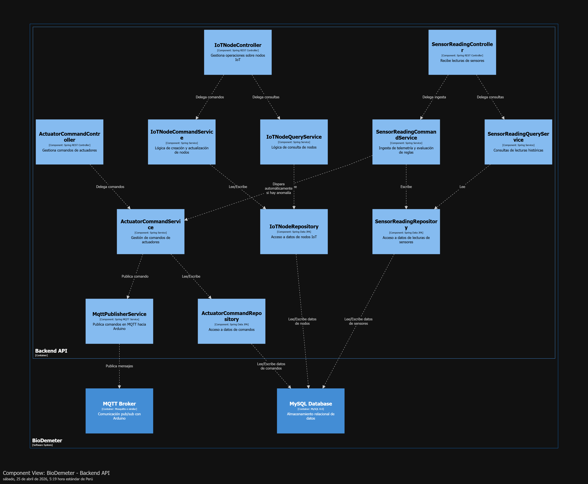

#### 4.2.4.6. Bounded Context Software Architecture Code Level Diagrams

##### 4.2.4.6.1. Bounded Context Domain Layer Class Diagrams

Este diagrama UML muestra la capa de dominio de IoT Management con tres agregados principales (IoTNode, SensorReading y ActuatorCommand), modelados como entidades independientes del negocio, junto con los value objects/enumeraciones (NodeStatus, ActuatorType, ActuatorAction, CommandStatus) que aseguran consistencia de datos; además, presenta los servicios de comando y consulta que orquestan la lógica, destacando que SensorReadingCommandService activa ActuatorCommandService cuando detecta anomalías en la telemetría.

  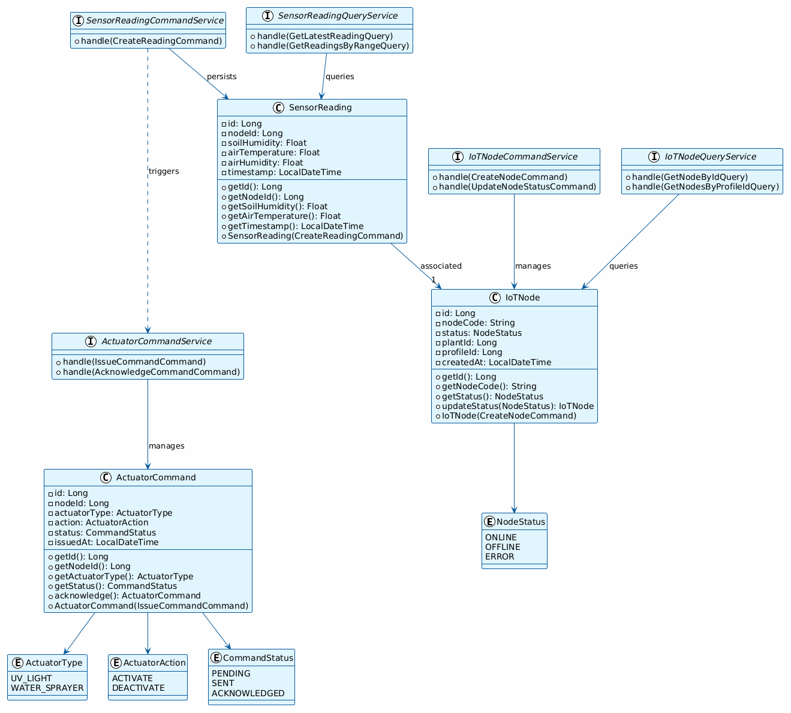

##### 4.2.4.6.2. Bounded Context Database Design Diagram

El diseño de base de datos del bounded context IoT Management se compone de tres tablas principales: iot_nodes, que registra cada nodo Arduino con su nodeCode único, estado, referencias de planta/perfil y fecha de creación; sensor_readings, que almacena la telemetría (humedad de suelo, temperatura y humedad de aire, timestamp) vinculada al nodo por nodeId y optimizada para consultas temporales con índices por nodo y fecha; y actuator_commands, que guarda el historial de comandos enviados a actuadores (tipo, acción, estado y fecha) también relacionado por nodeId e indexado para localizar rápidamente comandos pendientes; en conjunto, las relaciones garantizan consistencia e integridad referencial al depender ambas tablas transaccionales de iot_nodes.

  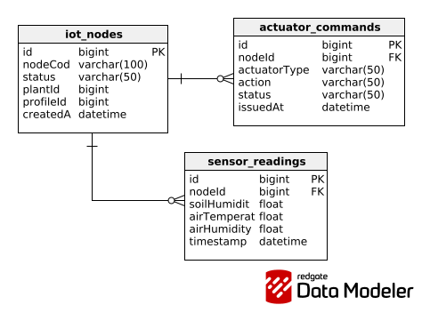

### 4.2.5. Bounded Context: CareScheduling

#### 4.2.5.1. Domain Layer

En esta capa se define el núcleo de la programación de cuidados de plantas, encapsulando las reglas de negocio para la gestión de tareas de mantenimiento como riego, fertilización y otras acciones programadas.

**Aggregate: `Task`**

El agregado Task es la raíz que gestiona las tareas de cuidado de plantas en el sistema, asegurando que las acciones programadas sean consistentes y válidas.

| Atributos | Tipo de dato | Visibilidad | Descripción |
|---|---|---|---|
| id | Long | Private | Identificador único de la tarea. |
| date | LocalDate | Private | Fecha programada para la ejecución de la tarea. |
| action | String | Private | Acción a realizar (ej. "WATER", "FERTILIZE"). |
| completed | Boolean | Private | Indica si la tarea ha sido completada. |
| plantId | PlantId | Private | ID de la planta asociada a la tarea. |
| profileId | ProfileId | Private | ID del perfil propietario de la tarea. |

| Métodos | Tipo de retorno | Visibilidad | Descripción |
|---|---|---|---|
| getId() | Long | Public | Devuelve el ID de la tarea. |
| getDate() | LocalDate | Public | Devuelve la fecha programada. |
| getAction() | String | Public | Devuelve la acción a realizar. |
| getCompleted() | Boolean | Public | Devuelve si la tarea está completada. |
| getPlantId() | PlantId | Public | Devuelve el ID de la planta asociada. |
| getProfileId() | ProfileId | Public | Devuelve el ID del perfil propietario. |
| updateInformation(String, LocalDate, PlantId, ProfileId, Boolean) | Task | Public | Actualiza la información de la tarea. |
| Task(CreateTaskCommand) | Constructor | Public | Crea una nueva tarea a partir de un comando. |

**Value Objects**

| Value Object | Descripción |
|---|---|
| PlantId | Registro que representa el identificador de una planta. Valida que no sea nulo o menor o igual a cero. |
| ProfileId | Registro que representa el identificador de un perfil. Valida que no sea nulo o menor o igual a cero. |

**Excepciones de Dominio**

| Excepción | Descripción |
|---|---|
| TaskCreationException | Se lanza cuando ocurre un error durante la creación de una tarea. |
| TaskDeletionException | Se lanza cuando ocurre un error durante la eliminación de una tarea. |

**Clase: `TaskQueryService`**

| Título | TaskQueryService |
|---|---|
| Descripción | Interfaz de servicio de consultas para operaciones de lectura de tareas. |

**Métodos**

| Método | Descripción |
|---|---|
| handle(GetAllTasksQuery) | Recupera la lista completa de tareas registradas en el sistema. |
| handle(GetTaskByIdQuery) | Obtiene una tarea por su identificador único. |

**Clase: `TaskCommandService`**

| Título | TaskCommandService |
|---|---|
| Descripción | Interfaz de servicio de comandos para la gestión de tareas. |

**Métodos**

| Método | Descripción |
|---|---|
| handle(CreateTaskCommand) | Crea una nueva tarea a partir del comando y retorna su ID. |
| handle(DeleteTaskCommand) | Elimina una tarea del sistema. |

#### 4.2.5.2. Interface Layer

La capa de interfaz del contexto CareScheduling expone controladores REST para la gestión de tareas de cuidado. Utiliza assemblers especializados para transformar las solicitudes HTTP en comandos y consultas, asegurando que el dominio no se vea afectado por cambios en la API externa.

**Controlador: `TaskCommandController`**

Maneja las operaciones de escritura sobre tareas, permitiendo la creación y eliminación de las mismas.

**Métodos**

| Método | Ruta | Descripción |
|---|---|---|
| createTask | POST /api/v1/tasks | Crea una nueva tarea y devuelve sus datos. |
| deleteTask | DELETE /api/v1/tasks/{taskId} | Elimina una tarea del sistema. |

**Controlador: `TaskQueryController`**

Gestiona las operaciones de consulta y lectura de tareas en la plataforma.

**Métodos**

| Método | Ruta | Descripción |
|---|---|---|
| getAllTasks | GET /api/v1/tasks | Lista todas las tareas del sistema. |

**Recursos (DTOs)**

| Recurso | Descripción |
|---|---|
| CreateTaskResource | Contiene los datos para crear una tarea: action, date, plantId, profileId, completed. |
| TaskResource | Representa la respuesta de una tarea: id, action, date, plantId, profileId, completed. |

**Assemblers (Transformadores)**

| Assembler | Descripción |
|---|---|
| CreateTaskCommandFromResourceAssembler | Convierte un CreateTaskResource en un CreateTaskCommand. |
| TaskResourceFromEntityAssembler | Convierte la entidad Task en un TaskResource. |

#### 4.2.5.3. Application Layer

Los servicios internos implementan la lógica de orquestación para la gestión de tareas. Se encargan de ejecutar comandos y coordinar la persistencia.

**Clase: `TaskCommandServiceImpl`**

| Título | TaskCommandServiceImpl |
|---|---|
| Descripción | Implementación del servicio de comandos para gestionar la creación y eliminación de tareas. |

**Dependencias**

| Dependencia | Descripción |
|---|---|
| TaskRepository | Repositorio para la persistencia de tareas. |

**Clase: `TaskQueryServiceImpl`**

| Título | TaskQueryServiceImpl |
|---|---|
| Descripción | Implementación del servicio de consultas para operaciones de lectura de tareas. |

**Dependencias**

| Dependencia | Descripción |
|---|---|
| TaskRepository | Repositorio para el acceso a la base de datos de tareas. |

#### 4.2.5.4. Infrastructure Layer

Esta capa implementa los mecanismos de persistencia mediante JPA y Spring Data JPA.

**Clase: `TaskRepository`**

| Título | TaskRepository |
|---|---|
| Descripción | Interfaz de persistencia para operaciones CRUD de tareas. |

**Métodos**

| Método | Descripción |
|---|---|
| findById(Long) | Recupera una tarea por su ID. |
| findAll() | Recupera todas las tareas. |
| save(Task) | Persiste o actualiza la información de la tarea. |
| deleteById(Long) | Elimina una tarea por su ID. |

#### 4.2.5.5. Bounded Context Software Architecture Component Level Diagrams

Este diagrama representa cómo el Bounded Context de CareScheduling gestiona las tareas de cuidado de plantas.
El TaskCommandController es el punto de entrada principal para el flujo de creación y eliminación de tareas, mientras que el TaskQueryController maneja las consultas de lectura. Ambos controladores delegan respectivamente en TaskCommandService y TaskQueryService.
La persistencia se realiza en una base de datos relacional MySQL a través de TaskRepository.

  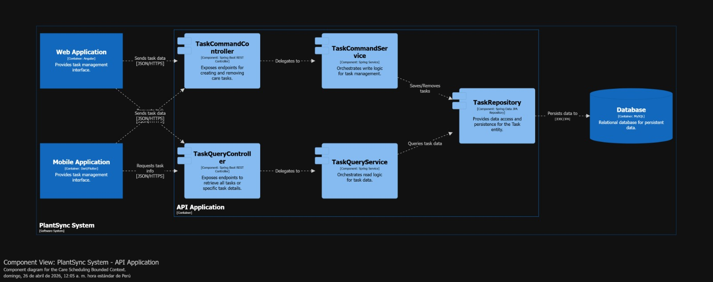

  Elaboración propia

#### 4.2.5.6. Bounded Context Software Architecture Code Level Diagrams

En esta sección, se explica los diagramas que presentan un mayor detalle sobre la implementación de componentes en el bounded context de CareScheduling.

##### 4.2.5.6.1. Bounded Context Domain Layer Class Diagrams

 

  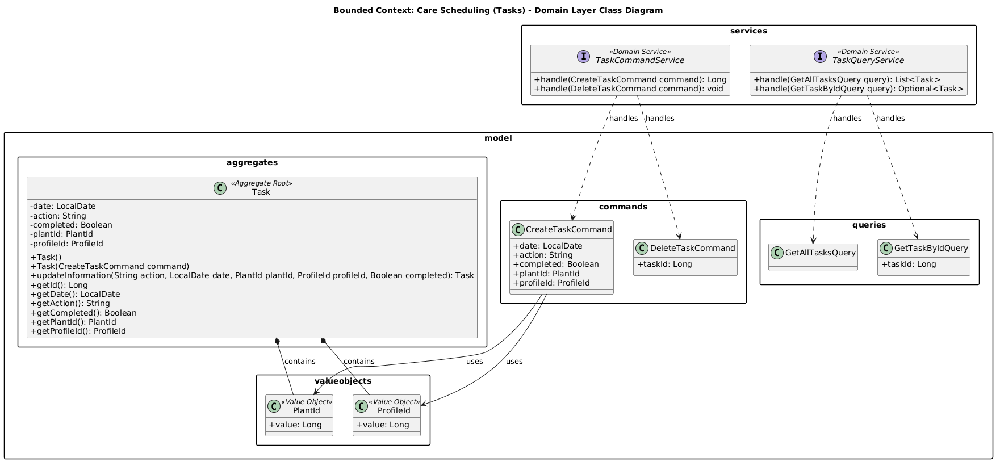

    Bounded Context Class Diagram - Elaboración propia

##### 4.2.5.6.2. Bounded Context Database Design Diagram

  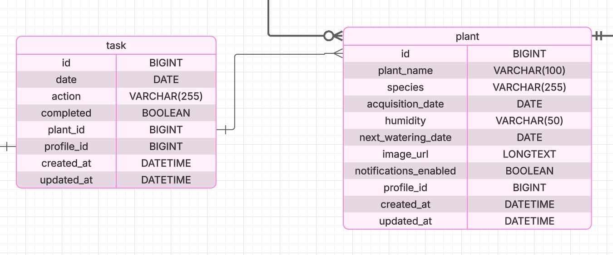

  Elaboración propia

### 4.2.6. Bounded Context: Inteligencia Botánica y Análisis Externo

#### 4.2.6.1. Domain Layer

En esta capa se define el núcleo de la generación de recomendaciones personalizadas de cuidado por especie, encapsulando las reglas de negocio para analizar telemetría de sensores, consultar datos botánicos externos y producir consejos accionables para el usuario.

**Aggregate: `Recommendation`**

El agregado Recommendation es la raíz que gestiona las recomendaciones de cuidado generadas para una planta específica, asegurando que la evaluación de condiciones y los consejos producidos sean consistentes y válidos.

| Atributos | Tipo de dato | Visibilidad | Descripción |
|---|---|---|---|
| id | RecommendationId | Private | Identificador único de la recomendación. |
| plantId | String | Private | Identificador de la planta evaluada. |
| userId | String | Private | Identificador del usuario propietario. |
| telemetrySnapshot | TelemetrySnapshot | Private | Captura inmutable de telemetría relevante. |
| externalSpeciesData | ExternalSpeciesData | Private | Datos externos de especie consultados. |
| plantCondition | PlantCondition | Private | Estado evaluado de la planta. |
| advices | List\<CareAdvice\> | Private | Lista de consejos priorizados generados. |
| generatedAt | LocalDateTime | Private | Fecha y hora de generación. |
| domainEvents | List\<DomainEvent\> | Private | Eventos de dominio pendientes de publicación. |

| Métodos | Tipo de retorno | Visibilidad | Descripción |
|---|---|---|---|
| getId() | RecommendationId | Public | Devuelve el ID de la recomendación. |
| getPlantId() | String | Public | Devuelve el ID de la planta asociada. |
| getUserId() | String | Public | Devuelve el ID del usuario propietario. |
| getPlantCondition() | PlantCondition | Public | Devuelve la condición evaluada de la planta. |
| getAdvicesOrderedByPriority() | List\<CareAdvice\> | Public | Devuelve consejos ordenados por prioridad. |
| pullDomainEvents() | List\<DomainEvent\> | Public | Extrae eventos de dominio para publicación. |
| evaluate(RecommendationService) | void | Public | Ejecuta evaluación con servicio de dominio. |
| Recommendation(RecommendationId, String, String, TelemetrySnapshot, ExternalSpeciesData) | Constructor | Public | Crea una nueva recomendación. |

**Entity: `CareAdvice`**

Entidad que representa un consejo específico generado como parte de una recomendación, incluyendo prioridad, tipo y mensaje de acción.

| Atributos | Tipo de dato | Visibilidad | Descripción |
|---|---|---|---|
| id | UUID | Private | Identificador único del consejo. |
| type | CareAdviceType | Private | Tipo de consejo generado. |
| priority | int | Private | Nivel de prioridad del consejo. |
| message | String | Private | Mensaje descriptivo para el usuario. |
| actionRequired | String | Private | Acción recomendada a ejecutar. |

| Métodos | Tipo de retorno | Visibilidad | Descripción |
|---|---|---|---|
| getId() | UUID | Public | Devuelve el ID del consejo. |
| getType() | CareAdviceType | Public | Devuelve el tipo de consejo. |
| getPriority() | int | Public | Devuelve la prioridad del consejo. |
| getMessage() | String | Public | Devuelve el mensaje descriptivo. |
| isHighPriority() | boolean | Public | Indica si el consejo es de alta prioridad. |
| CareAdvice(CareAdviceType, int, String, String) | Constructor | Public | Crea un nuevo consejo de cuidado. |

**Value Objects**

| Value Object | Descripción |
|---|---|
| RecommendationId | Registro que representa el identificador único de una recomendación. Encapsula un UUID. |
| TelemetrySnapshot | Captura inmutable de telemetría relevante: humedad del suelo, temperatura ambiental, nivel de luz, timestamp y origen. Proporciona métodos de validación contra umbrales. |
| ExternalSpeciesData | Información externa por especie: rangos óptimos de humedad, temperatura, iluminación mínima, frecuencia de riego sugerida y fuente de datos. |
| PlantCondition | Enumeración que representa el estado evaluado de la planta: OPTIMAL, STRESS_HUMIDITY, STRESS_TEMPERATURE, STRESS_LIGHT, CRITICAL. |
| CareAdviceType | Enumeración del tipo de consejo: WATERING, LIGHT_SUPPLEMENT, TEMPERATURE_ADJUSTMENT, FERTILIZER, GENERAL. |

**Domain Events**

| Event | Descripción |
|---|---|
| RecommendationGenerated | Evento de dominio emitido cuando se genera exitosamente una nueva recomendación para una planta. Contiene ID de recomendación, plantId, userId, condición detectada y cantidad de consejos. |

**Domain Services**

| Service | Descripción |
|---|---|
| RecommendationService | Servicio de dominio que compara telemetría contra datos externos de especie, determina PlantCondition y construye la lista priorizada de CareAdvice. |

**Clase: `RecommendationQueryService`**

| Título | RecommendationQueryService |
|---|---|
| Descripción | Interfaz de servicio de consultas para operaciones de lectura de recomendaciones generadas. |

**Métodos**

| Método | Descripción |
|---|---|
| handle(GetLatestRecommendationQuery) | Recupera la recomendación más reciente de una planta. |
| handle(GetRecommendationHistoryQuery) | Recupera el historial paginado de recomendaciones de una planta. |

**Clase: `RecommendationCommandService`**

| Título | RecommendationCommandService |
|---|---|
| Descripción | Interfaz de servicio de comandos para la generación de recomendaciones. |

**Métodos**

| Método | Descripción |
|---|---|
| handle(GenerateRecommendationCommand) | Orquesta la generación completa de una recomendación: consulta telemetría, especie, datos externos, evalúa, persiste y publica evento. |

#### 4.2.6.2. Interface Layer

La capa de interfaz del contexto Inteligencia Botánica y Análisis Externo expone controladores REST para consulta de recomendaciones y consumidores de eventos para procesamiento asíncrono de telemetría. Utiliza assemblers especializados para transformar las solicitudes y respuestas, asegurando que el dominio no se vea afectado por cambios en la API externa.

**Controlador: `RecommendationController`**

Gestiona las operaciones de consulta de recomendaciones generadas para plantas específicas.

**Métodos**

| Método | Ruta | Descripción |
|---|---|---|
| getLatestRecommendation | GET /api/v1/recommendations/{plantId}/latest | Devuelve la última recomendación generada para una planta. |
| getRecommendationHistory | GET /api/v1/recommendations/{plantId}/history | Devuelve el historial paginado de recomendaciones de una planta. |

**Consumidor de Eventos: `TelemetryEventConsumer`**

Escucha eventos de nueva telemetría publicados por el bounded context IoT Management y desencadena la generación automática de recomendaciones.

**Métodos**

| Método | Descripción |
|---|---|
| onTelemetrySaved(TelemetrySavedEvent) | Consume el evento de telemetría guardada y activa el comando GenerateRecommendation. |

**Recursos (DTOs)**

| Recurso | Descripción |
|---|---|
| RecommendationResource | Representa la respuesta de una recomendación: plantCondition, lista de advices ordenados por prioridad, timestamp de generación y fuente de datos. |

**Assemblers (Transformadores)**

| Assembler | Descripción |
|---|---|
| RecommendationAssembler | Convierte el aggregate Recommendation en un RecommendationResource para exposición vía API REST. |

#### 4.2.6.3. Application Layer

Los servicios internos implementan la lógica de orquestación para la generación y consulta de recomendaciones. Se encargan de coordinar la interacción entre telemetría, perfiles de planta, datos externos y persistencia.

**Clase: `GenerateRecommendationCommandHandler`**

| Título | GenerateRecommendationCommandHandler |
|---|---|
| Descripción | Implementación del handler de comando que orquesta la generación completa de una recomendación. |

**Dependencias**

| Dependencia | Descripción |
|---|---|
| IRecommendationRepository | Repositorio para persistencia de recomendaciones. |
| ISpeciesDataRepository | Repositorio para consulta de datos externos de especie. |
| RecommendationService | Servicio de dominio para evaluación de condiciones. |
| RecommendationEventPublisher | Publicador de eventos de dominio. |
| PlantProfilesClient | Cliente HTTP para consulta de especie desde PlantProfiles BC. |

**Clase: `GetLatestRecommendationQueryHandler`**

| Título | GetLatestRecommendationQueryHandler |
|---|---|
| Descripción | Implementación del handler de consulta para recuperar la última recomendación de una planta. |

**Dependencias**

| Dependencia | Descripción |
|---|---|
| IRecommendationRepository | Repositorio para acceso a datos de recomendaciones. |

**Clase: `GetRecommendationHistoryQueryHandler`**

| Título | GetRecommendationHistoryQueryHandler |
|---|---|
| Descripción | Implementación del handler de consulta para recuperar historial paginado de recomendaciones. |

**Dependencias**

| Dependencia | Descripción |
|---|---|
| IRecommendationRepository | Repositorio para acceso paginado al historial. |

#### 4.2.6.4. Infrastructure Layer

Esta capa implementa los mecanismos de persistencia, integración con servicios externos y publicación de eventos.

**Clase: `RecommendationRepositoryImpl`**

| Título | RecommendationRepositoryImpl |
|---|---|
| Descripción | Implementación JPA del repositorio de recomendaciones para persistencia en base de datos relacional. |

**Métodos**

| Método | Descripción |
|---|---|
| save(Recommendation) | Persiste o actualiza una recomendación. |
| findById(RecommendationId) | Recupera una recomendación por su ID. |
| findLatestByPlantId(String) | Recupera la recomendación más reciente de una planta. |
| findByPlantIdPaginated(String, int, int) | Recupera historial paginado de recomendaciones. |

**Clase: `SpeciesDataRepositoryImpl`**

| Título | SpeciesDataRepositoryImpl |
|---|---|
| Descripción | Implementación del repositorio que consume API externa de datos botánicos por especie (ej. Perenual API). |

**Métodos**

| Método | Descripción |
|---|---|
| findBySpeciesName(String) | Consulta datos externos de especie y retorna ExternalSpeciesData. |

**Clase: `TelemetryEventConsumerImpl`**

| Título | TelemetryEventConsumerImpl |
|---|---|
| Descripción | Implementación del consumidor de eventos que escucha TelemetrySaved desde el message broker y delega al command handler. |

**Clase: `RecommendationEventPublisher`**

| Título | RecommendationEventPublisher |
|---|---|
| Descripción | Adaptador que publica el evento RecommendationGenerated al message broker (RabbitMQ/Kafka) para notificaciones. |

**Infraestructura de Soporte**

| Component | Descripción |
|---|---|
| SpeciesDataCache | Caché basada en Redis con TTL configurable para reducir llamadas a API externa. Almacena ExternalSpeciesData indexado por speciesName. |

#### 4.2.6.5. Bounded Context Software Architecture Component Level Diagrams

Este diagrama representa cómo el Bounded Context de Inteligencia Botánica y Análisis Externo gestiona la generación de recomendaciones personalizadas de cuidado por especie.

El RecommendationController es el punto de entrada principal para las consultas de recomendaciones, delegando en los query handlers correspondientes. El TelemetryEventConsumer escucha eventos de nueva telemetría desde IoT Management y activa el GenerateRecommendationCommandHandler, quien orquesta la consulta de especie desde PlantProfiles, la obtención de datos externos desde SpeciesDataRepository, la evaluación con RecommendationService y la persistencia del resultado. La persistencia se realiza en una base de datos relacional MySQL a través de RecommendationRepositoryImpl.

  

  Elaboración propia

#### 4.2.6.6. Bounded Context Software Architecture Code Level Diagrams

En esta sección, se explican los diagramas que presentan un mayor detalle sobre la implementación de componentes en el bounded context de Inteligencia Botánica y Análisis Externo.

##### 4.2.6.6.1. Bounded Context Domain Layer Class Diagrams

 

  

    Bounded Context Class Diagram - Elaboración propia

##### 4.2.6.6.2. Bounded Context Database Design Diagram

  

  Elaboración propia

### 4.2.7. Bounded Context: \<PlantGuidance\>

#### 4.2.7.1. Domain Layer

En esta capa se define el núcleo de la seguridad y gestión de identidades, encapsulando las reglas de negocio para la autenticación y autorización de usuarios.

En esta capa se gestiona la inteligencia del sistema. Integrando la ia del chatbot con los datos dinámicos de los sensores y de los perfiles de las plantas para ofrecer recomendaciones.

**Aggregate: `Consultation`**

Representa una sesión de consulta temporal donde un usuario interactúa con la IA para obtener asesoría basada en los datos específicos de una de sus plantas.

| Atributos      | Tipo de dato     | Visibilidad | Descripción                                     |
|----------------|-----------------|------------|------------------------------------------------|
| consultationId    | Long            | Private    | Identificador único de la consulta.            |
| plantId      | Long           | Private    | ID de la planta sobre la cual se realiza la consulta.    |
| userMessage       | String          | Private    | Pregunta o inquietud enviada por el usuario.                      |
| aiResponse    | String         | Private    | Respuesta generada por el modelo de IA          |
| plantSnapshot    | PlantSnapshot         | Private    | Objeto de valor con los datos de la planta en el momento de la consulta.          |
| createdAt    | Timestamp         | Private    | Fecha y hora de la interacción.          |

| Métodos                         | Tipo de retorno | Visibilidad | Descripción                                      |
|---------------------------------|----------------|------------|------------------------------------------------|
| getConsultationId()                 | Long           | Public     | Devuelve el ID de la consulta.                   |
| getPlantId()                 | Long          | Public     | Devuelve el ID de la planta asociada.    |
| getAiResponse()                      | String         | Public     | Devuelve la respuesta generada por la IA.              |
| updateResponse(response)                |void       | Public     | Asigna la respuesta final generada por el servicio de IA.        |
| getCreatedAt()                     | Timestamp  | Public     | Devuelve la fecha de la consulta.       |

**Value Objects**

| Value Object   | Descripción                                                                 |
|----------------|-----------------------------------------------------------------------------|
| ChatRole  | Define el rol del emisor del mensaje: `USER`, `ASSISTANT` y `SYSTEM`.      |
| PlantSnapshot | Contiene los datos técnicos de la planta al momento de la duda: nombre, descripción, temperatura y humedad.|

**Clase: `ChatbotQueryService`**

| Título       | ChatbotQueryService |
|--------------|----------------------|
| Descripción  | Interfaz de servicio de consultas para recuperar el historial de interacciones de una planta específica. |

**Métodos**

| Método                             | Descripción                                               |
|-----------------------------------|-----------------------------------------------------------|
| handle(GetConsultationsByPlantIdQuery)        | Obtiene todas las consultas realizadas para una planta específica.   |
| handle(GetConsultationByIdQuery) | Obtiene los detalles de una consulta específica.     |

**Clase: `ChatbotCommandService`**

| Título       | ChatbotCommandService |
|--------------|------------------------|
| Descripción  | Interfaz de servicio de comandos para procesar la lógica de generación de asesoría mediante IA. |

**Métodos**

| Método                           | Descripción                                                        |
|---------------------------------|--------------------------------------------------------------------|
| handle(ProcessPlantConsultationCommand)     | Orquesta la obtención de datos de la planta, genera el prompt para la IA y registra la respuesta.            |
| handle(ClearPlantConsultationsCommand)     | Elimina el historial de consultas de una planta. |

#### 4.2.7.2. Interface Layer

La capa de interfaz del contexto PlantGuidance expone los endpoints necesarios para que la aplicación móvil o web envíe las preguntas del usuario. Utiliza transformadores para convertir las solicitudes en comandos que incluyen el contexto de la planta seleccionada.

**Controlador: `ChatbotController`**

Controlador REST que maneja el flujo de comunicación entre el usuario y el agente de IA botánico.

**Metodos**

| Método           | Ruta                              | Descripción                                               |
|-----------------|----------------------------------|-----------------------------------------------------------|
| consultAi   | POST /api/v1/chatbot/consult        | Recibe la pregunta del usuario y el ID de la planta para generar asesoría. |
| getPlantHistory | GET /api/v1/chatbot/history/{plantId} | Recupera la conversación actual para una planta. |
| deleteHistory | DELETE /api/v1/chatbot/history/{plantId} | Borra la conversación al salir de la vista del chatbot. |

**Dependencias**

| Dependencia                         | Descripción                                                                 |
|------------------------------------|-----------------------------------------------------------------------------|
| ChatbotCommandService                 | Servicio para procesar la generación de respuestas con IA.               |
| ChatbotQueryService               | Servicio para recuperar datos de consultas previas. |
| ConsultationResourceFromEntityAssembler | Convierte la entidad Consultation a un recurso JSON.           |
| ProcessConsultationCommandFromResourceAssembler | Mapea el request del usuario a un comando de dominio.      |

#### 4.2.7.3. Application Layer

LEl servicio ChatbotCommandServiceImpl actúa como el orquestador principal. No solo llama a la IA, sino que primero utiliza un ProfilesContextFacade (ACL) para obtener la temperatura y humedad actual del Bounded Context de Plant Profiles antes de enviar la solicitud al agente de IA

**Clase: `ChatbotCommandServiceImpl`**

| Título       | ChatbotCommandServiceImpl |
|--------------|--------------------------|
| Descripción  | Implementación de la lógica de negocio para la generación de consejos botánicos inteligentes. |

**Dependencias**

| Dependencia            | Descripción                                   |
|-------------------------|-----------------------------------------------|
| ConsultationRepository       | Repositorio para persistencia (audit log) de las consultas.  |
| AiServiceAgent     | Adaptador de infraestructura para la API  |
| ProfilesContextFacade     | Fachada para obtener datos de la planta desde otro Bounded Context.  |

**Clase: `ChatbotQueryServiceImpl`**

| Título       | ChatbotQueryServiceImpl |
|--------------|----------------------------|
| Descripción  | Implementación del servicio de lectura para el historial de chat del usuario. |

**Dependencias**

| Dependencia            | Descripción                                   |
|-------------------------|-----------------------------------------------|
| ConsultationRepository      | Acceso a la persistencia de consultas. |

#### 4.2.7.4. Infrastructure Layer

Esta capa maneja la integración técnica con la API de la IA y la base de datos de auditoría. El AiServiceAdapter transforma el contexto del dominio en un prompt optimizado para el modelo de lenguaje.

**Clase: `ConsultationRepository`**

| Título       | ConsultationRepository |
|-------------|------------------|
| Descripción | Interfaz de persistencia para las entidades de consulta de IA. |

**Metodos**

| Método             | Descripción                                           |
|-------------------|-------------------------------------------------------|
| save(Consultation) | Persiste el log de la consulta y la respuesta generada. |
| findByPlantId(Long)   | Recupera las consultas asociadas a una planta.                        |
| deleteAllByPlantId(Long)    | Elimina el historial de consultas.                        |

**Dependencias**

| Dependencia            | Propósito                                   |
|-------------------------|-----------------------------------------------|
| ConsultationEntity      | Representación JPA de la consulta en la base de datos. |
| AiClient      | Cliente externo para la comunicación con los servidores de la IA |

#### 4.2.7.5. Bounded Context Software Architecture Component Level Diagrams

Este diagrama de componentes representa cómo el sistema consume datos de plantas para alimentar la IA. 

El `ChatbotController` recibe la consulta del usuario. El `ChatbotCommandService` orquesta el flujo: solicita los datos de temperatura y humedad al `ProfilesContextFacade`, combina esta información con la pregunta del usuario y la envía al `AiServiceAdapter`. Finalmente, la respuesta se entrega al usuario y se registra en el repositorio mediante JPA.

  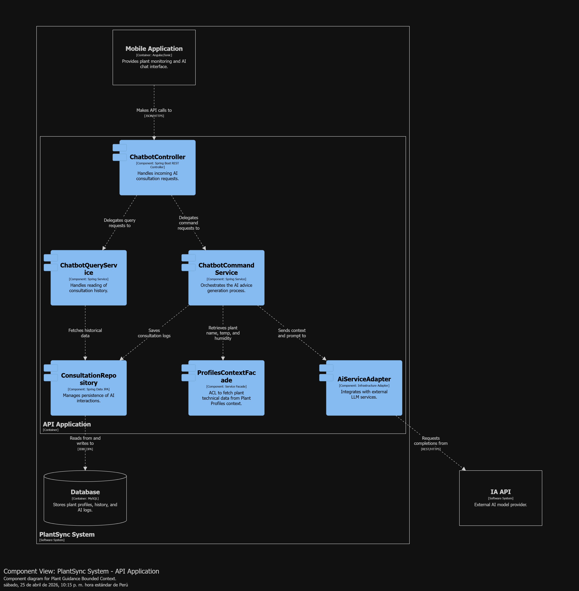

  Elaboración propia

#### 4.2.7.6. Bounded Context Software Architecture Code Level Diagrams

En esta sección, se explica los diagramas que presentan un mayor detalle sobre la implementación de componentes en el bounded context de IAM.

##### 4.2.7.6.1. Bounded Context Domain Layer Class Diagrams

 

  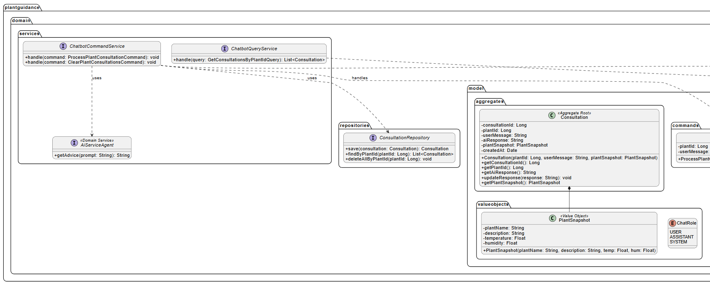

  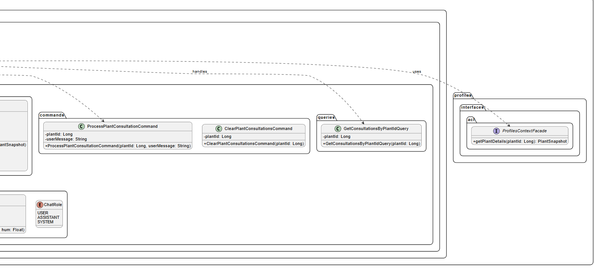

    Bounded Context Class Diagram - Elaboración propia

##### 4.2.7.6.2. Bounded Context Database Design Diagram

  

  Elaboración propia

# Conclusiones

## Conclusiones y recomendaciones

**Conclusiones**

-  Se ha confirmado que la problemática central no es solo el olvido del riego, sino la falta de conocimiento técnico sobre las necesidades específicas de cada especie. El diseño de los Bounded Contexts de Inteligencia Botánica y Plant Profiles responde directamente a esta brecha, proporcionando una solución que centraliza el conocimiento especializado.

- Inicialmente, el equipo asumió que los usuarios preferirían guías estáticas de cuidado. Sin embargo, tras el análisis de las entrevistas y el Needfinding, se validó que los segmentos objetivo demandan inmediatez e interactividad. Esto motivó el incluir un Chatbot con IA, desplazando las guías tradicionales por una interfaz conversacional más eficiente.

- La hipótesis de que la monitorización en tiempo real mediante dispositivos IoT reduciría la incertidumbre del usuario resultó ser acertada. Los criterios de éxito definidos en el Lean UX Canvasmuestran una tendencia positiva tras las validaciones de los prototipos iniciales y el flujo de mensajes del dominio.

- La implementación de Domain-Driven Design (DDD) permitió delimitar claramente las responsabilidades del sistema. La separación de contextos como IoT Management y Care Scheduling asegura que el producto sea escalable y que la complejidad técnica de los sensores no interfiera con la experiencia de usuario en la capa de aplicación.

**Recomendaciones**

- Implementar de manera progresiva los requerimientos y sugerencias recolectados durante la fase de entrevistas con los segmentos objetivo, asegurando que el desarrollo de funcionalidades esté estrictamente alineado con las necesidades reales detectadas para maximizar la satisfacción del usuario y la propuesta de valor del producto.

- Supervisar rigurosamente que, durante la etapa de codificación y construcción del sistema, se respeten los límites y la autonomía de cada Bounded Context definidos en el diseño estratégico. Esto es fundamental para evitar el acoplamiento innecesario, facilitar el mantenimiento y garantizar la integridad de la arquitectura de software propuesta.

# Bibliografía

Revista Economía. (2020). Incremento del interés de los peruanos por el cuidado de las áreas verdes. https://www.revistaeconomia.com/incremento-del-interes-de-los-peruanos-por-el-cuidado-de-las-areas-verdes/

# Anexos

- Link Video TB1: `https://upcedupe-my.sharepoint.com/:v:/g/personal/u20231a500_upc_edu_pe/IQBkDt1uzmT5Ro1mWs3A0bWMASojRLdRjF21GPgz28Es7Yc?nav=eyJyZWZlcnJhbEluZm8iOnsicmVmZXJyYWxBcHAiOiJTdHJlYW1XZWJBcHAiLCJyZWZlcnJhbFZpZXciOiJTaGFyZURpYWxvZy1MaW5rIiwicmVmZXJyYWxBcHBQbGF0Zm9ybSI6IldlYiIsInJlZmVycmFsTW9kZSI6InZpZXcifX0%3D&e=gySJdu`

## Links

Link del repositorio del reporte: https://github.com/BioDemeter-IoT/report
